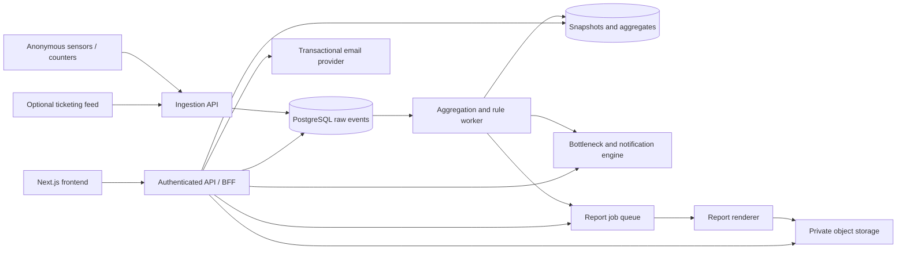

# Mundo Backend Implementation Contract

**Document status:** implementation handoff
**Contract version:** 1.0
**Frontend baseline:** the current Next.js application in this repository
**Companion document:** [`database.md`](./database.md)

This document defines the backend behavior required by the Mundo Museum visitor-intelligence frontend. It is intentionally specific: field names, units, status values, date behavior, permissions, polling, report generation, and failure behavior are part of the contract.

The current frontend is a complete visual prototype, but its data is still held in `app/(dashboard)/museum-data.ts`, its live refresh is simulated in the browser, authentication accepts any valid-looking form submission, settings are local React state, and PDF/CSV files are generated in the browser. The backend implementation must replace those simulations without changing the visible interaction model or layout; fixture labels whose arithmetic is contradictory must be corrected to the reconciled contract values in this document.

## 1. Product scope

Mundo is a privacy-preserving, abstracted museum visitor-flow modeler. It must support:

- secure staff authentication and password recovery;
- a live dashboard that refreshes at a configurable 15/30/60-second interval, defaulting to 30 seconds;
- current museum and zone occupancy;
- hourly entry, exit, movement, dwell, and engagement analytics;
- automatic detection and lifecycle management of bottlenecks;
- a zone-by-hour heatmap with date, zone, and metric filters;
- exhibit rankings, trends, funnels, and individual exhibit profiles;
- asynchronous PDF and CSV report generation with report history;
- workspace, polling, capacity-threshold, and notification settings;
- in-app notifications and global search;
- anonymous sensor/event ingestion without retaining visitor identity.

### 1.1 Explicit non-goals for version 1

- ticket purchasing, payments, memberships, or public visitor accounts;
- facial recognition, raw video storage, biometric identification, or tracking a person across days;
- a content-management system for exhibit descriptions;
- building-floor route optimization beyond the structured operational recommendations described here;
- replacing the museum's ticketing or access-control system.

## 2. Authoritative frontend behavior

| Frontend route | Access | Backend responsibility |
|---|---|---|
| `/` | Public | Authenticate email/password and establish a session. |
| `/forgot-password` | Public | Accept a reset request without revealing whether the email exists. |
| `/dashboard` | Authenticated | Return one coherent live snapshot, comparison data, zone state, and open bottlenecks. |
| `/heatmap` | Authenticated | Return a date-scoped zone × hour matrix, summary metrics, cell detail, and flow insight. |
| `/exhibits` | Authenticated | Return KPI totals, ranked exhibits, an hourly series, funnel, and selected-exhibit profile. |
| `/reports` | Authenticated | Preview, enqueue, list, monitor, and download reports. |
| `/settings` | Authenticated | Read resolved settings; every member may save personal refresh/landing/notification preferences, while only an administrator may change museum-wide defaults and thresholds. |

The shell also needs the signed-in user's profile, global search results, unread notifications, and a logout action. Light/dark theme switching currently belongs to the browser and may remain in local storage; it can optionally be synchronized as a user preference.

### 2.1 Current prototype controls that are not yet wired

The backend team should not mistake these visual controls for completed integration:

- the dashboard date and “Today” controls do not currently change the data window;
- the exhibit date/range controls are currently labels only;
- `/heatmap?zone=<slug>` works, but `/heatmap?view=zones` has no distinct view behavior;
- `/exhibits?exhibit=<slug>` selects a fixture, while “Open full exhibit profile” has no route yet;
- `/dashboard?panel=help` and the profile-menu button have no implemented panels;
- shell search, notifications, and the displayed user are currently fixture data;
- settings inputs are not persisted, and the current Reset action resets only React state.

Wire the existing date/filter/export/report/settings controls to the contracts below. Help, profile management, and a separate exhibit-profile route should receive a product/UI decision before the backend invents additional endpoints.

## 3. Recommended system shape

Start with a **modular monolith plus background worker**, not independent microservices. It gives the team clear module boundaries without creating distributed-transaction and deployment overhead too early.



The runtime may be implemented with Next.js route handlers or a separate TypeScript service such as Fastify/NestJS. The HTTP contract in this document is authoritative regardless of framework.

### 3.1 Required backend modules

1. **Identity:** login, logout, session refresh, current user, password reset, role checks.
2. **Museum catalog:** museum, zones, entry points, exhibits, sensors, opening hours, capacities.
3. **Ingestion:** authenticated batches, schema validation, deduplication, dead-letter handling.
4. **Analytics:** live snapshots, hourly/daily rollups, comparison windows, data quality.
5. **Flow operations:** bottleneck detection, acknowledgement, resolution, structured insights.
6. **Exhibit intelligence:** rankings, dwell, funnels, engagement score, trends.
7. **Reporting:** preview, asynchronous jobs, artifact rendering, private downloads, retention.
8. **Notifications:** in-app records, unread counts, delivery preferences, report-ready events.
9. **Settings:** workspace settings, threshold validation, optimistic concurrency, audit history.
10. **Search:** authorized search across zones, exhibits, and reports.
11. **Audit/observability:** security audit log, metrics, traces, structured logs, health checks.

### 3.2 Infrastructure baseline

- PostgreSQL is the source of truth; see `database.md`.
- Redis is recommended for short-lived response caching, rate limits, distributed locks, and a job queue. The system must remain correct if the cache is flushed.
- PDF/CSV artifacts belong in private S3-compatible object storage, not database byte columns.
- A transactional email provider sends reset links and optional alert emails.
- Run at least one API process and one worker process. Report rendering should not block API request threads.
- Use a transaction outbox for notifications and jobs that must be emitted after a database commit.

## 4. Identity, tenancy, and authorization

Every operational record is scoped to a `museumId`. The first deployment has one museum, but the contract must not assume that a user can see every museum.

### 4.1 Roles

| Role | Read analytics | Generate/download reports | Acknowledge/resolve alerts | Edit exhibits/zones | Change workspace settings/members/sensors |
|---|---:|---:|---:|---:|---:|
| `viewer` | Yes | Existing artifacts only | No | No | No |
| `analyst` | Yes | Yes | No | No | No |
| `operator` | Yes | Yes | Yes | No | No |
| `curator` | Yes | Yes | No | Exhibits only | No |
| `museum_admin` | Yes | Yes | Yes | Yes | Yes |

Authorization is always checked server-side. Hiding a button is not authorization.

Every active member may read the Settings page and update only their own preferences. Non-administrators must see museum-wide fields as read-only (or a clear forbidden state if they attempt to mutate them); the sidebar and mobile bottom navigation do not need to hide the Settings route.

Represent these capabilities separately: every active member receives `preferences:write`; only `museum_admin` receives `settings:write` for workspace mutation.

### 4.2 Browser session policy

- Use a secure, HTTP-only, same-site cookie named `__Host-mundo_session` in production.
- Do not store access or refresh tokens in `localStorage`.
- Sessions should have a short idle timeout, a configurable absolute timeout, rotation after login/privilege changes, and server-side revocation.
- Cookie-authenticated state-changing requests require CSRF protection. Same-origin checks alone are not enough for every deployment model.
- Return `Cache-Control: no-store` for identity responses.

Use a synchronizer token bound to the server-side session. Login and `GET /api/v1/auth/me` return a high-entropy `csrfToken`; the frontend keeps it only in memory and sends it as `X-CSRF-Token` on every cookie-authenticated `POST`, `PATCH`, `PUT`, or `DELETE`. Store only a keyed hash in `identity.sessions.csrf_secret_hash`, compare in constant time, rotate it with the session, and also validate `Origin`/`Sec-Fetch-Site`. CSRF failures return `403 CSRF_VALIDATION_FAILED`. Login and password-reset requests are pre-session endpoints, so protect them with strict origin checks, content-type enforcement, and rate limits.

### 4.3 Login flow

`POST /api/v1/auth/login`

```json
{
  "email": "ama@example.org",
  "password": "user-entered password"
}
```

Success: `200`, session cookie, and:

```json
{
  "data": {
    "user": {
      "id": "6fbf3354-fcd9-4a24-b906-220940c2348d",
      "displayName": "Ama Mensah",
      "email": "ama@example.org",
      "initials": "AM",
      "avatarUrl": null
    },
    "activeMuseum": {
      "id": "7deaa499-c481-4455-9285-53b3445db217",
      "name": "Mundo Museum",
      "timezone": "Africa/Accra",
      "role": "museum_admin"
    },
    "permissions": ["analytics:read", "reports:write", "preferences:write", "flow:acknowledge", "flow:resolve", "settings:write"],
    "csrfToken": "opaque-high-entropy-token"
  },
  "meta": {
    "requestId": "req_01K...",
    "generatedAt": "2026-07-24T21:03:10Z"
  }
}
```

Use `401` with the same public message for unknown email, wrong password, or disabled account. Rate-limit by normalized email and IP. Recommended starting limits are 5 failed attempts per account per 15 minutes and 20 per IP per 15 minutes, followed by increasing backoff rather than permanent lockout.

Museum selection happens only after the credentials are valid. If the user has one active membership, select it. If the user has several memberships, select their still-valid server-stored default/last-active membership. When several memberships exist and no valid default is available, do not choose an arbitrary museum and do not ask the user to resubmit the password. Return `409 MUSEUM_SELECTION_REQUIRED` with a short-lived, single-use selection token:

```json
{
  "error": {
    "code": "MUSEUM_SELECTION_REQUIRED",
    "message": "Choose a museum workspace to continue.",
    "details": {
      "selectionToken": "short-lived-opaque-token",
      "expiresAt": "2026-07-24T21:08:10Z",
      "memberships": [
        {
          "museumId": "7deaa499-c481-4455-9285-53b3445db217",
          "museumName": "Mundo Museum",
          "role": "museum_admin"
        }
      ]
    },
    "requestId": "req_01K..."
  }
}
```

The frontend submits the choice to `POST /api/v1/auth/select-museum`:

```json
{
  "selectionToken": "short-lived-opaque-token",
  "museumId": "7deaa499-c481-4455-9285-53b3445db217"
}
```

Success establishes the normal session and returns the same payload as login. The token is bound to the authenticated user and original login attempt. The current single-museum frontend will normally follow the automatic branch; a workspace picker is required before multi-membership users can follow the selection branch.

Additional identity endpoints:

| Method | Path | Result |
|---|---|---|
| `GET` | `/api/v1/auth/me` | User, memberships, active museum, permissions, and user preferences. |
| `POST` | `/api/v1/auth/select-museum` | Exchange a valid login selection token plus museum ID for a session. |
| `POST` | `/api/v1/auth/logout` | Revoke current session and expire cookie; return `204`. |
| `POST` | `/api/v1/auth/logout-all` | Revoke all user sessions after reauthentication. |
| `POST` | `/api/v1/auth/switch-museum` | Validate membership, rotate session context, return active museum. |

### 4.4 Password recovery

`POST /api/v1/auth/password-reset-requests`

```json
{ "email": "ama@example.org" }
```

Always return `202` with a generic response, including when no account exists:

```json
{
  "data": {
    "accepted": true,
    "message": "If an account exists, a recovery link will be sent."
  },
  "meta": {
    "requestId": "req_01K...",
    "generatedAt": "2026-07-24T21:03:10Z"
  }
}
```

Requirements:

- generate at least 256 bits of randomness;
- store only a cryptographic hash of the reset token;
- expire the token after 30 minutes;
- make it one-time-use and invalidate older unused reset tokens for the same user;
- rate-limit by normalized email and IP;
- never log the raw token or place it in analytics URLs;
- send a link to a future `/reset-password?token=...` frontend route;
- after a successful reset, revoke all existing sessions and send a security notification.

`POST /api/v1/auth/password-resets`

```json
{
  "token": "raw-token-from-email",
  "newPassword": "new user password"
}
```

Return `204` on success. Use a modern password hash such as Argon2id with parameters calibrated in the deployment environment. Password rules and breach-list checks should be enforced on the server and returned as field errors.

## 5. API-wide contract

### 5.1 Naming and representation

- Base path: `/api/v1`.
- JSON uses `camelCase`; PostgreSQL uses `snake_case`.
- IDs are UUID strings. Human-readable slugs and exhibit codes are not primary keys.
- Timestamps are ISO 8601 UTC strings, for example `2026-07-24T15:00:00Z`.
- Local calendar dates are `YYYY-MM-DD` interpreted in the museum's IANA timezone.
- Unless an endpoint explicitly says otherwise, `from` and `to` are inclusive museum-local calendar dates. Internally they become the half-open interval from local midnight on `from` through local midnight after `to`. UTC conversion must use the timezone rules effective on each boundary, not a fixed offset.
- A one-day `date` query represents that museum-local calendar day. Hourly responses contain the real buckets in that interval and may contain 23 or 25 clock hours across daylight-saving transitions. Each bucket therefore includes an absolute `bucketStart`, local label, UTC offset, and sequence/fold information when a local hour repeats.
- Durations are integer seconds. The frontend formats `1122` as `18m 42s`.
- Percentages are numeric percentages from `0` to `100`, not fractions. Preserve decimals in the API; round only for display.
- Counts are integers. Currency is not currently part of this product.
- Status values are lowercase machine values. The frontend maps them to title case.
- No endpoint should return preformatted HTML.

### 5.2 Success envelope

```json
{
  "data": {},
  "meta": {
    "requestId": "req_01K...",
    "generatedAt": "2026-07-24T21:03:10Z",
    "museumTimezone": "Africa/Accra",
    "dataWatermark": "2026-07-24T21:02:55Z"
  }
}
```

`dataWatermark` is the newest event time fully included in the calculation. It is different from `generatedAt` and is essential for communicating stale sensor data.

Metadata requirements are endpoint-specific but never ambiguous:

- `meta.requestId` and `meta.generatedAt` are required on every JSON success response;
- `meta.museumTimezone` is required on every museum-scoped response;
- `meta.dataWatermark` is required on analytics, preview, and report-generation responses derived from sensor data;
- `meta.page` is required only for cursor-paginated lists;
- fields that do not apply are omitted, not returned as `null`, and `meta: {}` is not a valid final response;
- `204`, `302`, file-stream, and `304` responses have no JSON success envelope.

### 5.3 Error envelope

```json
{
  "error": {
    "code": "INVALID_DATE_RANGE",
    "message": "The end date must be on or after the start date.",
    "fields": {
      "to": "Must be on or after from."
    },
    "requestId": "req_01K..."
  }
}
```

Use these status codes consistently:

- `400` malformed syntax or unsupported parameter;
- `401` no valid session;
- `403` authenticated but not authorized;
- `404` resource absent within the caller's museum scope;
- `409` duplicate/idempotency conflict or invalid state transition;
- `412` stale `If-Match` version when saving settings;
- `422` semantically invalid fields;
- `429` rate limit exceeded, with `Retry-After`;
- `503` analytics temporarily unavailable **only when no safe snapshot can be served**. If a last-known-good snapshot exists, return `200` with `quality.status: "stale"`, its original watermark/snapshot time, and a machine-readable stale reason; never combine an error envelope and normal data in one response.

Do not expose SQL, stack traces, storage keys, password state, or whether a cross-tenant resource exists.

### 5.4 Pagination, sorting, and filtering

- Use cursor pagination for report history, notifications, audit records, and large exhibit lists.
- A list response contains `page: { nextCursor, hasMore, limit }` in `meta`.
- Default limit is 25; maximum is 100.
- Whitelist sort fields. Never pass an arbitrary client string into SQL ordering.
- Empty search strings mean no text filter.
- Zone filters use `zoneId`, not zone name.

### 5.5 Idempotency and concurrency

- Require `Idempotency-Key` for report creation, sensor batches, and other retried creates.
- Store the key, caller scope, request hash, response status, and resource ID for at least 24 hours.
- Reusing a key with a different body returns `409 IDEMPOTENCY_KEY_REUSED`.
- Workspace settings and user preferences each include their own `version`; update the relevant resource with `If-Match: "<version>"`.
- Live pointer rows may be upserted, but historical aggregate values are append-only by `revisionId`. Jobs must be safe to replay and must never overwrite a revision already pinned by a report.

### 5.6 Polling and caching

The live dashboard polls at the authenticated member's resolved effective interval—`30` seconds by default—and also refreshes after the tab becomes visible.

- `GET` analytics responses should include an `ETag` based on museum, query, snapshot, workspace-settings version, and relevant preference version.
- Honor `If-None-Match` and return `304` with no response body when unchanged.
- Include `autoRefresh` and `refreshAfterSeconds` in live responses after workspace defaults and user overrides are resolved. `refreshAfterSeconds` is `15`, `30`, or `60` when enabled and `null` when disabled; manual refresh remains available.
- Permit up to 15-second private/shared cache reuse for the same museum and query, but never cache one museum's response under another museum's key.
- The frontend must keep the previous successful snapshot visible if a refresh fails and show a non-blocking stale-data notice.
- Cancel or ignore older in-flight requests when filters change.

## 6. Metric definitions

These meanings are part of the API contract. Changing a formula requires a versioned metric definition and must not silently rewrite historical reports.

| Metric | Definition |
|---|---|
| Visitors today | Sum of accepted `museum_entry` quantities during the museum's local operating day, after deduplication and corrections. This is an **admission count**, not a distinct-person count: a true exit followed by re-entry is counted again. The UI may continue to label it “Total visitors,” but API/schema names must preserve this definition. |
| Current inside | The authoritative museum ingress/egress ledger at the snapshot watermark: opening balance + accepted museum entries − accepted museum exits + authorized corrections. It equals `assignedInside + transitionalInside + unassignedInside`; zone totals equal only `assignedInside`. |
| Total capacity | Sum of capacities effective at the snapshot time for active public zones. |
| Museum utilization | `currentInside / totalCapacity * 100`; this is capacity-weighted, not the average of zone percentages. |
| Zone occupancy | `currentVisitors / effectiveCapacity * 100`. Store the raw percentage even above 100; the UI may cap a bar visually. |
| Entries/exits | Accepted entry/exit events in the requested bucket after deduplication and corrections. |
| Net flow | `entries - exits` for the same zone and time bucket. |
| Average engagement | Mean unioned engaged time per completed qualified museum visit in seconds. Engaged intervals are valid zone-dwell or exhibit-interaction intervals; overlapping intervals are counted once. Exclude incomplete/impossible visits and publish sample count and coverage. This is distinct from zone dwell and exhibit dwell. |
| Average dwell | Mean qualified completed zone or exhibit session dwell in seconds for the endpoint's stated population. Exclude impossible/unfinished sessions and publish sample count and coverage. |
| Exhibit view | A qualified presence within the exhibit's configured capture area for at least its minimum view duration. |
| Exhibit interaction | A deliberate interaction event such as touch, audio start, scan, button, or tracked interaction zone. |
| Completion | A session reaching the exhibit's configured completion event or completion dwell threshold. |
| Completion rate | `completedSessions / startedSessions * 100`; return `null` when the denominator is zero. |
| Capture rate | `qualifiedViews / passersby * 100`. |
| Return interaction rate | Anonymous same-day subjects with more than one qualified interaction divided by subjects with at least one interaction. |
| Data coverage | Expected sensor-minutes received divided by expected sensor-minutes for active required sensors. |
| Trend percent | `(current - comparison) / comparison * 100`; return `null` with a reason when comparison is zero or unavailable. |

Every published mean or rate must include the population needed to audit it. An average dwell/engagement metric object—or the enclosing row in a dense table response—includes `value`, `sampleSize`, `coveragePercent`, `capability`, and `availabilityReason`; a completion-rate metric also includes `startedSessions` and `completedSessions`. When the required session-level observations are unavailable, return the metric value as `null`, its capability as `false`, and a reason such as `SESSION_LINKAGE_UNAVAILABLE` rather than estimating from occupancy. Aggregate-only sensors can still support counts and occupancy, but they cannot by themselves support visit-level engagement, dwell, funnel, or return-rate metrics.

Recommended default zone states, configurable per museum:

- `normal`: occupancy below the busy threshold;
- `busy`: occupancy at or above `70%` and below the critical threshold;
- `critical`: occupancy at or above `85%`.

The current interface expects exhibit states of `excellent`, `strong`, and `watch`. To match the fixture (`88` is excellent, `85` is strong, and `74` is watch), the default boundaries are `excellent >= 88`, `strong >= 75 and < 88`, and `watch < 75`.

### 6.1 Engagement score

Use a transparent, versioned score rather than an unexplained model output. A reasonable version 1 formula is:

```text
score = 100 * (
  0.30 * percentile_rank(qualified_views) +
  0.25 * normalized_dwell +
  0.25 * normalized_completion_rate +
  0.20 * normalized_interaction_rate
)
```

Every component inside the parentheses is a unitless `0..1` value; API percentages such as `completionRatePercent: 83` must be divided by `100` before entering the formula. Normalize view rank and dwell within a comparable exhibit category and reporting window where possible. Clamp only the final result to `0..100`; retain raw and normalized components plus `calculationVersion`. Never infer scores when data coverage is below the museum's minimum reliable coverage; return `engagementScore: null`, the unavailable component values, and `quality.status = "insufficient"` instead.

### 6.2 Bottleneck detection

Create or continue a bottleneck incident when one or more configured signals remain true for a debounce period, recommended three consecutive one-minute buckets:

- occupancy is at/above the critical threshold;
- queue length or estimated wait time exceeds its configured threshold;
- sustained **positive** net flow (`entries - exits`) shows accumulation while measured egress throughput remains below arrival rate;
- queue length or transition throughput confirms that the accumulation is a restriction rather than ordinary demand;
- a sensor-specific congestion signal is raised.

Deduplicate by museum, zone, location, and rule. Escalate severity in place, and resolve only after a configurable clear period. Human acknowledgement does not resolve an incident.

### 6.3 Status and availability enums

Use the following wire values consistently:

- analytics quality: `good`, `degraded`, `stale`, `insufficient`, `unavailable`;
- quality reason codes: an array of stable uppercase codes such as `LOW_SENSOR_COVERAGE`, `STALE_WATERMARK`, `SESSION_LINKAGE_UNAVAILABLE`, `COMPARISON_ZERO`, or `COMPARISON_UNAVAILABLE`;
- zone state: `normal`, `busy`, `critical`, `unknown`;
- bottleneck severity: `moderate`, `high`, `critical`;
- bottleneck lifecycle: `open`, `acknowledged`, `resolved`;
- exhibit state: `excellent`, `strong`, `watch`, `unknown`;
- congestion risk: `low`, `moderate`, `high`, `critical`, `unknown`;
- trend direction: `up`, `down`, `flat`, `unavailable`;
- report job state: `queued`, `running`, `ready`, `failed`, `cancelled`, `expired`;
- report artifact state: `available`, `expired`;
- sensor health: `online`, `degraded`, `offline`, `maintenance`, `unknown`.

Every `quality` object has `{ status, coveragePercent, reasonCodes, provisional }`. `coveragePercent` may be `null` only when expected coverage cannot be calculated. A nullable trend additionally returns `trendAvailabilityReason`, using `COMPARISON_ZERO`, `COMPARISON_UNAVAILABLE`, or `INSUFFICIENT_QUALITY`. Do not overload `status` with display text.

## 7. Endpoint summary

All museum endpoints begin with `/api/v1/museums/{museumId}` and require a membership in that museum.

| Method | Path suffix | Purpose |
|---|---|---|
| `GET` | `/bootstrap` | User-facing museum metadata, permissions, settings, zones, unread count. |
| `GET` | `/zones` | Active zones and effective capacities. |
| `GET` | `/exhibits` | Catalog lookup used by filters/search. |
| `GET` | `/dashboard` | One coherent live dashboard snapshot. |
| `GET` | `/dashboard/export?snapshotId=...` | Server-generated zone-status CSV for the exact retained live snapshot. |
| `GET` | `/heatmap` | Zone × hour metrics and summary for one local date. |
| `GET` | `/heatmap/export` | CSV for the current heatmap filters. |
| `GET` | `/exhibit-analytics` | KPI summary and ranked exhibits for a range. |
| `GET` | `/exhibits/{exhibitId}/analytics` | Selected exhibit series, funnel, profile, and insight. |
| `GET` | `/exhibit-analytics/export` | CSV for the current filters/sort. |
| `GET` | `/bottlenecks` | Filtered incident list. |
| `POST` | `/bottlenecks/{id}/acknowledgements` | Acknowledge an open incident. |
| `POST` | `/bottlenecks/{id}/resolutions` | Explicitly resolve an open/acknowledged incident with an authorized reason. |
| `POST` | `/report-previews` | Compute a lightweight report preview. |
| `POST` | `/reports` | Queue one report job. |
| `GET` | `/reports` | Cursor-paginated report history and summary. |
| `GET` | `/reports/{reportId}` | Job state and generated artifacts. |
| `POST` | `/reports/{reportId}/retry` | Retry a failed report with permission. |
| `GET` | `/reports/{reportId}/artifacts/{artifactId}/download` | Authorized short-lived download. |
| `GET` | `/settings` | Workspace and user-facing live-data settings. |
| `PATCH` | `/settings` | Administrator-only museum/workspace defaults and thresholds. |
| `PATCH` | `/preferences` | The current member's landing, refresh, theme, and notification preferences. |
| `GET` | `/notifications` | Unread/recent in-app notifications. |
| `PATCH` | `/notifications/{id}` | Mark read or dismissed. |
| `POST` | `/notifications/read-all` | Mark all visible notifications read. |
| `GET` | `/search` | Search authorized zones, exhibits, and reports. |

## 8. Bootstrap and catalog

`GET /api/v1/museums/{museumId}/bootstrap`

This should be loaded once by the authenticated dashboard shell. It avoids repeating catalog and permission calls on every tab.

```json
{
  "data": {
    "museum": {
      "id": "7deaa499-c481-4455-9285-53b3445db217",
      "name": "Mundo Museum",
      "timezone": "Africa/Accra"
    },
    "user": {
      "id": "6fbf3354-fcd9-4a24-b906-220940c2348d",
      "displayName": "Ama Mensah",
      "initials": "AM",
      "role": "museum_admin"
    },
    "permissions": ["analytics:read", "reports:write", "preferences:write", "flow:acknowledge", "flow:resolve", "settings:write"],
    "settings": {
      "defaultLandingPage": "dashboard",
      "themePreference": "dark",
      "resolvedTheme": "dark",
      "autoRefresh": true,
      "refreshIntervalSeconds": 30,
      "busyThresholdPercent": 70,
      "criticalThresholdPercent": 85,
      "bottleneckAlerts": true,
      "reportReadyAlerts": true,
      "workspaceVersion": 4,
      "preferenceVersion": 2
    },
    "zones": [
      {
        "id": "d446d570-0b59-4ca3-b0e2-95328b0b8722",
        "slug": "ancient-worlds",
        "name": "Ancient Worlds",
        "shortName": "Ancient",
        "effectiveCapacity": 180,
        "displayOrder": 2,
        "active": true
      }
    ],
    "unreadNotificationCount": 3
  },
  "meta": {
    "requestId": "req_01K...",
    "generatedAt": "2026-07-24T21:03:10Z",
    "museumTimezone": "Africa/Accra"
  }
}
```

Catalog records should include stable UUID, slug, code, display name, short name, active state, display order, and zone relationship. The initial seed should preserve the current prototype slugs so deep links continue to work:

`grand-atrium`, `ancient-worlds`, `modern-gallery`, `west-african-heritage`, `sculpture-court`, `special-exhibition`, and `cafe-retail`.

Browser deep links intentionally remain human-readable: `/heatmap?zone=<zone-slug>` and `/exhibits?exhibit=<exhibit-slug>`. Analytics APIs accept UUIDs only. The frontend resolves a route slug against the authorized bootstrap/catalog response and sends the matching UUID as `zoneId` or `exhibitId`; an unknown or unauthorized slug produces the page's not-found/empty state and must never be forwarded as an ID. Search `href` values use slugs for the same reason.

## 9. Live dashboard contract

`GET /api/v1/museums/{museumId}/dashboard?comparison=previous_day`

All values must come from the same committed snapshot/watermark. Do not assemble KPI cards from requests that can observe different moments.

This is a live endpoint and always represents the museum's current local operating day. If a client supplies `date`, it must equal that day; otherwise return `422 LIVE_DATE_NOT_TODAY`. Do not combine a historical chart with current occupancy or open incidents. Historical date exploration belongs to Heatmap, Exhibit Analytics, and Reports; until a dedicated historical-dashboard contract exists, the dashboard date control should remain “Today.” Polling stops when the browser tab is hidden and resumes with an immediate conditional request when visible.

`previous_day` is a like-for-like elapsed-time comparison based on the analytics watermark. If the current watermark is 21:02:55 into the local day, the comparison ends at 21:02:55 on the preceding local day, including the corresponding partial hourly bucket. It is not the preceding full day.

```json
{
  "data": {
    "snapshotId": "67e45926-0ba0-4a22-8d37-e0634546d751",
    "window": {
      "localDate": "2026-07-24",
      "startAt": "2026-07-24T00:00:00Z",
      "endAt": "2026-07-24T21:02:55Z",
      "dayEndAt": "2026-07-25T00:00:00Z",
      "comparisonStartAt": "2026-07-23T00:00:00Z",
      "comparisonEndAt": "2026-07-23T21:02:55Z",
      "elapsedSeconds": 75775
    },
    "snapshotAt": "2026-07-24T21:03:00Z",
    "autoRefresh": true,
    "refreshAfterSeconds": 30,
    "kpis": {
      "visitorsToday": {
        "value": 1842,
        "comparisonValue": 1638,
        "deltaPercent": 12.45,
        "trend": "up",
        "sparkline": [
          { "bucketStart": "2026-07-24T14:00:00Z", "value": 22 },
          { "bucketStart": "2026-07-24T15:00:00Z", "value": 31 }
        ]
      },
      "averageEngagementSeconds": {
        "value": 1122,
        "comparisonValue": 1041,
        "deltaPercent": 7.78,
        "trend": "up",
        "sampleSize": 1291,
        "coveragePercent": 98.4,
        "capability": true,
        "availabilityReason": null,
        "sparkline": [
          { "bucketStart": "2026-07-24T14:00:00Z", "value": 1048 },
          { "bucketStart": "2026-07-24T15:00:00Z", "value": 1122 }
        ]
      },
      "activeBottlenecks": {
        "value": 3,
        "comparisonValue": 5,
        "delta": -2,
        "trend": "down",
        "actionRequired": true,
        "sparkline": [
          { "bucketStart": "2026-07-24T14:00:00Z", "value": 4 },
          { "bucketStart": "2026-07-24T15:00:00Z", "value": 3 }
        ]
      },
      "exhibitInteractions": {
        "value": 8694,
        "comparisonValue": 7969,
        "deltaPercent": 9.1,
        "trend": "up",
        "trackedExhibits": 42,
        "sparkline": [
          { "bucketStart": "2026-07-24T14:00:00Z", "value": 612 },
          { "bucketStart": "2026-07-24T15:00:00Z", "value": 681 }
        ]
      }
    },
    "visitorFlow": {
      "granularity": "hour",
      "timezone": "Africa/Accra",
      "series": [
        {
          "bucketStart": "2026-07-24T08:00:00Z",
          "label": "8 AM",
          "admissions": 84,
          "comparisonAdmissions": 72,
          "partial": false
        }
      ]
    },
    "liveSummary": {
      "currentInside": 977,
      "assignedInside": 977,
      "transitionalInside": 0,
      "unassignedInside": 0,
      "entriesCurrentHour": 384,
      "exitsCurrentHour": 357,
      "netFlowCurrentHour": 27,
      "totalCapacity": 1340,
      "availableCapacity": 363,
      "utilizationPercent": 72.91
    },
    "zones": [
      {
        "id": "d446d570-0b59-4ca3-b0e2-95328b0b8722",
        "slug": "ancient-worlds",
        "name": "Ancient Worlds",
        "shortName": "Ancient",
        "currentVisitors": 162,
        "capacity": 180,
        "occupancyPercent": 90,
        "averageDwellSeconds": 1266,
        "dwellSampleSize": 132,
        "dwellCapability": true,
        "dwellAvailabilityReason": null,
        "entriesLastHour": 41,
        "exitsLastHour": 48,
        "netFlowLastHour": -7,
        "status": "critical",
        "dataCoveragePercent": 99.2,
        "measuredAt": "2026-07-24T21:03:00Z"
      }
    ],
    "bottlenecks": [
      {
        "id": "52d6ba2c-50bd-4c38-9a44-a9df8a807ff8",
        "zoneId": "d446d570-0b59-4ca3-b0e2-95328b0b8722",
        "zoneName": "Ancient Worlds",
        "location": "East entrance",
        "severity": "critical",
        "status": "open",
        "startedAt": "2026-07-24T20:52:00Z",
        "durationSeconds": 660,
        "note": "Queue is restricting cross-gallery flow"
      }
    ],
    "quality": {
      "status": "good",
      "coveragePercent": 98.7,
      "reasonCodes": [],
      "staleSensorCount": 0,
      "provisional": false
    }
  },
  "meta": {
    "requestId": "req_01K...",
    "generatedAt": "2026-07-24T21:03:10Z",
    "museumTimezone": "Africa/Accra",
    "dataWatermark": "2026-07-24T21:02:55Z"
  }
}
```

`visitorFlow.series` is hourly museum admissions, not occupancy and not current-inside samples. It contains every elapsed configured opening-hour bucket through the watermark plus any out-of-hours bucket containing accepted admissions or corrections. The final bucket may be partial and is marked `partial: true`. For both current and comparison series, the sum of admissions through the corresponding partial bucket must exactly equal `kpis.visitorsToday.value` and `comparisonValue`; corrections are applied to the affected bucket rather than hidden in an unreconciled total. Each sparkline item is timestamped, ordered ascending, and uses the same unit as its parent KPI. `liveSummary.currentInside` is authoritative; `sum(zones.currentVisitors)` must equal `assignedInside`, while `currentInside = assignedInside + transitionalInside + unassignedInside`. A nonzero discrepancy is visible quality information, not a value to silently force into one zone.

The dashboard's active bottleneck count/list includes both `open` and `acknowledged` incidents. Acknowledgement records ownership of the response; only the clear/resolution rule removes the incident from active views.

When no live data exists, return the catalog zones with `currentVisitors: null`, `occupancyPercent: null`, `status: "unknown"`, and a quality reason. Do not turn missing data into zero.

The dashboard export endpoint requires `snapshotId=<id returned above>` and must export that exact retained snapshot, never whatever is current when the download request arrives. If the snapshot has passed the configured export retention window, return `410 SNAPSHOT_EXPIRED`. CSV columns are:

`Zone`, `Current visitors`, `Capacity`, `Occupancy percent`, `Average dwell seconds`, `Entries last hour`, `Exits last hour`, `Net flow`, `Status`, `Measured at`, `Data coverage percent`.

## 10. Heatmap contract

`GET /api/v1/museums/{museumId}/heatmap?date=2026-07-24&zoneId=<optional-zone-uuid>`

Return all switchable metrics in each cell so changing from occupancy to visitors/dwell/entries/exits is instant and consistent.

Omit `zoneId` to request all authorized active zones; the API does not use the string sentinel `all`. `date` is one museum-local calendar day. Return buckets intersecting the museum's configured public opening window, plus any buckets containing recorded events outside that window. `hours` is authoritative and can vary with opening hours and daylight-saving transitions; the frontend must not assume thirteen buckets.

```json
{
  "data": {
    "date": "2026-07-24",
    "timezone": "Africa/Accra",
    "granularity": "hour",
    "revisionToken": "heatmap-revision-token",
    "hours": [
      {
        "index": 0,
        "bucketStart": "2026-07-24T08:00:00Z",
        "bucketEnd": "2026-07-24T09:00:00Z",
        "localHour": "08:00",
        "label": "08:00",
        "utcOffset": "+00:00",
        "fold": 0
      }
    ],
    "rows": [
      {
        "zone": {
          "id": "d446d570-0b59-4ca3-b0e2-95328b0b8722",
          "slug": "ancient-worlds",
          "name": "Ancient Worlds",
          "shortName": "Ancient",
          "capacity": 180
        },
        "cells": [
          {
            "bucketStart": "2026-07-24T08:00:00Z",
            "bucketEnd": "2026-07-24T09:00:00Z",
            "occupancyPercent": 12,
            "averageVisitors": 21.6,
            "visitorSampleCount": 60,
            "peakVisitors": 27,
            "averageDwellSeconds": 324,
            "dwellSampleSize": 18,
            "dwellAvailabilityReason": null,
            "entries": 7,
            "exits": 3,
            "status": "normal",
            "capabilities": {
              "occupancy": true,
              "visitors": true,
              "dwell": true,
              "entries": true,
              "exits": true
            },
            "quality": {
              "status": "good",
              "coveragePercent": 100,
              "reasonCodes": [],
              "provisional": false
            }
          }
        ]
      }
    ],
    "summary": {
      "peakHour": {
        "bucketStart": "2026-07-24T15:00:00Z",
        "label": "3:00 PM",
        "zoneId": "87f08062-22cc-4ddc-9bb7-6fdd3e4aa3e2",
        "zoneName": "Special Exhibition",
        "occupancyPercent": 91
      },
      "busiestZone": { "zoneId": "87f08062-22cc-4ddc-9bb7-6fdd3e4aa3e2", "name": "Special Exhibition", "dailyAverageOccupancyPercent": 64.23 },
      "longestDwell": { "zoneId": "87f08062-22cc-4ddc-9bb7-6fdd3e4aa3e2", "name": "Special Exhibition", "seconds": 1632 },
      "criticalCellCount": 7,
      "criticalZoneCount": 2
    },
    "quality": { "status": "good", "coveragePercent": 98.7, "reasonCodes": [], "provisional": false }
  },
  "meta": {
    "requestId": "req_01K...",
    "generatedAt": "2026-07-25T06:00:10Z",
    "museumTimezone": "Africa/Accra",
    "dataWatermark": "2026-07-25T05:58:00Z"
  }
}
```

`averageVisitors` is the time-weighted sample mean of measured/estimated concurrent visitors during the bucket, not admissions and not the number of distinct people who entered during that hour. Weight irregular samples by the duration for which each observation is effective. `occupancyPercent` is the corresponding time-weighted mean of `visitors / effectiveCapacity * 100`, so it remains valid across an effective-capacity change. Counts in `entries` and `exits` are bucket totals.

The development acceptance fixture is deterministic: the thirteen Special Exhibition occupancy values average `64.23%`; with critical defined as `>= 85%`, the current matrix has seven critical cells across Ancient Worlds and Special Exhibition. The `1632`-second longest-dwell value is a separate seeded dwell aggregate from the zone fixture and is not derived from occupancy. Seed tests and frontend acceptance labels must use these reconciled values rather than copying the live `88%` Special Exhibition snapshot into the historical daily-average field.

For a selected cell, the frontend may derive values from the cell or request:

`GET /api/v1/museums/{museumId}/heatmap/cells/{zoneId}?bucketStart=<ISO timestamp>&revisionToken=<token-from-heatmap-response>`

The detail adds incoming-source proportions and a structured insight:

```json
{
  "data": {
    "revisionToken": "heatmap-revision-token",
    "zoneId": "87f08062-22cc-4ddc-9bb7-6fdd3e4aa3e2",
    "bucketStart": "2026-07-24T15:00:00Z",
    "bucketEnd": "2026-07-24T16:00:00Z",
    "metrics": {
      "capacity": 200,
      "occupancyPercent": 91,
      "averageVisitors": 182,
      "visitorSampleCount": 60,
      "peakVisitors": 190,
      "averageDwellSeconds": 1632,
      "dwellSampleSize": 124,
      "dwellAvailabilityReason": null,
      "entries": 44,
      "exits": 35,
      "status": "critical"
    },
    "capabilities": {
      "occupancy": true,
      "visitors": true,
      "dwell": true,
      "entries": true,
      "exits": true,
      "incomingFlow": true
    },
    "incomingFlows": [
      { "fromZoneId": "...", "fromZoneName": "Grand Atrium", "transitions": 42, "sharePercent": 34 }
    ],
    "insight": {
      "severity": "critical",
      "title": "Capacity intervention recommended",
      "message": "Redirect arrivals toward Modern Gallery for the next 30 minutes.",
      "recommendedZoneId": "...",
      "facts": [
        { "code": "PEAK_ARRIVAL_LEAD", "value": 18, "unit": "minutes" }
      ],
      "calculationVersion": "flow-insight-v1"
    },
    "quality": {
      "status": "good",
      "coveragePercent": 98.7,
      "reasonCodes": [],
      "provisional": false
    }
  },
  "meta": {
    "requestId": "req_01K...",
    "generatedAt": "2026-07-25T06:00:10Z",
    "museumTimezone": "Africa/Accra",
    "dataWatermark": "2026-07-25T05:58:00Z"
  }
}
```

Insights should be deterministic and templated from structured facts in version 1. If a generative model is introduced later, validate its output schema, ground it in recorded metrics, label it, and never allow it to make automated safety decisions.

### 10.1 Heatmap CSV export

`GET /api/v1/museums/{museumId}/heatmap/export?date=2026-07-24&zoneId=<optional-zone-uuid>&revisionToken=<token-from-heatmap-response>`

The UI sends the opaque `revisionToken` from the matching heatmap response, and the export uses that identical local date, zone scope, aggregate revision set, status thresholds, and watermark. Omit `zoneId` for all zones. Return `text/csv; charset=utf-8` with `Content-Disposition: attachment; filename="mundo-zone-heatmap-2026-07-24.csv"` and these stable columns:

`Local date`, `Timezone`, `Zone ID`, `Zone`, `Bucket start UTC`, `Bucket end UTC`, `Local hour`, `UTC offset`, `Average visitors`, `Peak visitors`, `Occupancy percent`, `Average dwell seconds`, `Dwell sample size`, `Entries`, `Exits`, `Status`, `Coverage percent`, `Provisional`.

Unavailable metrics are empty CSV fields, never zero. Include `X-Mundo-Data-Watermark` and `ETag` headers. Formula-injection protection applies to editable zone names. If the historical revision set has been retired, return `410 ANALYTICS_REVISION_EXPIRED`; otherwise a retry with the same filters and revision watermark must produce equivalent data.

## 11. Exhibit analytics contract

### 11.1 Ranking and KPI response

`GET /api/v1/museums/{museumId}/exhibit-analytics?from=2026-07-01&to=2026-07-24&zoneId=<optional-zone-uuid>&q=&sort=score&direction=desc&limit=25`

`from` and `to` are inclusive museum-local dates using the shared half-open conversion rule. Omit `zoneId` for all zones; do not send `all` to the API. The immediately preceding comparison range contains the same number of local calendar dates.

```json
{
  "data": {
    "window": {
      "from": "2026-07-01",
      "to": "2026-07-24",
      "startAt": "2026-07-01T00:00:00Z",
      "endAt": "2026-07-25T00:00:00Z",
      "timezone": "Africa/Accra",
      "comparisonFrom": "2026-06-07",
      "comparisonTo": "2026-06-30"
    },
    "revisionToken": "exhibit-analytics-revision-token",
    "kpis": {
      "totalInteractions": { "value": 8694, "deltaPercent": 9.1, "trackedExhibits": 42, "capability": true, "coveragePercent": 98.9, "sparklineGranularity": "day", "sparkline": [{ "bucketStart": "2026-07-24T00:00:00Z", "value": 681 }] },
      "averageExhibitDwellSeconds": { "value": 372, "benchmarkSeconds": 334, "deltaPercent": 7.2, "sampleSize": 6114, "capability": true, "availabilityReason": null, "coveragePercent": 98.6, "sparklineGranularity": "day", "sparkline": [{ "bucketStart": "2026-07-24T00:00:00Z", "value": 372 }] },
      "completionRatePercent": { "value": 72, "startedSessions": 5240, "completedSessions": 3773, "deltaPercent": 4.6, "capability": true, "availabilityReason": null, "coveragePercent": 98.4, "sparklineGranularity": "day", "sparkline": [{ "bucketStart": "2026-07-24T00:00:00Z", "value": 72 }] },
      "topExhibit": { "exhibitId": "...", "name": "Benin Bronze Head", "score": 92, "deltaPercent": 12.8 }
    },
    "items": [
      {
        "rank": 1,
        "id": "8cd682b0-0de9-41dd-ad83-468b9e6475d0",
        "slug": "benin-bronze-head",
        "code": "EX-1042",
        "name": "Benin Bronze Head",
        "zone": { "id": "...", "name": "West African Heritage" },
        "views": 1384,
        "interactions": 941,
        "averageDwellSeconds": 522,
        "dwellSampleSize": 1082,
        "dwellAvailabilityReason": null,
        "completionRatePercent": 83,
        "startedSessions": 902,
        "completedSessions": 749,
        "completionAvailabilityReason": null,
        "engagementScore": 92,
        "trendPercent": 12.8,
        "status": "excellent",
        "capabilities": { "view": true, "interaction": true, "dwell": true, "start": true, "completion": true },
        "quality": { "status": "good", "coveragePercent": 99.1, "reasonCodes": [], "provisional": false },
        "calculationVersion": "exhibit-engagement-v1"
      }
    ]
  },
  "meta": {
    "requestId": "req_01K...",
    "generatedAt": "2026-07-25T06:00:10Z",
    "museumTimezone": "Africa/Accra",
    "dataWatermark": "2026-07-25T05:58:00Z",
    "page": { "nextCursor": null, "hasMore": false, "limit": 25 }
  }
}
```

Search is case-insensitive across exhibit name and code. The server, not the browser, applies zone filter and ranking for paginated data. Whitelisted sort values are `score`, `views`, `completion`, and `trend`. KPI sparklines are chronological daily buckets for multi-day ranges and hourly absolute-time buckets for a one-day range; `sparklineGranularity` makes the choice explicit. `trendPercent` compares the current range's engagement score with the immediately preceding range of equal museum-local duration; return `null` plus `trendAvailabilityReason` when the prior score is zero, missing, or insufficient quality.

### 11.2 Selected exhibit response

`GET /api/v1/museums/{museumId}/exhibits/{exhibitId}/analytics?from=2026-07-01&to=2026-07-24&comparison=previous_period`

```json
{
  "data": {
    "window": {
      "from": "2026-07-01",
      "to": "2026-07-24",
      "startAt": "2026-07-01T00:00:00Z",
      "endAt": "2026-07-25T00:00:00Z",
      "timezone": "Africa/Accra",
      "comparisonFrom": "2026-06-07",
      "comparisonTo": "2026-06-30"
    },
    "exhibit": {
      "id": "8cd682b0-0de9-41dd-ad83-468b9e6475d0",
      "slug": "benin-bronze-head",
      "code": "EX-1042",
      "name": "Benin Bronze Head",
      "zone": { "id": "...", "name": "West African Heritage" },
      "status": "excellent"
    },
    "summary": {
      "engagementScore": 92,
      "views": 1384,
      "averageDwellSeconds": 522,
      "dwellSampleSize": 1082,
      "dwellCoveragePercent": 99.1,
      "dwellCapability": true,
      "dwellAvailabilityReason": null,
      "completionRatePercent": 83,
      "startedSessions": 902,
      "completedSessions": 749,
      "completionCoveragePercent": 99.1,
      "completionCapability": true,
      "completionAvailabilityReason": null,
      "trendPercent": 12.8
    },
    "hourOfDaySeries": [
      {
        "localHour": "08:00",
        "label": "8 AM",
        "engagementScore": 22,
        "sampleSize": 71,
        "comparisonEngagementScore": 18,
        "comparisonSampleSize": 66,
        "coveragePercent": 98.8
      }
    ],
    "funnel": {
      "passersby": 2418,
      "viewed": 1384,
      "interacted": 941,
      "started": 902,
      "completed": 749,
      "viewToInteractionPercent": 68,
      "completionRatePercent": 83
    },
    "profile": {
      "peakEngagementLocalHour": "15:00",
      "passerbyCapturePercent": 57.2,
      "returnInteractionPercent": 14.8,
      "congestionRisk": "low"
    },
    "insight": {
      "title": "Curatorial insight",
      "message": "Audio-led interpretation is associated with 22% longer dwell at this exhibit.",
      "calculationVersion": "curatorial-insight-v1",
      "evidence": { "sampleSize": 441, "dwellLiftPercent": 22 }
    },
    "capabilities": { "passerby": true, "view": true, "interaction": true, "dwell": true, "start": true, "completion": true, "anonymousReturn": true },
    "quality": { "status": "good", "coveragePercent": 99.1, "reasonCodes": [], "provisional": false }
  },
  "meta": {
    "requestId": "req_01K...",
    "generatedAt": "2026-07-25T06:00:10Z",
    "museumTimezone": "Africa/Accra",
    "dataWatermark": "2026-07-25T05:58:00Z"
  }
}
```

`hourOfDaySeries` is explicitly a `0..100` engagement-score profile grouped by museum-local clock hour across the entire inclusive range; it is not a chronological single-day series. Recalculate the score from the combined underlying component numerators/denominators for each local hour rather than averaging daily scores. During a daylight-saving fall-back, both occurrences of a repeated local hour contribute to the same local-hour profile with their actual durations and samples. Views and interactions remain separately named counts. Funnel values must be monotonic: `passersby >= viewed >= interacted >= started >= completed`. If the sensor configuration does not support a stage or stable same-day anonymous keys, return the affected count/rate—including `returnInteractionPercent`—as `null`, set the capability to `false`, and add a quality reason rather than inventing it.

### 11.3 Exhibit CSV export

`GET /api/v1/museums/{museumId}/exhibit-analytics/export?from=2026-07-01&to=2026-07-24&zoneId=<optional-zone-uuid>&q=&sort=score&direction=desc&revisionToken=<token-from-ranking-response>`

The UI sends the ranking response's opaque `revisionToken`. The server applies that same inclusive local-date range, optional zone UUID, case-insensitive name/code search, authorized catalog scope, sort, comparison range, calculation version, aggregate revisions, and watermark. Export all matching rows rather than only the current page. Return `text/csv; charset=utf-8` with `Content-Disposition: attachment; filename="mundo-exhibit-performance-2026-07-01-to-2026-07-24.csv"` and columns:

`Rank`, `Exhibit ID`, `Exhibit code`, `Exhibit`, `Zone ID`, `Zone`, `Views`, `Interactions`, `Average dwell seconds`, `Dwell sample size`, `Started sessions`, `Completed sessions`, `Completion rate percent`, `Engagement score`, `Trend percent`, `Trend availability reason`, `Status`, `Coverage percent`, `Calculation version`, `Provisional`.

Unavailable values are empty fields. Include `X-Mundo-Data-Watermark` and `ETag`; protect editable names/codes from formula injection. A retry against a retained revision set must be equivalent, and an unavailable historical revision returns `410 ANALYTICS_REVISION_EXPIRED`.

## 12. Reports contract

Reports are immutable analytics snapshots. At creation time, pin the exact append-only aggregate revision IDs that cover the normalized range/scope. The worker and every authorized retry read only those versions; late events create newer aggregate rows rather than overwriting pinned values. A generated artifact must continue to represent its recorded revisions, watermark, parameters, and metric/template versions even after newer events arrive.

### 12.1 Supported values

Report types:

- `visitor_flow` — attendance, dwell, movement, zone state;
- `exhibit_performance` — rankings, interaction, completion;
- `zone_heatmap` — hourly occupancy and capacity pressure;
- `executive_summary` — concise cross-museum view.

Formats: `pdf`, `csv`, or both through `outputFormats: ["pdf", "csv"]`.

Report scope is always `{ "kind": "all_zones", "zoneIds": [] }` or `{ "kind": "zones", "zoneIds": ["<authorized-zone-uuid>"] }`. Version 1 UI selects at most one zone, although the array leaves room for an authorized multi-zone builder later. `all_zones` requires an empty array; `zones` requires at least one ID. Persist the resolved zone names alongside IDs for historical rendering, but IDs and `kind` remain authoritative.

Job states: `queued`, `running`, `ready`, `failed`, `cancelled`, `expired`. The frontend's current “Generating” label maps from `queued|running`; “Ready” maps from `ready`.

### 12.2 Preview

`POST /api/v1/museums/{museumId}/report-previews`

```json
{
  "type": "visitor_flow",
  "from": "2026-07-01",
  "to": "2026-07-24",
  "scope": {
    "kind": "all_zones",
    "zoneIds": []
  }
}
```

`from` and `to` are inclusive museum-local calendar dates; internally query the half-open interval from local midnight on `from` through local midnight after `to`. Preview requests are read-only, may be cached briefly, and do not create report history. They must use historical aggregates for the requested interval—never current live-zone values merely because those are already cached.

Preview cards depend on report type:

| Type | Required preview definitions |
|---|---|
| `visitor_flow` | Period admissions = sum of hourly admissions; average engagement = `sum(engaged_seconds_total) / sum(engagement_sample_count)`; museum occupancy = time-weighted `current_inside / effective_capacity`; zone bars = time-weighted average zone occupancy; include peak bucket. |
| `exhibit_performance` | Sum interactions; weighted exhibit dwell; `sum(completions) / sum(starts)` completion; top exhibit by the pinned engagement-score version. |
| `zone_heatmap` | Peak zone-hour occupancy, time-weighted mean occupancy, critical bucket/zone counts, longest weighted dwell, and coverage. |
| `executive_summary` | Period admissions, weighted museum engagement, weighted utilization, total exhibit interactions, active/resolved bottleneck counts, and top exhibit/zone. |

Every preview returns the precise numerator/denominator-backed values, `dataWatermark`, contributing `revisionIds`, calculation versions, coverage, and provisional state. Labels and formatted dates remain frontend concerns. A visitor-flow preview response is:

```json
{
  "data": {
    "type": "visitor_flow",
    "name": "Visitor Flow",
    "window": {
      "from": "2026-07-01",
      "to": "2026-07-24",
      "startAt": "2026-07-01T00:00:00Z",
      "endAt": "2026-07-25T00:00:00Z",
      "timezone": "Africa/Accra"
    },
    "scope": {
      "kind": "all_zones",
      "zoneIds": [],
      "label": "All museum zones"
    },
    "metrics": {
      "periodAdmissions": { "value": 18420, "comparisonValue": 16993, "deltaPercent": 8.4 },
      "averageEngagementSeconds": { "value": 1122, "engagedSecondsTotal": 1448502, "sampleSize": 1291, "coveragePercent": 98.4, "capability": true, "availabilityReason": null },
      "utilizationPercent": { "value": 72.91, "visitorSeconds": 168004200, "capacitySeconds": 230426400 },
      "peakBucket": { "bucketStart": "2026-07-18T15:00:00Z", "admissions": 612 }
    },
    "zoneBars": [
      { "zoneId": "d446d570-0b59-4ca3-b0e2-95328b0b8722", "shortName": "Ancient", "averageOccupancyPercent": 64.1 }
    ],
    "quality": { "status": "good", "coveragePercent": 98.7, "reasonCodes": [], "provisional": false },
    "provenance": {
      "revisionIds": ["rev_01K..."],
      "metricVersions": ["visitor-flow-v1", "engagement-v1"],
      "templateVersion": "visitor-flow-preview-v1"
    }
  },
  "meta": {
    "requestId": "req_01K...",
    "generatedAt": "2026-07-25T06:00:10Z",
    "museumTimezone": "Africa/Accra",
    "dataWatermark": "2026-07-25T05:58:00Z"
  }
}
```

`metrics` is a discriminated object keyed by `type`: `exhibit_performance` returns `totalInteractions`, `averageExhibitDwellSeconds`, `completionRatePercent`, and `topExhibit`; `zone_heatmap` returns `peakCell`, `meanOccupancyPercent`, `criticalCellCount`, `criticalZoneCount`, and `longestDwell`; `executive_summary` returns `periodAdmissions`, `averageEngagementSeconds`, `utilizationPercent`, `totalExhibitInteractions`, `activeBottleneckCount`, `resolvedBottleneckCount`, `topExhibit`, and `topZone`. Every mean/rate uses the same auditable count fields defined in section 6. Keys from another report type are omitted rather than set to invented zeroes.

The Reports page's “Data coverage” card binds to `quality.coveragePercent` from the preview for the currently selected range/scope. Load the default preview on page entry and refresh it when configuration changes; do not use an unrelated live-dashboard coverage value.

### 12.3 Create a report

`POST /api/v1/museums/{museumId}/reports` with `Idempotency-Key`.

```json
{
  "type": "visitor_flow",
  "from": "2026-07-01",
  "to": "2026-07-24",
  "scope": {
    "kind": "all_zones",
    "zoneIds": []
  },
  "outputFormats": ["pdf", "csv"],
  "locale": "en-GB"
}
```

Validate `from <= to`, a maximum range (recommended 366 days), scope kind/zone ownership, requested formats, permission, and available data. The server resolves and pins the museum's IANA timezone at job creation; the client cannot choose a different reporting timezone. A one-zone request uses `{ "kind": "zones", "zoneIds": ["<uuid>"] }`. Return `202`:

```json
{
  "data": {
    "id": "f2afcd08-d109-4a97-9f39-2d7511329035",
    "name": "Visitor Flow",
    "type": "visitor_flow",
    "window": {
      "from": "2026-07-01",
      "to": "2026-07-24",
      "startAt": "2026-07-01T00:00:00Z",
      "endAt": "2026-07-25T00:00:00Z",
      "timezone": "Africa/Accra"
    },
    "scope": {
      "kind": "all_zones",
      "zoneIds": [],
      "label": "All museum zones"
    },
    "outputFormats": ["pdf", "csv"],
    "status": "queued",
    "progressPercent": 0,
    "requestedAt": "2026-07-24T21:03:00Z",
    "dataWatermark": "2026-07-24T21:02:55Z",
    "quality": { "status": "good", "coveragePercent": 98.7, "reasonCodes": [], "provisional": false },
    "provenance": { "revisionIds": ["rev_01K..."], "metricVersions": ["visitor-flow-v1"], "templateVersion": "visitor-flow-report-v1" },
    "artifacts": []
  },
  "meta": {
    "requestId": "req_01K...",
    "generatedAt": "2026-07-24T21:03:10Z",
    "museumTimezone": "Africa/Accra",
    "dataWatermark": "2026-07-24T21:02:55Z"
  }
}
```

### 12.4 History and job status

`GET /api/v1/museums/{museumId}/reports?status=<optional-job-status>&limit=25&cursor=...`

Omit `status` to list all report states; never use the non-enum sentinel `all`. When present, `status` must be one of the report job states in section 6.3.

Return:

- `summary.total`, `summary.ready`, and `summary.generatedLast30Days`;
- `summary.latestCsvArtifact`, when one exists, for the header action;
- report name/type/date range/zone/formats/requester/timestamps/status/progress;
- artifact metadata for ready jobs;
- a safe failure code/message for failed jobs.

The exact list shape is:

```json
{
  "data": {
    "summary": {
      "total": 4,
      "ready": 4,
      "generatedLast30Days": 4,
      "latestCsvArtifact": {
        "reportId": "f2afcd08-d109-4a97-9f39-2d7511329035",
        "artifactId": "7ad9c43b-3124-4db1-8df8-c8f750bd5799",
        "fileName": "visitor-flow-2026-07-01-to-2026-07-24.csv",
        "generatedAt": "2026-07-24T21:03:12Z"
      }
    },
    "items": [
      {
        "id": "f2afcd08-d109-4a97-9f39-2d7511329035",
        "name": "Visitor Flow",
        "type": "visitor_flow",
        "window": { "from": "2026-07-01", "to": "2026-07-24", "timezone": "Africa/Accra" },
        "scope": { "kind": "all_zones", "zoneIds": [], "label": "All museum zones" },
        "outputFormats": ["pdf", "csv"],
        "status": "ready",
        "progressPercent": 100,
        "requestedBy": { "id": "6fbf3354-fcd9-4a24-b906-220940c2348d", "displayName": "Ama Mensah" },
        "requestedAt": "2026-07-24T21:03:00Z",
        "startedAt": "2026-07-24T21:03:01Z",
        "generatedAt": "2026-07-24T21:03:12Z",
        "expiresAt": "2026-10-22T21:03:12Z",
        "dataWatermark": "2026-07-24T21:02:55Z",
        "quality": { "status": "good", "coveragePercent": 98.7, "reasonCodes": [], "provisional": false },
        "provenance": { "revisionIds": ["rev_01K..."], "metricVersions": ["visitor-flow-v1"], "templateVersion": "visitor-flow-report-v1" },
        "artifacts": [
          {
            "id": "c59ab61e-4ec2-4b71-9ffd-6fcfa9b6f3da",
            "format": "pdf",
            "status": "available",
            "mimeType": "application/pdf",
            "fileName": "visitor-flow-2026-07-01-to-2026-07-24.pdf",
            "sizeBytes": 184230,
            "sha256": "hex-encoded-sha256",
            "generatedAt": "2026-07-24T21:03:12Z",
            "expiresAt": "2026-10-22T21:03:12Z",
            "downloadPath": "/api/v1/museums/7deaa499-c481-4455-9285-53b3445db217/reports/f2afcd08-d109-4a97-9f39-2d7511329035/artifacts/c59ab61e-4ec2-4b71-9ffd-6fcfa9b6f3da/download"
          },
          {
            "id": "7ad9c43b-3124-4db1-8df8-c8f750bd5799",
            "format": "csv",
            "status": "available",
            "mimeType": "text/csv",
            "fileName": "visitor-flow-2026-07-01-to-2026-07-24.csv",
            "sizeBytes": 48231,
            "sha256": "hex-encoded-sha256",
            "generatedAt": "2026-07-24T21:03:12Z",
            "expiresAt": "2026-10-22T21:03:12Z",
            "downloadPath": "/api/v1/museums/7deaa499-c481-4455-9285-53b3445db217/reports/f2afcd08-d109-4a97-9f39-2d7511329035/artifacts/7ad9c43b-3124-4db1-8df8-c8f750bd5799/download"
          }
        ],
        "error": null
      }
    ]
  },
  "meta": {
    "requestId": "req_01K...",
    "generatedAt": "2026-07-25T06:00:10Z",
    "museumTimezone": "Africa/Accra",
    "page": { "nextCursor": null, "hasMore": false, "limit": 25 }
  }
}
```

Artifact status is `available` or `expired`. A failed report sets `error` to `{ "code": "safe-machine-code", "message": "safe operator message", "retryable": true }` and leaves unavailable artifacts absent. `GET /reports/{id}` returns the same report-item shape under `data`, including provenance and all artifacts, without the list summary/page metadata. `summary.latestCsvArtifact` always references an actually available CSV; it never points at a PDF-only report or regenerates data using current filters.

The frontend may poll `GET /reports/{id}` every two seconds while a job is active, with exponential backoff after 30 seconds. Server-Sent Events can be added later, but polling must work.

### 12.5 Download security

`GET /api/v1/museums/{museumId}/reports/{reportId}/artifacts/{artifactId}/download`

After authorization, either stream the object or return `302` to a signed URL valid for at most five minutes. Set a safe `Content-Disposition` filename. Never expose the permanent object key. Record download count and audit event. Expired artifacts return `410 REPORT_ARTIFACT_EXPIRED`.

PDF and CSV rendering belongs on the worker. CSV must use UTF-8, RFC 4180-compatible quoting, stable English column keys, and explicit units. Prevent spreadsheet formula injection by prefixing cells beginning with `=`, `+`, `-`, or `@` when values originate from editable text.

## 13. Settings contract

`GET /api/v1/museums/{museumId}/settings`

```json
{
  "data": {
    "workspace": {
      "museumName": "Mundo Museum",
      "timezone": "Africa/Accra",
      "capacityThresholds": {
        "busyPercent": 70,
        "criticalPercent": 85
      },
      "defaults": {
        "defaultLandingPage": "dashboard",
        "autoRefresh": true,
        "refreshIntervalSeconds": 30,
        "bottleneckAlerts": true,
        "reportReadyAlerts": true
      },
      "version": 4,
      "updatedAt": "2026-07-24T19:12:00Z",
      "updatedBy": { "id": "...", "displayName": "Ama Mensah" }
    },
    "preferenceOverrides": {
      "defaultLandingPage": null,
      "themePreference": "dark",
      "autoRefresh": null,
      "refreshIntervalSeconds": null,
      "bottleneckAlerts": null,
      "reportReadyAlerts": null,
      "version": 2
    },
    "effectivePreferences": {
      "defaultLandingPage": "dashboard",
      "themePreference": "dark",
      "resolvedTheme": "dark",
      "autoRefresh": true,
      "refreshIntervalSeconds": 30,
      "bottleneckAlerts": true,
      "reportReadyAlerts": true,
      "sources": {
        "defaultLandingPage": "workspace_default",
        "themePreference": "user_override",
        "autoRefresh": "workspace_default",
        "refreshIntervalSeconds": "workspace_default",
        "bottleneckAlerts": "workspace_default",
        "reportReadyAlerts": "workspace_default"
      }
    },
    "permissions": {
      "canEditWorkspace": true,
      "canEditPreferences": true
    }
  },
  "meta": {
    "requestId": "req_01K...",
    "generatedAt": "2026-07-25T06:00:10Z",
    "museumTimezone": "Africa/Accra"
  }
}
```

`PATCH /api/v1/museums/{museumId}/settings` with `If-Match: "4"` accepts partial `museumName`, `timezone`, `capacityThresholds`, or `defaults` and requires `museum_admin`. Validate and persist the museum row and mandatory workspace-settings row in one transaction; increment the workspace-settings version even for a name-only/timezone-only change so there is one workspace concurrency token.

`PATCH /api/v1/museums/{museumId}/preferences` with `If-Match: "2"` accepts the current user's fields under `overrides`, for example:

```json
{
  "overrides": {
    "defaultLandingPage": "heatmap",
    "themePreference": "dark",
    "autoRefresh": true,
    "refreshIntervalSeconds": 15,
    "bottleneckAlerts": null,
    "reportReadyAlerts": null
  }
}
```

It may be called by every active member. `null` clears an override: landing/refresh/notification fields inherit the workspace default, while a cleared theme falls back to `system`. Return `preferenceOverrides`, `effectivePreferences`, and the new preference version. `sources` values are `user_override`, `workspace_default`, or `system_default`.

`themePreference` is `light`, `dark`, or `system`. For an explicit `light`/`dark` preference, `resolvedTheme` is the same value. The server cannot know the browser's current OS color scheme reliably, so when `themePreference` is `system`, return `resolvedTheme: null`; the frontend resolves it with `prefers-color-scheme` before applying the theme. The current header toggle writes an explicit light/dark override, while browser-only local storage can remain a temporary fallback during migration.

Validation rules:

- timezone is a recognized IANA timezone;
- landing page is `dashboard`, `heatmap`, or `exhibits`;
- refresh interval is `15`, `30`, or `60` seconds;
- busy threshold is `50..80`;
- critical threshold is `75..100`;
- busy threshold is at least five percentage points below critical;
- `themePreference` is `light`, `dark`, or `system` when synchronized;
- every workspace mutation requires `museum_admin` and every preference mutation is restricted to the authenticated user's own membership.

Each PATCH returns its complete saved resource with an incremented version and standard metadata. Record workspace before/after values in the audit log; preference logging may be limited to security-relevant metadata. The UI's Reset button resets unsaved form state only. If both resource groups changed, save them as two explicit requests and show a partial-save error if the second fails; never pretend they were one transaction.

## 14. Notifications, search, and flow actions

### 14.1 Notifications

`GET /api/v1/museums/{museumId}/notifications?status=unread&limit=10`

```json
{
  "data": {
    "unreadCount": 3,
    "items": [
      {
        "id": "...",
        "kind": "capacity_threshold_crossed",
        "severity": "critical",
        "title": "Ancient Worlds at 90%",
        "body": "Capacity threshold crossed 2 minutes ago.",
        "entity": { "type": "zone", "id": "...", "href": "/heatmap?zone=ancient-worlds" },
        "createdAt": "2026-07-24T21:01:00Z",
        "readAt": null
      }
    ]
  },
  "meta": {
    "requestId": "req_01K...",
    "generatedAt": "2026-07-25T06:00:10Z",
    "museumTimezone": "Africa/Accra",
    "page": { "nextCursor": null, "hasMore": false, "limit": 10 }
  }
}
```

Create notifications from outbox events so a committed bottleneck/report state cannot lose its notification. A threshold deduplication key is episode-scoped, for example `capacity:{incidentId}:{threshold}:{crossingSequence}`; it prevents retries of one crossing from duplicating a notification without suppressing a later incident or re-crossing forever. Acknowledging an incident and reading a notification are separate actions.

### 14.2 Search

`GET /api/v1/museums/{museumId}/search?q=bronze&types=zone,exhibit,report&limit=6`

Return `type`, `id`, `label`, `detail`, and a safe frontend `href`. Apply authorization before ranking. Navigation entries remain static in the frontend; the endpoint covers data-backed zones, exhibits, and reports. Escape highlighted snippets or return plain text only.

### 14.3 Bottleneck acknowledgement

`POST /api/v1/museums/{museumId}/bottlenecks/{id}/acknowledgements`

```json
{ "note": "Floor team redirected arrivals to Modern Gallery." }
```

This records actor/time/note and changes `open` to `acknowledged`; it does not close the incident. Return the updated incident with `status: "acknowledged"`, `acknowledgedAt`, and `acknowledgedBy` in the standard success envelope. A repeated acknowledgement by the same actor may return the existing record idempotently; an acknowledgement after resolution returns `409 BOTTLENECK_ALREADY_RESOLVED`.

### 14.4 Explicit bottleneck resolution

`POST /api/v1/museums/{museumId}/bottlenecks/{id}/resolutions` with `Idempotency-Key`

```json
{
  "reasonCode": "MANUAL_OBSERVATION_CLEAR",
  "note": "Queue cleared after arrivals were redirected; floor lead confirmed normal movement."
}
```

Only `operator` or `museum_admin` members with `flow:resolve` may use this endpoint. Accepted reason codes are `MANUAL_OBSERVATION_CLEAR`, `FALSE_POSITIVE`, `SENSOR_FAULT`, and `OPERATIONAL_OVERRIDE`; a note is mandatory. Success returns `201` with the updated incident, `status: "resolved"`, `resolvedAt`, `resolvedBy`, reason, and audit ID. Automatic clear rules create the same resolution record with actor type `system`. Resolution is terminal; repeating the same idempotency key returns the original response, while a different resolution attempt returns `409 BOTTLENECK_ALREADY_RESOLVED`.

## 15. Sensor and event ingestion

The frontend does not call ingestion endpoints. They are server-to-server and use a separate hostname or route group, credentials, rate limits, and permissions.

### 15.1 Authentication

Prefer mutually authenticated TLS for managed gateways. At minimum use a per-gateway key ID and HMAC signature covering request timestamp, nonce, and raw body. Reject timestamps outside a short window and replayed nonces. HMAC verification requires recoverable key material, so store it envelope-encrypted with a KMS key (a one-way password-style hash is insufficient); mTLS deployments store public certificate fingerprints. Support rotation with overlap.

### 15.2 Batch endpoint

`POST /ingest/v1/museums/{museumId}/events` with `Idempotency-Key`.

The authenticated credential identifies a registered **gateway sensor**. `gatewayId` must match that credential. Each event's `sensorExternalId` identifies the emitter. The credential sensor may emit its own events directly without a `sensor_gateway_links` row; any different child emitter must have an active, effective `sensor_gateway_links` relationship to that gateway. Self-links are invalid. Store the credential gateway on the batch and the emitting sensor on each raw event. Never trust the path `museumId`, `gatewayId`, zone, or exhibit without resolving them through the credential's museum scope.

```json
{
  "schemaVersion": 1,
  "gatewayId": "gw-west-01",
  "sentAt": "2026-07-24T21:02:57Z",
  "events": [
    {
      "eventId": "6dcdb5df-2dc5-471a-9434-a93350866ca8",
      "sensorExternalId": "counter-ancient-east",
      "occurredAt": "2026-07-24T21:02:55Z",
      "type": "zone_entry",
      "zoneSlug": "ancient-worlds",
      "entryPointCode": "ANCIENT-EAST",
      "quantity": 1,
      "correctionDelta": null,
      "correctionAbsoluteCount": null,
      "anonymousSubjectKey": null,
      "qualityScore": 0.99,
      "sequence": 984231,
      "attributes": {}
    }
  ]
}
```

Accepted event types:

- `museum_entry`, `museum_exit`;
- `zone_entry`, `zone_exit`, `zone_presence`;
- `zone_transition` with both `fromZoneSlug` and `toZoneSlug`;
- `exhibit_passerby`, `exhibit_view`, `exhibit_interaction`;
- `exhibit_start`, `exhibit_complete`;
- `queue_observation` with nonnegative `queueLength`, optional `estimatedWaitSeconds`, and optional `throughputPerMinute`;
- `occupancy_correction` from an authorized operational source.

Return `202` with accepted, duplicate, and rejected counts plus per-event machine errors for partial rejection. A duplicate `eventId` from the same sensor is success, not a second count.

### 15.3 Heartbeat endpoint

`POST /ingest/v1/museums/{museumId}/heartbeats` uses the same gateway authentication and accepts:

```json
{
  "schemaVersion": 1,
  "gatewayId": "gw-west-01",
  "sentAt": "2026-07-24T21:03:00Z",
  "heartbeats": [
    {
      "heartbeatId": "9c271ae5-744d-4128-b827-73311f02e9e9",
      "sensorExternalId": "counter-ancient-east",
      "occurredAt": "2026-07-24T21:02:59Z",
      "status": "online",
      "batteryPercent": 87,
      "latencyMs": 42,
      "firmwareVersion": "2.4.1",
      "attributes": {}
    }
  ]
}
```

Return `202` with accepted/duplicate/rejected counts. Deduplicate by emitting sensor and `heartbeatId`; update the sensor's last heartbeat only if `occurredAt` is newer, while retaining the append-only historical heartbeat. A heartbeat proves device health, not visitor-data coverage.

### 15.4 Validation and processing rules

- Limit batch bytes and event count; a starting cap is 1 MB and 1,000 events.
- Validate gateway/child-sensor authorization, museum ownership, sensor active period, event-type capability, timestamp bounds, sequence, quantity, and quality range. Enforce type-specific shapes: museum events require a museum entry point; zone events require the intended zone; transitions require distinct from/to zones; exhibit events require an exhibit whose effective placement matches the event-time zone; and queue observations require their structured queue fields.
- Normal count events use positive `quantity`. An authorized `occupancy_correction` supplies exactly one signed `correctionDelta` or non-negative `correctionAbsoluteCount`; never overload an unsigned count to represent a decrease.
- Store `receivedAt` separately from `occurredAt`.
- Put unparseable or unmapped events in a dead-letter table without blocking valid siblings.
- Accept reasonably late events, recommended up to 24 hours, mark affected aggregates provisional, and recompute them idempotently.
- Events too far in the future are rejected; small clock skew is recorded.
- Preserve raw payload only when necessary and redact secret/identity fields before storage.

### 15.5 Anonymous visitor keys

If a sensor needs session-level dwell/funnel calculations, it may send a pseudonymous key produced at the edge with a museum-specific HMAC and a daily rotating salt. The backend must not receive the original device identifier. Keys must not be linkable across museums or local days and must be removed from raw data according to retention policy. Aggregate-only sensors can leave the key null and provide `quantity` counts.

## 16. Aggregation and job processing

### 16.1 Analytics pipeline

1. Persist and deduplicate accepted events.
2. Publish an outbox record in the same transaction.
3. A worker consumes the outbox and updates one-minute/current-state records.
4. Roll one-minute state into hourly and daily metrics.
5. Recalculate late-affected buckets inside a bounded lateness window.
6. Run bottleneck rules and create/advance incidents.
7. Create deduplicated notification outbox records.
8. Advance the museum data watermark only after all required aggregates through that point are committed.

Never compute the whole dashboard by scanning raw events on every 30-second poll. Serve snapshot/aggregate tables.

### 16.2 Report worker state machine

```text
queued -> running -> ready
                  -> failed -> queued (authorized retry)
queued/running -> cancelled
ready -> expired (artifact retention reached)
```

The worker must claim jobs with a database lease or `FOR UPDATE SKIP LOCKED`, heartbeat long jobs, and recover abandoned leases. Record progress and safe failure codes. Render from the job's pinned append-only aggregate revisions and store metric versions, data watermark, template version, and a checksum with each artifact.

For a multi-format job, upload each artifact to a temporary object key, validate it, then promote it and insert its metadata. A retry reuses already validated artifacts with matching generator/template versions and renders only missing or invalid formats. Mark the job `ready` only when every requested format has a valid artifact. Expiration keeps job/artifact tombstone metadata: once every artifact is unavailable, mark the job `expired`; downloads return `410` rather than degrading to `404`. Storage deletion is retried independently and recorded.

### 16.3 Scheduled jobs

- sensor-health evaluation every minute;
- stale snapshot/data-quality evaluation every minute;
- hourly metric finalization shortly after each local hour;
- daily metrics after museum-day close plus lateness delay;
- report artifact expiration/cleanup daily;
- raw telemetry retention cleanup or partition drop daily;
- password-reset/session cleanup hourly;
- notification expiry and outbox retry continuously;
- aggregate reconciliation/backfill on demand.

## 17. Security and privacy requirements

- Treat analytics as confidential operational data even when it contains no direct visitor PII.
- Do not store raw images, audio, faces, device MAC addresses, advertising IDs, ticket names, or biometric templates in this system.
- Encrypt traffic in transit and database/object storage at rest.
- Use least-privilege database roles for API, ingestion, worker, migration, and reporting tasks.
- Enforce museum scope in application authorization and PostgreSQL row-level security where practical.
- Validate every identifier against the active museum; cross-tenant lookup must behave like `404`.
- Use parameterized SQL and strict request schemas. Reject unknown security-sensitive fields.
- Protect exports against CSV injection and reports against unescaped template content.
- Private object-storage buckets only; short-lived signed URLs after authorization.
- Redact email, IP, tokens, cookies, sensor secrets, and pseudonymous subject keys from logs.
- Audit login security events, membership/role changes, settings/threshold changes, alert acknowledgement, report creation/download, sensor changes, and manual occupancy corrections.
- Apply small-cell suppression in exported demographic or segmented analytics if those dimensions are added later. Version 1 has no demographic data.
- Document and configure retention rather than retaining raw events indefinitely.

## 18. Reliability, performance, and observability

### 18.1 Initial service targets

| Operation | Target |
|---|---|
| Cached live dashboard | p95 under 250 ms |
| Uncached live dashboard | p95 under 500 ms |
| Heatmap for 7 zones × one day | p95 under 750 ms |
| Exhibit analytics first page | p95 under 750 ms |
| Ingestion acknowledgement | p95 under 250 ms, excluding client upload time |
| Dashboard data freshness | under 60 seconds when sensors are healthy |
| Report job start | within 10 seconds under normal load |

### 18.2 Required telemetry

- structured JSON logs with `requestId`, `traceId`, `museumId`, user/sensor ID, route, status, duration, and sanitized error code;
- distributed traces across API, queue, worker, database, and object storage;
- metrics for request latency/errors, ingest accepted/duplicate/rejected, queue depth/age, event lag, watermark lag, sensor freshness, report duration/failures, cache hit rate, and database pool saturation;
- alerts for sustained watermark lag, missing required sensors, negative/impossible occupancy, dead-letter spikes, outbox backlog, report failures, email failures, and storage errors;
- `/health/live` for process liveness and `/health/ready` for critical dependency readiness. Do not include secrets or detailed topology.

Do not log every successful raw event individually in production; use counters and sampled diagnostics.

## 19. Testing contract

### 19.1 Unit tests

- timezone/local-day boundaries and daylight-saving transitions;
- occupancy, utilization, net flow, dwell, funnel, score, trend, and threshold formulas;
- like-for-like previous-day cutoffs and reconciliation of hourly/partial-bucket admissions to dashboard totals;
- time-weighted heatmap visitor/occupancy means and the seven-cell acceptance-fixture critical count;
- missing/zero denominator behavior;
- password/reset token lifecycle;
- role and museum-scope authorization;
- CSV escaping and filename sanitization;
- report state transitions and retry policy;
- event validation and deduplication.

### 19.2 Integration tests

- ingest a fixed event set and assert live, hourly, heatmap, exhibit, and report values;
- replay the same batch and prove counts do not change;
- insert late events and prove affected buckets are corrected;
- prove a user from museum A cannot query or download museum B data;
- save settings with valid and stale versions;
- clear preference overrides and prove effective values/source markers inherit the workspace defaults;
- resolve route slugs to authorized UUIDs and reject unknown/cross-museum slugs before analytics calls;
- generate both PDF and CSV, verify checksum/mime type, and enforce private download authorization;
- revoke a session after password reset;
- verify outbox retries do not duplicate notifications.

### 19.3 Contract and end-to-end tests

- publish an OpenAPI 3.1 specification and generate/validate TypeScript response types;
- test the exact dashboard/heatmap/exhibit/report JSON examples against schemas;
- test `304` polling behavior and stale snapshot fallback;
- test `/`, `/forgot-password`, all dashboard tabs, search, theme persistence, notification panel, report generation/history/downloads, and settings save/reset;
- run accessibility checks without relying only on color for status.

### 19.4 Seed acceptance fixture

The development seed should include the seven current zones and **42 active tracked exhibits** so the KPI denominator is truthful. Preserve the six named exhibit examples used by the visible ranking/profile and add 36 deterministic lower-ranked fixtures. Also seed hourly buckets from 08:00 through 20:00, three active bottlenecks, and four completed reports. The values in `museum-data.ts` may be used as visual inputs, but the seed builder must reconcile hourly admissions to `visitorsToday`/comparison totals and must calculate the heatmap summary from the matrix exactly as section 10 specifies. Do not preserve the prototype's contradictory `88%` daily-average/`6` critical-cell labels. Production code must read from APIs.

## 20. Environment and deployment configuration

Use validated configuration with separate development, staging, and production values. At minimum:

- database connection/pool and migration role;
- Redis/queue connection;
- cookie signing/encryption secrets and public application URL;
- object-storage endpoint, private bucket, region, and signing credentials;
- email provider/from address;
- ingestion HMAC/mTLS configuration;
- password/session/reset expiry settings;
- event lateness and raw-data retention;
- report artifact retention and maximum report range;
- log/trace destinations and sampling;
- feature flags for external integrations.

Secrets must come from a secret manager in production, never committed environment files. Migrations run as a controlled release step, not automatically from every API instance.

Deployment order:

1. apply backward-compatible database migration;
2. deploy worker capable of old and new event versions;
3. deploy API;
4. run smoke/contract checks;
5. enable new frontend integration or feature flag;
6. remove obsolete fields only in a later release after usage verification.

## 21. Frontend replacement plan

1. Add one typed API client and shared response schemas.
2. Add an authenticated server-side route guard for the dashboard route group.
3. Replace `museum-data.ts` imports with bootstrap/query data while keeping it as a development fixture temporarily.
4. Replace dashboard jitter with `GET /dashboard` polling every configured interval.
5. Wire heatmap date/zone filters to the query and use returned cell metrics.
6. Move exhibit filtering/sorting/pagination to the analytics endpoint; fetch selected exhibit detail by ID.
7. Replace browser report timers and handcrafted files with report jobs and artifacts.
8. Persist administrator workspace fields and per-user preferences through their separately versioned `PATCH` resources; reset only local unsaved state.
9. Load search and notifications from their endpoints while keeping navigation links static.
10. Add loading, empty, stale, partial-quality, forbidden, and retry states without clearing last good data.
11. Remove mock runtime paths only after contract tests pass against staging.

## 22. Decisions to lock before production

The contracts above provide safe development defaults, but the product owner, museum operations lead, privacy owner, and backend/data leads must record and approve these deployment-specific decisions before production data is accepted:

1. Which entrance counters or ticket feeds are authoritative for admissions, exits, opening balance, and manual corrections—and how conflicting sources are reconciled.
2. Exact event capabilities per sensor, gateway membership, expected heartbeat cadence, clock-skew tolerance, maximum lateness, queue units, and correction authorization.
3. Museum operating hours/closures, all zone capacities and effective dates, transition/unassigned handling, and whether any nested zones are allowed in version 1.
4. Exhibit placement history, minimum view duration, interaction/start/completion rules, comparable scoring categories, and the approved engagement-score version.
5. Debounce, hysteresis, clear period, cooldown, and notification recipients for each versioned bottleneck rule.
6. Minimum reliable coverage, stale-data thresholds, behavior during partial sensor outages, and the named operational owner for data-quality incidents.
7. Raw-event, pseudonym, session, analytics, audit, report-artifact, and tombstone retention; lawful basis/privacy notice; deletion and incident-response procedures.
8. Identity provider/password policy, session timeouts, role owners, administrator recovery, email provider, and support-access process.
9. Report branding/templates, supported locales, maximum ranges, artifact lifetime, signing authority, and whether generated reports require an approval watermark.
10. Expected sensor/event rate, concurrent dashboard users, report concurrency, SLOs, recovery-point/recovery-time objectives, hosting region, storage provider, and alert escalation contacts.

Capture these as versioned architecture/product decisions; do not leave them as undocumented environment variables or worker constants.

## 23. Definition of done

The backend handoff is complete only when all of the following are true:

- all authenticated routes reject missing, revoked, and cross-museum sessions;
- password reset is generic, rate-limited, hashed, expiring, one-use, and revokes sessions;
- the dashboard returns a coherent snapshot and supports 30-second conditional polling;
- every visible UI metric has the exact definition and unit in section 6;
- heatmap filters and all five metrics use stored/derived data, not frontend formulas;
- exhibit rankings, selected detail, funnel, and comparisons reconcile to the same reporting window;
- report jobs survive process restarts, generate private artifacts, and retain immutable provenance;
- settings validation and optimistic concurrency work and are audited;
- ingestion is authenticated, deduplicated, replay-safe, and privacy-preserving;
- late events and missing sensors are represented through quality metadata, never silently converted to zero;
- OpenAPI, migrations, seed data, automated tests, dashboards, alerts, runbooks, and rollback steps are delivered;
- the current frontend can replace its mocks without redesigning its pages.
