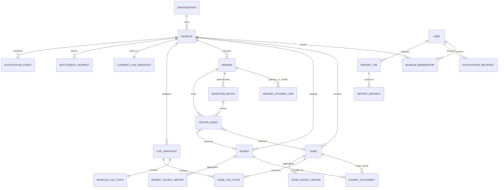

# Mundo Database Implementation Specification

**Document status:** implementation handoff
**Schema contract version:** 1.0
**Recommended engine:** PostgreSQL 16 or newer
**Companion document:** [`backend.md`](./backend.md)

This document defines the relational model and data lifecycle required to implement the Mundo backend. It is designed to preserve tenant isolation, anonymous visitor privacy, live dashboard performance, historical reproducibility, late-event correction, and durable report generation.

The SQL below is reference-quality migration material, not a single migration to paste into production. Split it into ordered, reviewed migrations; add rollback/runbook notes; and verify it against the exact PostgreSQL version used by the team.

Sections are organized by domain for readability, so their code blocks are not in executable dependency order. Section 24 is the authoritative migration order; for example, create `museum.museums` before identity tables that reference it.

## 1. Design decisions

1. **PostgreSQL is the source of truth.** Redis may cache responses and coordinate jobs, but losing Redis must not lose accepted events, settings, alerts, or report state.
2. **Every museum-owned row carries `museum_id`.** Application authorization and row-level security both enforce that boundary.
3. **Raw events are immutable.** Corrections are new events or derived-state revisions; accepted evidence is not edited away.
4. **Live reads use precomputed state.** A 30-second dashboard poll must not scan the raw event table.
5. **Historical reads use aggregates.** Heatmaps and exhibit rankings read hourly/daily tables with a calculation version and source watermark.
6. **Dates and timestamps are different concepts.** Timestamps are UTC `timestamptz`; an operational date is a `date` interpreted in the museum's IANA timezone.
7. **Durations are integer seconds and percentages are numeric values.** Formatted values such as `18m 42s` or `Jul 1–24, 2026` are presentation only.
8. **Missing data is `NULL`, not zero.** Every aggregate includes coverage/quality fields.
9. **Reports are immutable snapshots.** A report stores its normalized request, source watermark, calculation versions, template version, and artifact checksums.
10. **No direct visitor PII is required.** Session-level calculations use short-lived, daily rotating pseudonymous keys or aggregate sensor counts.

## 2. Domain vocabulary

Use these names consistently in SQL, services, OpenAPI, tests, and analytics jobs.

| Term | Meaning |
|---|---|
| Organization | Institution that owns one or more museum workspaces. |
| Museum | Tenant/workspace visible to the Mundo user. |
| Zone | Capacity-controlled public area such as Ancient Worlds. |
| Entry point | Directional or bidirectional crossing attached to a museum or zone. |
| Exhibit | Trackable curated object or experience inside a zone. |
| Sensor | Authenticated source capable of producing one or more event types. |
| Raw event | Immutable anonymous count/session observation from a sensor. |
| Watermark | Latest event time fully included in a committed aggregate revision. |
| Snapshot | Coherent live museum/zone state at one moment. |
| Bucket | Fixed analytics interval, normally an hour for the current UI. |
| Incident | Durable bottleneck lifecycle record, not merely a high occupancy value. |
| Report job | Immutable request plus its asynchronous rendering state. |
| Artifact | Private PDF or CSV object created for a report job. |

## 3. Schemas and extensions

Recommended logical schemas:

```sql
CREATE EXTENSION IF NOT EXISTS citext;
CREATE EXTENSION IF NOT EXISTS pg_trgm;
CREATE EXTENSION IF NOT EXISTS btree_gist;

CREATE SCHEMA IF NOT EXISTS identity;
CREATE SCHEMA IF NOT EXISTS museum;
CREATE SCHEMA IF NOT EXISTS telemetry;
CREATE SCHEMA IF NOT EXISTS analytics;
CREATE SCHEMA IF NOT EXISTS operations;
CREATE SCHEMA IF NOT EXISTS reporting;
CREATE SCHEMA IF NOT EXISTS audit;
CREATE SCHEMA IF NOT EXISTS app_private;
```

- `identity`: staff accounts, memberships, sessions, password recovery, user preferences.
- `museum`: organizations, museums, zones, capacities, exhibits, sensors, operating configuration.
- `telemetry`: ingestion batches, deduplication keys, raw events, heartbeats, dead letters.
- `analytics`: derived sessions, live state, snapshots, time buckets, metric definitions, quality.
- `operations`: bottlenecks, insights, notifications, idempotency, transactional outbox.
- `reporting`: report jobs, job state history, private artifact metadata.
- `audit`: append-only security and administrative audit records.
- `app_private`: helper functions not granted directly to application users.

Do not install a time-series extension solely for the first release. Native range partitioning and the indexes below are sufficient at moderate scale. TimescaleDB can be evaluated later with measured event volume and operational capacity.

### 3.1 Relationship overview



## 4. Common conventions

### 4.1 Primary keys

Use UUID primary keys with `gen_random_uuid()` unless the application provides a validated UUIDv7. Never expose sequential database IDs as authorization boundaries.

### 4.2 Timestamps

Every mutable business table should have:

```sql
created_at timestamptz NOT NULL DEFAULT now(),
updated_at timestamptz NOT NULL DEFAULT now()
```

Update `updated_at` in one shared trigger or explicitly in repository code. Pick one approach and test it; do not mix ad hoc behavior.

### 4.3 Soft deletion

- Catalog rows use `archived_at` or an `active` flag because historical analytics still reference them.
- Security tokens and expired temporary data are hard-deleted after retention.
- Raw events are removed by dropping expired partitions.
- Report jobs may be retained after artifacts expire.

### 4.4 Tenant-safe foreign keys

Parent tables expose `UNIQUE (museum_id, id)`. Child tables use composite foreign keys such as:

```sql
FOREIGN KEY (museum_id, zone_id)
  REFERENCES museum.zones (museum_id, id)
```

This prevents accidentally connecting a museum A event to a museum B zone even when application validation fails.

### 4.5 Machine values

Use lowercase `text` with `CHECK` constraints for business state rather than PostgreSQL enums. Adding a new state then remains a normal constraint migration.

## 5. Identity and access tables

### 5.1 Users

```sql
CREATE TABLE identity.users (
  id uuid PRIMARY KEY DEFAULT gen_random_uuid(),
  email citext NOT NULL UNIQUE,
  password_hash text,
  display_name text NOT NULL,
  avatar_url text,
  locale text NOT NULL DEFAULT 'en-GB',
  status text NOT NULL DEFAULT 'invited'
    CHECK (status IN ('invited', 'active', 'suspended', 'disabled')),
  email_verified_at timestamptz,
  password_changed_at timestamptz,
  last_login_at timestamptz,
  created_at timestamptz NOT NULL DEFAULT now(),
  updated_at timestamptz NOT NULL DEFAULT now(),
  CHECK (length(trim(display_name)) BETWEEN 1 AND 160)
);
```

Rules:

- normalize email in application code before insert; `citext` provides case-insensitive uniqueness;
- `password_hash` may be null for an invited or future SSO-only user;
- never store reset tokens, plaintext passwords, or password hints here;
- account status changes must be audited and active sessions revoked when appropriate.

### 5.2 Organizations and memberships

Organizations and museums are defined in the next section. Membership references both user and museum:

```sql
CREATE TABLE identity.museum_memberships (
  museum_id uuid NOT NULL,
  user_id uuid NOT NULL REFERENCES identity.users(id) ON DELETE CASCADE,
  role text NOT NULL
    CHECK (role IN ('viewer', 'analyst', 'operator', 'curator', 'museum_admin')),
  status text NOT NULL DEFAULT 'active'
    CHECK (status IN ('invited', 'active', 'suspended')),
  invited_by uuid REFERENCES identity.users(id),
  invited_at timestamptz,
  accepted_at timestamptz,
  created_at timestamptz NOT NULL DEFAULT now(),
  updated_at timestamptz NOT NULL DEFAULT now(),
  PRIMARY KEY (museum_id, user_id),
  FOREIGN KEY (museum_id, invited_by)
    REFERENCES identity.museum_memberships (museum_id, user_id)
);
```

Add the museum foreign key after `museum.museums` is created:

```sql
ALTER TABLE identity.museum_memberships
  ADD CONSTRAINT museum_memberships_museum_fk
  FOREIGN KEY (museum_id) REFERENCES museum.museums(id) ON DELETE CASCADE;
```

If one user needs multiple simultaneous roles later, introduce role and membership-role tables. Do not encode multiple roles in a comma-separated column.

### 5.3 Browser sessions

```sql
CREATE TABLE identity.sessions (
  id uuid PRIMARY KEY DEFAULT gen_random_uuid(),
  user_id uuid NOT NULL REFERENCES identity.users(id) ON DELETE CASCADE,
  active_museum_id uuid,
  token_hash bytea NOT NULL UNIQUE,
  csrf_secret_hash bytea,
  created_at timestamptz NOT NULL DEFAULT now(),
  last_seen_at timestamptz NOT NULL DEFAULT now(),
  idle_expires_at timestamptz NOT NULL,
  absolute_expires_at timestamptz NOT NULL,
  revoked_at timestamptz,
  revoke_reason text,
  ip_address inet,
  user_agent text,
  FOREIGN KEY (active_museum_id, user_id)
    REFERENCES identity.museum_memberships (museum_id, user_id) ON DELETE CASCADE,
  CHECK (idle_expires_at <= absolute_expires_at)
);

CREATE INDEX sessions_active_user_idx
  ON identity.sessions (user_id, absolute_expires_at DESC)
  WHERE revoked_at IS NULL;

CREATE INDEX sessions_expiry_idx
  ON identity.sessions (absolute_expires_at);
```

Store a keyed hash of the opaque cookie token, not the raw cookie. Session validation checks revoked, idle, absolute expiry, user status, and active membership.

### 5.4 Password-reset tokens

```sql
CREATE TABLE identity.password_reset_tokens (
  id uuid PRIMARY KEY DEFAULT gen_random_uuid(),
  user_id uuid NOT NULL REFERENCES identity.users(id) ON DELETE CASCADE,
  token_hash bytea NOT NULL UNIQUE,
  requested_at timestamptz NOT NULL DEFAULT now(),
  expires_at timestamptz NOT NULL,
  used_at timestamptz,
  requested_ip inet,
  requested_user_agent text,
  CHECK (expires_at > requested_at),
  CHECK (used_at IS NULL OR used_at >= requested_at)
);

CREATE INDEX password_reset_active_user_idx
  ON identity.password_reset_tokens (user_id, expires_at DESC)
  WHERE used_at IS NULL;

CREATE INDEX password_reset_expiry_idx
  ON identity.password_reset_tokens (expires_at);
```

The reset transaction locks the token row, verifies hash/expiry/use state, marks it used, changes the password, revokes sessions, revokes sibling reset tokens, writes an audit record, and commits atomically.

### 5.5 User preferences

```sql
CREATE TABLE identity.user_preferences (
  museum_id uuid NOT NULL REFERENCES museum.museums(id) ON DELETE CASCADE,
  user_id uuid NOT NULL REFERENCES identity.users(id) ON DELETE CASCADE,
  default_landing_page_override text
    CHECK (default_landing_page_override IS NULL OR default_landing_page_override IN ('dashboard', 'heatmap', 'exhibits')),
  theme text CHECK (theme IS NULL OR theme IN ('light', 'dark', 'system')),
  auto_refresh_override boolean,
  refresh_interval_override_seconds integer
    CHECK (refresh_interval_override_seconds IS NULL OR refresh_interval_override_seconds IN (15, 30, 60)),
  bottleneck_alerts_override boolean,
  report_ready_alerts_override boolean,
  version bigint NOT NULL DEFAULT 1,
  created_at timestamptz NOT NULL DEFAULT now(),
  updated_at timestamptz NOT NULL DEFAULT now(),
  PRIMARY KEY (museum_id, user_id),
  FOREIGN KEY (museum_id, user_id)
    REFERENCES identity.museum_memberships (museum_id, user_id) ON DELETE CASCADE
);
```

Provision one row when a membership becomes active. Every field is a personal override: `NULL` means inherit the workspace default. The Settings page reads/writes landing page, theme, refresh, and notification preferences through the membership-scoped `/preferences` endpoint with this row's `version`; theme may additionally be mirrored locally only to avoid a first-paint flash. These personal writes do not require museum-admin permission.

## 6. Museum and catalog tables

### 6.1 Organizations and museums

```sql
CREATE TABLE museum.organizations (
  id uuid PRIMARY KEY DEFAULT gen_random_uuid(),
  slug text NOT NULL UNIQUE,
  name text NOT NULL,
  status text NOT NULL DEFAULT 'active'
    CHECK (status IN ('active', 'suspended', 'closed')),
  created_at timestamptz NOT NULL DEFAULT now(),
  updated_at timestamptz NOT NULL DEFAULT now(),
  CHECK (slug ~ '^[a-z0-9]+(?:-[a-z0-9]+)*$'),
  CHECK (length(trim(name)) BETWEEN 1 AND 200)
);

CREATE TABLE museum.museums (
  id uuid PRIMARY KEY DEFAULT gen_random_uuid(),
  organization_id uuid NOT NULL REFERENCES museum.organizations(id),
  slug text NOT NULL,
  code text NOT NULL,
  name text NOT NULL,
  timezone text NOT NULL DEFAULT 'Africa/Accra',
  status text NOT NULL DEFAULT 'active'
    CHECK (status IN ('active', 'suspended', 'closed')),
  opened_on date,
  archived_at timestamptz,
  created_at timestamptz NOT NULL DEFAULT now(),
  updated_at timestamptz NOT NULL DEFAULT now(),
  UNIQUE (organization_id, slug),
  UNIQUE (organization_id, code),
  UNIQUE (id, organization_id),
  CHECK (slug ~ '^[a-z0-9]+(?:-[a-z0-9]+)*$'),
  CHECK (length(trim(name)) BETWEEN 1 AND 200)
);
```

Validate `timezone` against the PostgreSQL timezone catalog or an application IANA timezone library in the save transaction. A mutable timezone change is high impact: audit it and trigger re-evaluation of future local-date schedules, but do not rewrite stored UTC buckets.

### 6.2 Workspace settings

```sql
CREATE TABLE museum.workspace_settings (
  museum_id uuid PRIMARY KEY REFERENCES museum.museums(id) ON DELETE CASCADE,
  default_landing_page text NOT NULL DEFAULT 'dashboard'
    CHECK (default_landing_page IN ('dashboard', 'heatmap', 'exhibits')),
  auto_refresh_default boolean NOT NULL DEFAULT true,
  refresh_interval_seconds integer NOT NULL DEFAULT 30
    CHECK (refresh_interval_seconds IN (15, 30, 60)),
  busy_threshold_percent numeric(5,2) NOT NULL DEFAULT 70
    CHECK (busy_threshold_percent BETWEEN 50 AND 80),
  critical_threshold_percent numeric(5,2) NOT NULL DEFAULT 85
    CHECK (critical_threshold_percent BETWEEN 75 AND 100),
  bottleneck_alerts_default boolean NOT NULL DEFAULT true,
  report_ready_alerts_default boolean NOT NULL DEFAULT true,
  stale_after_seconds integer NOT NULL DEFAULT 60
    CHECK (stale_after_seconds BETWEEN 30 AND 3600),
  minimum_reliable_coverage_percent numeric(5,2) NOT NULL DEFAULT 80
    CHECK (minimum_reliable_coverage_percent BETWEEN 0 AND 100),
  version bigint NOT NULL DEFAULT 1,
  updated_by uuid REFERENCES identity.users(id),
  created_at timestamptz NOT NULL DEFAULT now(),
  updated_at timestamptz NOT NULL DEFAULT now(),
  FOREIGN KEY (museum_id, updated_by)
    REFERENCES identity.museum_memberships (museum_id, user_id),
  CHECK (busy_threshold_percent + 5 <= critical_threshold_percent)
);
```

The admin-only `/settings` read model merges museum name/timezone with this workspace row and uses this row's single `version` for optimistic concurrency. The row is mandatory for every museum. Every workspace Settings PATCH—including a name-only or timezone-only change—requires `museum_admin`, locks this row, compares `If-Match`, updates the requested museum/workspace fields, and increments this version in the same transaction. The same Settings page uses a separate `/preferences` request/version for the signed-in member's landing page, theme, refresh, and notification choices; do not combine the two optimistic-concurrency domains into one write.

### 6.3 Operating hours

```sql
CREATE TABLE museum.operating_hours (
  id uuid PRIMARY KEY DEFAULT gen_random_uuid(),
  museum_id uuid NOT NULL REFERENCES museum.museums(id) ON DELETE CASCADE,
  day_of_week smallint NOT NULL CHECK (day_of_week BETWEEN 0 AND 6),
  opens_at time,
  closes_at time,
  closed boolean NOT NULL DEFAULT false,
  valid_from date NOT NULL DEFAULT current_date,
  valid_to date,
  created_at timestamptz NOT NULL DEFAULT now(),
  CHECK (
    (closed AND opens_at IS NULL AND closes_at IS NULL)
    OR
    (NOT closed AND opens_at IS NOT NULL AND closes_at IS NOT NULL AND opens_at < closes_at)
  ),
  CHECK (valid_to IS NULL OR valid_to >= valid_from)
);

CREATE INDEX operating_hours_lookup_idx
  ON museum.operating_hours (museum_id, valid_from, valid_to, day_of_week);
```

Add a separate closures/exceptions table for holidays and one-off openings rather than mutating recurring hours.

### 6.4 Zones and effective capacity

```sql
CREATE TABLE museum.zones (
  id uuid PRIMARY KEY DEFAULT gen_random_uuid(),
  museum_id uuid NOT NULL REFERENCES museum.museums(id) ON DELETE CASCADE,
  parent_zone_id uuid,
  slug text NOT NULL,
  code text NOT NULL,
  name text NOT NULL,
  short_name text NOT NULL,
  default_capacity integer NOT NULL CHECK (default_capacity > 0),
  floor_level text,
  public_access boolean NOT NULL DEFAULT true,
  display_order integer NOT NULL DEFAULT 0,
  active boolean NOT NULL DEFAULT true,
  metadata jsonb NOT NULL DEFAULT '{}'::jsonb,
  archived_at timestamptz,
  created_at timestamptz NOT NULL DEFAULT now(),
  updated_at timestamptz NOT NULL DEFAULT now(),
  UNIQUE (museum_id, id),
  UNIQUE (museum_id, slug),
  UNIQUE (museum_id, code),
  FOREIGN KEY (museum_id, parent_zone_id)
    REFERENCES museum.zones (museum_id, id),
  CHECK (slug ~ '^[a-z0-9]+(?:-[a-z0-9]+)*$'),
  CHECK (length(trim(name)) BETWEEN 1 AND 160),
  CHECK (length(trim(short_name)) BETWEEN 1 AND 40)
);

CREATE INDEX zones_active_display_idx
  ON museum.zones (museum_id, display_order, id)
  WHERE active AND archived_at IS NULL;

CREATE INDEX zones_name_trgm_idx
  ON museum.zones USING gin (lower(name) gin_trgm_ops);

CREATE TABLE museum.zone_capacity_versions (
  id uuid PRIMARY KEY DEFAULT gen_random_uuid(),
  museum_id uuid NOT NULL,
  zone_id uuid NOT NULL,
  capacity integer NOT NULL CHECK (capacity > 0),
  effective_from timestamptz NOT NULL,
  effective_to timestamptz,
  reason text,
  created_by uuid REFERENCES identity.users(id),
  created_at timestamptz NOT NULL DEFAULT now(),
  UNIQUE (zone_id, effective_from),
  FOREIGN KEY (museum_id, zone_id)
    REFERENCES museum.zones (museum_id, id) ON DELETE CASCADE,
  FOREIGN KEY (museum_id, created_by)
    REFERENCES identity.museum_memberships (museum_id, user_id),
  CHECK (effective_to IS NULL OR effective_to > effective_from),
  EXCLUDE USING gist (
    museum_id WITH =,
    zone_id WITH =,
    tstzrange(effective_from, effective_to, '[)') WITH &&
  )
);

CREATE INDEX zone_capacity_effective_idx
  ON museum.zone_capacity_versions (museum_id, zone_id, effective_from DESC);
```

The GiST exclusion constraint prevents overlapping effective ranges; the capacity-management transaction still locks the zone while closing one version and inserting the next. Historical occupancy and reports use the capacity effective at each sample time, not today's default capacity.

### 6.5 Entry points

```sql
CREATE TABLE museum.entry_points (
  id uuid PRIMARY KEY DEFAULT gen_random_uuid(),
  museum_id uuid NOT NULL REFERENCES museum.museums(id) ON DELETE CASCADE,
  zone_id uuid,
  code text NOT NULL,
  name text NOT NULL,
  direction text NOT NULL
    CHECK (direction IN ('entry', 'exit', 'bidirectional', 'internal_transition')),
  active boolean NOT NULL DEFAULT true,
  metadata jsonb NOT NULL DEFAULT '{}'::jsonb,
  created_at timestamptz NOT NULL DEFAULT now(),
  updated_at timestamptz NOT NULL DEFAULT now(),
  UNIQUE (museum_id, id),
  UNIQUE (museum_id, code),
  FOREIGN KEY (museum_id, zone_id)
    REFERENCES museum.zones (museum_id, id)
);
```

### 6.6 Exhibits

```sql
CREATE TABLE museum.exhibits (
  id uuid PRIMARY KEY DEFAULT gen_random_uuid(),
  museum_id uuid NOT NULL REFERENCES museum.museums(id) ON DELETE CASCADE,
  slug text NOT NULL,
  code text NOT NULL,
  name text NOT NULL,
  status text NOT NULL DEFAULT 'active'
    CHECK (status IN ('draft', 'active', 'maintenance', 'retired')),
  tracking_enabled boolean NOT NULL DEFAULT true,
  minimum_view_seconds integer NOT NULL DEFAULT 3
    CHECK (minimum_view_seconds BETWEEN 1 AND 3600),
  target_dwell_seconds integer
    CHECK (target_dwell_seconds IS NULL OR target_dwell_seconds > 0),
  completion_rule jsonb NOT NULL DEFAULT '{}'::jsonb,
  display_order integer NOT NULL DEFAULT 0,
  active_from timestamptz,
  active_to timestamptz,
  metadata jsonb NOT NULL DEFAULT '{}'::jsonb,
  archived_at timestamptz,
  created_at timestamptz NOT NULL DEFAULT now(),
  updated_at timestamptz NOT NULL DEFAULT now(),
  UNIQUE (museum_id, id),
  UNIQUE (museum_id, slug),
  UNIQUE (museum_id, code),
  CHECK (active_to IS NULL OR active_from IS NULL OR active_to > active_from)
);

CREATE INDEX exhibits_active_display_idx
  ON museum.exhibits (museum_id, status, display_order, id)
  WHERE archived_at IS NULL;

CREATE INDEX exhibits_name_trgm_idx
  ON museum.exhibits USING gin (lower(name) gin_trgm_ops);

CREATE INDEX exhibits_code_trgm_idx
  ON museum.exhibits USING gin (lower(code) gin_trgm_ops);

CREATE TABLE museum.exhibit_placements (
  id uuid PRIMARY KEY DEFAULT gen_random_uuid(),
  museum_id uuid NOT NULL REFERENCES museum.museums(id) ON DELETE CASCADE,
  exhibit_id uuid NOT NULL,
  zone_id uuid NOT NULL,
  location_label text,
  valid_during tstzrange NOT NULL,
  created_by uuid NOT NULL REFERENCES identity.users(id),
  created_at timestamptz NOT NULL DEFAULT now(),
  UNIQUE (museum_id, id),
  UNIQUE (museum_id, id, exhibit_id, zone_id),
  FOREIGN KEY (museum_id, exhibit_id)
    REFERENCES museum.exhibits (museum_id, id),
  FOREIGN KEY (museum_id, zone_id)
    REFERENCES museum.zones (museum_id, id),
  FOREIGN KEY (museum_id, created_by)
    REFERENCES identity.museum_memberships (museum_id, user_id),
  CHECK (NOT isempty(valid_during)),
  EXCLUDE USING gist (
    museum_id WITH =,
    exhibit_id WITH =,
    valid_during WITH &&
  )
);

CREATE INDEX exhibit_placements_zone_period_idx
  ON museum.exhibit_placements USING gist (museum_id, zone_id, valid_during);
```

An exhibit's zone is resolved from the placement containing the event timestamp. The catalog/bootstrap query may expose the placement containing `now()` as the current zone, but it must not rewrite historical analytics when a curator moves the exhibit. Future placements are allowed; overlapping placements for one exhibit are not. Once telemetry references a placement, its museum/exhibit/zone/lower bound are immutable. A controlled move closes the old upper bound and inserts a successor in one locked transaction; it never reassigns the old row or deletes history.

### 6.7 Sensors and credentials

```sql
CREATE TABLE museum.sensors (
  id uuid PRIMARY KEY DEFAULT gen_random_uuid(),
  museum_id uuid NOT NULL REFERENCES museum.museums(id) ON DELETE CASCADE,
  zone_id uuid,
  exhibit_id uuid,
  entry_point_id uuid,
  external_id text NOT NULL,
  name text NOT NULL,
  kind text NOT NULL
    CHECK (kind IN ('people_counter', 'presence', 'interaction', 'queue', 'gateway', 'manual', 'other')),
  capabilities text[] NOT NULL DEFAULT '{}',
  status text NOT NULL DEFAULT 'provisioning'
    CHECK (status IN ('provisioning', 'online', 'degraded', 'offline', 'maintenance', 'retired')),
  required_for_coverage boolean NOT NULL DEFAULT true,
  expected_heartbeat_seconds integer
    CHECK (expected_heartbeat_seconds IS NULL OR expected_heartbeat_seconds BETWEEN 5 AND 86400),
  firmware_version text,
  last_heartbeat_at timestamptz,
  activated_at timestamptz,
  retired_at timestamptz,
  metadata jsonb NOT NULL DEFAULT '{}'::jsonb,
  created_at timestamptz NOT NULL DEFAULT now(),
  updated_at timestamptz NOT NULL DEFAULT now(),
  UNIQUE (museum_id, id),
  UNIQUE (museum_id, external_id),
  FOREIGN KEY (museum_id, zone_id)
    REFERENCES museum.zones (museum_id, id),
  FOREIGN KEY (museum_id, exhibit_id)
    REFERENCES museum.exhibits (museum_id, id),
  FOREIGN KEY (museum_id, entry_point_id)
    REFERENCES museum.entry_points (museum_id, id)
);

CREATE INDEX sensors_health_idx
  ON museum.sensors (museum_id, status, last_heartbeat_at)
  WHERE status <> 'retired';

CREATE TABLE museum.sensor_gateway_links (
  id uuid PRIMARY KEY DEFAULT gen_random_uuid(),
  museum_id uuid NOT NULL REFERENCES museum.museums(id) ON DELETE CASCADE,
  gateway_sensor_id uuid NOT NULL,
  emitting_sensor_id uuid NOT NULL,
  valid_during tstzrange NOT NULL DEFAULT tstzrange(now(), NULL, '[)'),
  created_by uuid NOT NULL REFERENCES identity.users(id),
  created_at timestamptz NOT NULL DEFAULT now(),
  UNIQUE (museum_id, id),
  FOREIGN KEY (museum_id, gateway_sensor_id)
    REFERENCES museum.sensors (museum_id, id) ON DELETE CASCADE,
  FOREIGN KEY (museum_id, emitting_sensor_id)
    REFERENCES museum.sensors (museum_id, id) ON DELETE CASCADE,
  FOREIGN KEY (museum_id, created_by)
    REFERENCES identity.museum_memberships (museum_id, user_id),
  CHECK (gateway_sensor_id <> emitting_sensor_id),
  CHECK (NOT isempty(valid_during)),
  EXCLUDE USING gist (
    museum_id WITH =,
    gateway_sensor_id WITH =,
    emitting_sensor_id WITH =,
    valid_during WITH &&
  )
);

CREATE INDEX sensor_gateway_links_emitter_period_idx
  ON museum.sensor_gateway_links USING gist
  (museum_id, emitting_sensor_id, valid_during);

CREATE TABLE museum.sensor_credentials (
  id uuid PRIMARY KEY DEFAULT gen_random_uuid(),
  museum_id uuid NOT NULL,
  sensor_id uuid NOT NULL,
  key_id text NOT NULL UNIQUE,
  secret_ciphertext bytea,
  secret_kms_key_id text,
  certificate_fingerprint text,
  status text NOT NULL DEFAULT 'active'
    CHECK (status IN ('active', 'rotating', 'revoked', 'expired')),
  valid_from timestamptz NOT NULL DEFAULT now(),
  valid_to timestamptz,
  last_used_at timestamptz,
  revoked_at timestamptz,
  created_at timestamptz NOT NULL DEFAULT now(),
  FOREIGN KEY (museum_id, sensor_id)
    REFERENCES museum.sensors (museum_id, id) ON DELETE CASCADE,
  CHECK (
    (secret_ciphertext IS NOT NULL AND secret_kms_key_id IS NOT NULL)
    OR certificate_fingerprint IS NOT NULL
  ),
  CHECK (valid_to IS NULL OR valid_to > valid_from)
);

CREATE TABLE museum.sensor_maintenance_windows (
  id uuid PRIMARY KEY DEFAULT gen_random_uuid(),
  museum_id uuid NOT NULL,
  sensor_id uuid NOT NULL,
  starts_at timestamptz NOT NULL,
  ends_at timestamptz NOT NULL,
  reason text NOT NULL,
  created_by uuid REFERENCES identity.users(id),
  created_at timestamptz NOT NULL DEFAULT now(),
  FOREIGN KEY (museum_id, sensor_id)
    REFERENCES museum.sensors (museum_id, id) ON DELETE CASCADE,
  FOREIGN KEY (museum_id, created_by)
    REFERENCES identity.museum_memberships (museum_id, user_id),
  CHECK (ends_at > starts_at)
);
```

Secret material belongs in a secret manager when possible. HMAC verification requires access to the HMAC key, so a database-backed implementation stores only envelope-encrypted ciphertext plus its KMS key identifier. An mTLS/public-key design may store only a certificate/public-key fingerprint. Never store a plaintext device secret.

`sensor_gateway_links` is the authorization boundary for a gateway that forwards events from child sensors. The ingest procedure must require an active link containing the batch `received_at` for every distinct emitter in the request; a gateway may always emit its own events without a self-link. Creating a link must also verify that `gateway_sensor_id` has `kind = 'gateway'` and both sensors are active in the same museum. Enforce those cross-row checks in the privileged link-management procedure (and repeat the active-link check during ingestion), not only in application memory.

## 7. Telemetry ingestion tables

### 7.1 Ingestion batches

```sql
CREATE TABLE telemetry.ingestion_batches (
  id uuid PRIMARY KEY DEFAULT gen_random_uuid(),
  museum_id uuid NOT NULL REFERENCES museum.museums(id) ON DELETE CASCADE,
  authenticated_gateway_sensor_id uuid NOT NULL,
  idempotency_key text NOT NULL,
  schema_version integer NOT NULL,
  sent_at timestamptz,
  received_at timestamptz NOT NULL DEFAULT now(),
  body_sha256 bytea NOT NULL,
  event_count integer NOT NULL CHECK (event_count >= 0),
  accepted_count integer NOT NULL DEFAULT 0 CHECK (accepted_count >= 0),
  duplicate_count integer NOT NULL DEFAULT 0 CHECK (duplicate_count >= 0),
  rejected_count integer NOT NULL DEFAULT 0 CHECK (rejected_count >= 0),
  status text NOT NULL DEFAULT 'received'
    CHECK (status IN ('received', 'accepted', 'partially_accepted', 'rejected')),
  processing_completed_at timestamptz,
  metadata jsonb NOT NULL DEFAULT '{}'::jsonb,
  UNIQUE (museum_id, id),
  UNIQUE (authenticated_gateway_sensor_id, idempotency_key),
  FOREIGN KEY (museum_id, authenticated_gateway_sensor_id)
    REFERENCES museum.sensors (museum_id, id),
  CHECK (accepted_count + duplicate_count + rejected_count <= event_count),
  CHECK (
    (status = 'received' AND processing_completed_at IS NULL)
    OR
    (
      status <> 'received'
      AND processing_completed_at IS NOT NULL
      AND accepted_count + duplicate_count + rejected_count = event_count
      AND (status <> 'accepted' OR rejected_count = 0)
      AND (status <> 'partially_accepted' OR (accepted_count + duplicate_count > 0 AND rejected_count > 0))
      AND (status <> 'rejected' OR (accepted_count + duplicate_count = 0 AND rejected_count > 0))
    )
  )
);

CREATE INDEX ingestion_batches_museum_received_idx
  ON telemetry.ingestion_batches (museum_id, received_at DESC);
```

The authenticated gateway is the credential-bearing caller represented by `gatewayId` in the backend contract. Each event separately identifies its emitting sensor. The stored body hash allows the API to detect an idempotency key reused with a different body.

### 7.2 Global event deduplication

PostgreSQL unique constraints on a range-partitioned table must include its partition key. Use a small, non-partitioned deduplication table for a global sensor event ID:

```sql
CREATE TABLE telemetry.event_deduplication (
  museum_id uuid NOT NULL,
  emitting_sensor_id uuid NOT NULL,
  source_event_id text NOT NULL,
  canonical_event_id uuid NOT NULL,
  occurred_at timestamptz NOT NULL,
  first_received_at timestamptz NOT NULL DEFAULT now(),
  expires_at timestamptz NOT NULL,
  PRIMARY KEY (museum_id, emitting_sensor_id, source_event_id),
  UNIQUE (canonical_event_id),
  FOREIGN KEY (museum_id, emitting_sensor_id)
    REFERENCES museum.sensors (museum_id, id) ON DELETE CASCADE
);

CREATE INDEX event_dedup_expiry_idx
  ON telemetry.event_deduplication (expires_at);
```

Keep deduplication keys longer than the maximum accepted event lateness plus the maximum gateway retry window.

### 7.3 Raw visitor events

```sql
CREATE TABLE telemetry.visitor_events (
  id uuid NOT NULL DEFAULT gen_random_uuid(),
  occurred_at timestamptz NOT NULL,
  received_at timestamptz NOT NULL DEFAULT now(),
  museum_id uuid NOT NULL,
  emitting_sensor_id uuid NOT NULL,
  ingestion_batch_id uuid,
  source_event_id text NOT NULL,
  source_sequence bigint,
  event_type text NOT NULL CHECK (event_type IN (
    'museum_entry', 'museum_exit',
    'zone_entry', 'zone_exit', 'zone_presence', 'zone_transition',
    'exhibit_passerby', 'exhibit_view', 'exhibit_interaction',
    'exhibit_start', 'exhibit_complete',
    'queue_observation', 'occupancy_correction'
  )),
  zone_id uuid,
  from_zone_id uuid,
  to_zone_id uuid,
  exhibit_id uuid,
  exhibit_placement_id uuid,
  entry_point_id uuid,
  quantity integer NOT NULL DEFAULT 1 CHECK (quantity > 0),
  correction_delta integer,
  correction_absolute_count integer
    CHECK (correction_absolute_count IS NULL OR correction_absolute_count >= 0),
  queue_length integer CHECK (queue_length IS NULL OR queue_length >= 0),
  estimated_wait_seconds integer CHECK (estimated_wait_seconds IS NULL OR estimated_wait_seconds >= 0),
  throughput_per_minute numeric(10,3)
    CHECK (throughput_per_minute IS NULL OR throughput_per_minute >= 0),
  duration_seconds integer CHECK (duration_seconds IS NULL OR duration_seconds >= 0),
  quality_score numeric(5,4) CHECK (quality_score IS NULL OR quality_score BETWEEN 0 AND 1),
  schema_version integer NOT NULL DEFAULT 1,
  attributes jsonb NOT NULL DEFAULT '{}'::jsonb,
  PRIMARY KEY (occurred_at, id),
  UNIQUE (occurred_at, id, museum_id, emitting_sensor_id),
  FOREIGN KEY (museum_id, emitting_sensor_id)
    REFERENCES museum.sensors (museum_id, id),
  FOREIGN KEY (museum_id, ingestion_batch_id)
    REFERENCES telemetry.ingestion_batches (museum_id, id),
  FOREIGN KEY (museum_id, zone_id)
    REFERENCES museum.zones (museum_id, id),
  FOREIGN KEY (museum_id, from_zone_id)
    REFERENCES museum.zones (museum_id, id),
  FOREIGN KEY (museum_id, to_zone_id)
    REFERENCES museum.zones (museum_id, id),
  FOREIGN KEY (museum_id, exhibit_id)
    REFERENCES museum.exhibits (museum_id, id),
  FOREIGN KEY (museum_id, exhibit_placement_id, exhibit_id, zone_id)
    REFERENCES museum.exhibit_placements (museum_id, id, exhibit_id, zone_id),
  FOREIGN KEY (museum_id, entry_point_id)
    REFERENCES museum.entry_points (museum_id, id),
  CHECK (
    (event_type = 'occupancy_correction' AND num_nonnulls(correction_delta, correction_absolute_count) = 1)
    OR
    (event_type <> 'occupancy_correction' AND correction_delta IS NULL AND correction_absolute_count IS NULL)
  ),
  CHECK (
    (event_type = 'zone_transition' AND from_zone_id IS NOT NULL AND to_zone_id IS NOT NULL AND from_zone_id <> to_zone_id)
    OR
    (event_type <> 'zone_transition' AND from_zone_id IS NULL AND to_zone_id IS NULL)
  ),
  CHECK (
    event_type NOT IN ('zone_entry', 'zone_exit', 'zone_presence', 'occupancy_correction')
    OR zone_id IS NOT NULL
  ),
  CHECK (
    event_type NOT IN ('museum_entry', 'museum_exit')
    OR entry_point_id IS NOT NULL
  ),
  CHECK (
    (event_type IN ('exhibit_passerby', 'exhibit_view', 'exhibit_interaction', 'exhibit_start', 'exhibit_complete')
      AND exhibit_id IS NOT NULL AND zone_id IS NOT NULL AND exhibit_placement_id IS NOT NULL)
    OR
    (event_type NOT IN ('exhibit_passerby', 'exhibit_view', 'exhibit_interaction', 'exhibit_start', 'exhibit_complete')
      AND exhibit_placement_id IS NULL)
  ),
  CHECK (
    (event_type = 'queue_observation'
      AND num_nonnulls(zone_id, entry_point_id) >= 1
      AND num_nonnulls(queue_length, estimated_wait_seconds, throughput_per_minute) >= 1)
    OR
    (event_type <> 'queue_observation'
      AND queue_length IS NULL
      AND estimated_wait_seconds IS NULL
      AND throughput_per_minute IS NULL)
  )
) PARTITION BY RANGE (occurred_at);

CREATE TABLE telemetry.event_processing_state (
  event_id uuid PRIMARY KEY,
  occurred_at timestamptz NOT NULL,
  museum_id uuid NOT NULL,
  emitting_sensor_id uuid NOT NULL,
  status text NOT NULL DEFAULT 'pending'
    CHECK (status IN ('pending', 'processing', 'processed', 'dead_lettered')),
  attempt_count integer NOT NULL DEFAULT 0 CHECK (attempt_count >= 0),
  available_at timestamptz NOT NULL DEFAULT now(),
  lease_owner text,
  lease_expires_at timestamptz,
  completed_at timestamptz,
  last_error_code text,
  last_error_detail text,
  created_at timestamptz NOT NULL DEFAULT now(),
  updated_at timestamptz NOT NULL DEFAULT now(),
  FOREIGN KEY (occurred_at, event_id, museum_id, emitting_sensor_id)
    REFERENCES telemetry.visitor_events (occurred_at, id, museum_id, emitting_sensor_id)
      ON DELETE CASCADE,
  CHECK (
    (status = 'processing' AND lease_owner IS NOT NULL AND lease_expires_at IS NOT NULL AND completed_at IS NULL)
    OR (status = 'pending' AND lease_owner IS NULL AND lease_expires_at IS NULL AND completed_at IS NULL)
    OR (status IN ('processed', 'dead_lettered') AND lease_owner IS NULL AND lease_expires_at IS NULL
        AND completed_at IS NOT NULL)
  )
);

CREATE INDEX event_processing_claim_idx
  ON telemetry.event_processing_state (available_at, created_at)
  WHERE status = 'pending';
```

The ingest transaction first reserves `canonical_event_id` in `event_deduplication`, then inserts `visitor_events.id` with that exact UUID and a `pending` processing-state row. A duplicate reservation returns the already-known canonical ID and never inserts another event. Event-type capability, gateway authorization, active placement at `occurred_at`, timestamp, sequence, and source-assignment checks still run in the privileged ingest procedure; the database checks above enforce the essential record shape. The procedure resolves and stores `exhibit_placement_id` rather than trusting it from the device. It also requires a `museum_entry` point to allow `entry`/`bidirectional` flow and a `museum_exit` point to allow `exit`/`bidirectional` flow. Only `event_processing_state` is updated by workers; the accepted raw event itself stays immutable.

### 7.4 Short-lived event pseudonyms

Do not place an anonymous subject key in the 90-day immutable raw-event row. Store the daily rotating HMAC in a separate table whose partitions can be dropped independently:

```sql
CREATE TABLE telemetry.event_pseudonyms (
  occurred_at timestamptz NOT NULL,
  event_id uuid NOT NULL,
  museum_id uuid NOT NULL,
  emitting_sensor_id uuid NOT NULL,
  anonymous_subject_key bytea NOT NULL,
  local_key_date date NOT NULL,
  created_at timestamptz NOT NULL DEFAULT now(),
  PRIMARY KEY (occurred_at, event_id),
  FOREIGN KEY (occurred_at, event_id, museum_id, emitting_sensor_id)
    REFERENCES telemetry.visitor_events (occurred_at, id, museum_id, emitting_sensor_id) ON DELETE CASCADE
) PARTITION BY RANGE (occurred_at);
```

Partition this table daily. Drop each partition after 48 hours, after the session worker has consumed it. If a longer investigation window is explicitly approved, envelope-encrypt the key and cryptographically erase the daily DEK at expiry. Raw-event immutability is preserved because the long-lived event contains no pseudonym.

Create raw-event monthly partitions and pseudonym daily partitions in advance:

```sql
CREATE TABLE telemetry.visitor_events_2026_07
  PARTITION OF telemetry.visitor_events
  FOR VALUES FROM ('2026-07-01T00:00:00Z') TO ('2026-08-01T00:00:00Z');

CREATE TABLE telemetry.event_pseudonyms_2026_07_24
  PARTITION OF telemetry.event_pseudonyms
  FOR VALUES FROM ('2026-07-24T00:00:00Z') TO ('2026-07-25T00:00:00Z');

CREATE INDEX visitor_events_2026_07_museum_time_idx
  ON telemetry.visitor_events_2026_07 (museum_id, occurred_at, id);

CREATE INDEX visitor_events_2026_07_zone_time_idx
  ON telemetry.visitor_events_2026_07 (museum_id, zone_id, occurred_at)
  WHERE zone_id IS NOT NULL;

CREATE INDEX visitor_events_2026_07_exhibit_time_idx
  ON telemetry.visitor_events_2026_07 (museum_id, exhibit_id, occurred_at)
  WHERE exhibit_id IS NOT NULL;

CREATE INDEX visitor_events_2026_07_time_brin_idx
  ON telemetry.visitor_events_2026_07 USING brin (occurred_at);
```

Automate partition creation at least two months ahead. A monitored default partition may prevent ingestion failure during an operational mistake, but it must be drained promptly because it undermines pruning.

### 7.5 Sensor heartbeats

Heartbeat replay protection also needs a non-partitioned key because the raw heartbeat table is time-partitioned:

```sql
CREATE TABLE telemetry.heartbeat_deduplication (
  museum_id uuid NOT NULL,
  authenticated_gateway_sensor_id uuid NOT NULL,
  emitting_sensor_id uuid NOT NULL,
  source_heartbeat_id text NOT NULL,
  canonical_heartbeat_id uuid NOT NULL,
  occurred_at timestamptz NOT NULL,
  first_received_at timestamptz NOT NULL DEFAULT now(),
  expires_at timestamptz NOT NULL,
  PRIMARY KEY (museum_id, emitting_sensor_id, source_heartbeat_id),
  UNIQUE (canonical_heartbeat_id),
  FOREIGN KEY (museum_id, authenticated_gateway_sensor_id)
    REFERENCES museum.sensors (museum_id, id),
  FOREIGN KEY (museum_id, emitting_sensor_id)
    REFERENCES museum.sensors (museum_id, id) ON DELETE CASCADE,
  CHECK (expires_at > first_received_at)
);

CREATE INDEX heartbeat_dedup_expiry_idx
  ON telemetry.heartbeat_deduplication (expires_at);

CREATE TABLE telemetry.sensor_heartbeats (
  occurred_at timestamptz NOT NULL,
  id uuid NOT NULL,
  museum_id uuid NOT NULL,
  authenticated_gateway_sensor_id uuid NOT NULL,
  emitting_sensor_id uuid NOT NULL,
  source_heartbeat_id text NOT NULL,
  received_at timestamptz NOT NULL DEFAULT now(),
  status text NOT NULL CHECK (status IN ('online', 'degraded', 'offline')),
  battery_percent numeric(5,2) CHECK (battery_percent IS NULL OR battery_percent BETWEEN 0 AND 100),
  latency_ms integer CHECK (latency_ms IS NULL OR latency_ms >= 0),
  firmware_version text,
  attributes jsonb NOT NULL DEFAULT '{}'::jsonb,
  PRIMARY KEY (occurred_at, id),
  FOREIGN KEY (museum_id, authenticated_gateway_sensor_id)
    REFERENCES museum.sensors (museum_id, id),
  FOREIGN KEY (museum_id, emitting_sensor_id)
    REFERENCES museum.sensors (museum_id, id)
) PARTITION BY RANGE (occurred_at);
```

The endpoint reserves `(museum_id, emitting_sensor_id, heartbeatId)` first and records the credential-bearing `authenticated_gateway_sensor_id`, then inserts the returned `canonical_heartbeat_id` as `sensor_heartbeats.id` with the same gateway provenance in one transaction. Replay returns that canonical ID without a second heartbeat row. The partitioned child intentionally has no foreign key back to the small dedup table, so expired dedup keys can be removed while 90-day heartbeat history remains; the privileged insert procedure is the enforcement boundary and direct heartbeat inserts are revoked. If a gateway submits a child heartbeat, apply the same active `sensor_gateway_links` authorization used for events. Keep heartbeat deduplication keys longer than the maximum heartbeat retry window; the worker updates `museum.sensors.last_heartbeat_at` and current status only from accepted heartbeats. Historical heartbeat rows remain append-only and retain both authenticated gateway and emitting sensor for audit.

### 7.6 Dead letters

```sql
CREATE TABLE telemetry.dead_letter_events (
  id uuid PRIMARY KEY DEFAULT gen_random_uuid(),
  museum_id uuid REFERENCES museum.museums(id),
  emitting_sensor_id uuid,
  ingestion_batch_id uuid,
  source_event_id text,
  reason_code text NOT NULL,
  reason_detail text,
  sanitized_payload jsonb NOT NULL,
  first_failed_at timestamptz NOT NULL DEFAULT now(),
  last_failed_at timestamptz NOT NULL DEFAULT now(),
  retry_count integer NOT NULL DEFAULT 0 CHECK (retry_count >= 0),
  resolved_at timestamptz,
  resolution text,
  FOREIGN KEY (museum_id, emitting_sensor_id)
    REFERENCES museum.sensors (museum_id, id),
  FOREIGN KEY (museum_id, ingestion_batch_id)
    REFERENCES telemetry.ingestion_batches (museum_id, id),
  CHECK (emitting_sensor_id IS NULL OR museum_id IS NOT NULL),
  CHECK (ingestion_batch_id IS NULL OR museum_id IS NOT NULL)
);

CREATE INDEX dead_letter_unresolved_idx
  ON telemetry.dead_letter_events (museum_id, first_failed_at DESC)
  WHERE resolved_at IS NULL;
```

Sanitize the payload before insert. It must not contain credentials, raw reset tokens, stable device identity, or prohibited visitor data.

## 8. Privacy-preserving derived sessions

Session tables are optional when a source sends reliable aggregates, but they are needed for dwell, funnel, and return-interaction calculations from event-level sources.

### 8.1 Museum visit sessions

```sql
CREATE TABLE analytics.museum_visit_sessions (
  id uuid PRIMARY KEY DEFAULT gen_random_uuid(),
  museum_id uuid NOT NULL REFERENCES museum.museums(id) ON DELETE CASCADE,
  operational_date date NOT NULL,
  entry_point_id uuid,
  exit_point_id uuid,
  entered_at timestamptz NOT NULL,
  exited_at timestamptz,
  last_seen_at timestamptz NOT NULL,
  status text NOT NULL CHECK (status IN ('active', 'completed', 'timed_out', 'corrected')),
  quality_score numeric(5,4) CHECK (quality_score IS NULL OR quality_score BETWEEN 0 AND 1),
  created_at timestamptz NOT NULL DEFAULT now(),
  updated_at timestamptz NOT NULL DEFAULT now(),
  UNIQUE (museum_id, id),
  FOREIGN KEY (museum_id, entry_point_id)
    REFERENCES museum.entry_points (museum_id, id),
  FOREIGN KEY (museum_id, exit_point_id)
    REFERENCES museum.entry_points (museum_id, id),
  CHECK (exited_at IS NULL OR exited_at >= entered_at)
);

CREATE INDEX museum_visit_active_idx
  ON analytics.museum_visit_sessions (museum_id, last_seen_at DESC)
  WHERE status = 'active';

CREATE TABLE analytics.session_pseudonyms (
  operational_date date NOT NULL,
  museum_id uuid NOT NULL,
  museum_visit_session_id uuid NOT NULL,
  anonymous_subject_key bytea NOT NULL,
  expires_at timestamptz NOT NULL,
  created_at timestamptz NOT NULL DEFAULT now(),
  PRIMARY KEY (operational_date, museum_id, museum_visit_session_id),
  UNIQUE (operational_date, museum_id, anonymous_subject_key),
  FOREIGN KEY (museum_id, museum_visit_session_id)
    REFERENCES analytics.museum_visit_sessions (museum_id, id) ON DELETE CASCADE,
  CHECK (expires_at > created_at)
) PARTITION BY RANGE (operational_date);

CREATE TABLE analytics.session_pseudonyms_2026_07_24
  PARTITION OF analytics.session_pseudonyms
  FOR VALUES FROM ('2026-07-24') TO ('2026-07-25');
```

`session_pseudonyms` is working correlation state, not long-lived analytics. Create daily partitions and drop them on the same 48-hour schedule as `telemetry.event_pseudonyms`. The durable visit-session row retains calculated times and quality but no subject key.

### 8.2 Zone sessions

```sql
CREATE TABLE analytics.zone_visit_sessions (
  id uuid PRIMARY KEY DEFAULT gen_random_uuid(),
  museum_id uuid NOT NULL,
  museum_visit_session_id uuid NOT NULL,
  zone_id uuid NOT NULL,
  entered_at timestamptz NOT NULL,
  exited_at timestamptz,
  dwell_seconds integer CHECK (dwell_seconds IS NULL OR dwell_seconds >= 0),
  status text NOT NULL CHECK (status IN ('active', 'completed', 'timed_out', 'corrected')),
  quality_score numeric(5,4) CHECK (quality_score IS NULL OR quality_score BETWEEN 0 AND 1),
  created_at timestamptz NOT NULL DEFAULT now(),
  updated_at timestamptz NOT NULL DEFAULT now(),
  FOREIGN KEY (museum_id, zone_id)
    REFERENCES museum.zones (museum_id, id),
  FOREIGN KEY (museum_id, museum_visit_session_id)
    REFERENCES analytics.museum_visit_sessions (museum_id, id) ON DELETE CASCADE,
  CHECK (exited_at IS NULL OR exited_at >= entered_at)
);

CREATE INDEX zone_visit_completed_idx
  ON analytics.zone_visit_sessions (museum_id, zone_id, exited_at)
  WHERE status = 'completed';

CREATE UNIQUE INDEX zone_visit_one_active_zone_idx
  ON analytics.zone_visit_sessions (museum_id, museum_visit_session_id)
  WHERE status = 'active';
```

### 8.3 Exhibit engagement sessions

```sql
CREATE TABLE analytics.exhibit_engagement_sessions (
  id uuid PRIMARY KEY DEFAULT gen_random_uuid(),
  museum_id uuid NOT NULL,
  museum_visit_session_id uuid,
  exhibit_id uuid NOT NULL,
  zone_id uuid NOT NULL,
  exhibit_placement_id uuid NOT NULL,
  operational_date date NOT NULL,
  first_passerby_at timestamptz,
  viewed_at timestamptz,
  interaction_started_at timestamptz,
  completed_at timestamptz,
  last_seen_at timestamptz NOT NULL,
  dwell_seconds integer CHECK (dwell_seconds IS NULL OR dwell_seconds >= 0),
  interaction_count integer NOT NULL DEFAULT 0 CHECK (interaction_count >= 0),
  quality_score numeric(5,4) CHECK (quality_score IS NULL OR quality_score BETWEEN 0 AND 1),
  created_at timestamptz NOT NULL DEFAULT now(),
  updated_at timestamptz NOT NULL DEFAULT now(),
  FOREIGN KEY (museum_id, exhibit_id)
    REFERENCES museum.exhibits (museum_id, id),
  FOREIGN KEY (museum_id, zone_id)
    REFERENCES museum.zones (museum_id, id),
  FOREIGN KEY (museum_id, exhibit_placement_id, exhibit_id, zone_id)
    REFERENCES museum.exhibit_placements (museum_id, id, exhibit_id, zone_id),
  FOREIGN KEY (museum_id, museum_visit_session_id)
    REFERENCES analytics.museum_visit_sessions (museum_id, id) ON DELETE CASCADE,
  CHECK (viewed_at IS NULL OR first_passerby_at IS NULL OR viewed_at >= first_passerby_at),
  CHECK (interaction_started_at IS NULL OR viewed_at IS NULL OR interaction_started_at >= viewed_at),
  CHECK (completed_at IS NULL OR interaction_started_at IS NULL OR completed_at >= interaction_started_at)
);

CREATE INDEX exhibit_sessions_period_idx
  ON analytics.exhibit_engagement_sessions (museum_id, exhibit_id, operational_date, last_seen_at);
```

Delete or cryptographically erase pseudonymous subject keys on the configured short retention schedule. These keys exist only in the two short-lived pseudonym tables, are museum-scoped, and rotate at least daily so sessions cannot be linked across days.

## 9. Metric definitions and revisions

```sql
CREATE TABLE analytics.metric_definitions (
  code text NOT NULL,
  version text NOT NULL,
  name text NOT NULL,
  unit text NOT NULL,
  formula text NOT NULL,
  configuration jsonb NOT NULL DEFAULT '{}'::jsonb,
  active_from timestamptz NOT NULL,
  active_to timestamptz,
  created_at timestamptz NOT NULL DEFAULT now(),
  PRIMARY KEY (code, version),
  CHECK (active_to IS NULL OR active_to > active_from)
);

CREATE TABLE analytics.aggregate_revisions (
  id uuid PRIMARY KEY DEFAULT gen_random_uuid(),
  museum_id uuid NOT NULL REFERENCES museum.museums(id) ON DELETE CASCADE,
  scope text NOT NULL CHECK (scope IN ('live', 'hourly', 'daily', 'report_backfill')),
  source_watermark timestamptz NOT NULL,
  calculation_versions jsonb NOT NULL CHECK (jsonb_typeof(calculation_versions) = 'object'),
  workspace_settings_version bigint NOT NULL,
  reason text NOT NULL,
  publish_to_current boolean NOT NULL DEFAULT true,
  provisional boolean NOT NULL DEFAULT false,
  created_at timestamptz NOT NULL DEFAULT now(),
  UNIQUE (museum_id, id)
);

CREATE INDEX aggregate_revisions_museum_idx
  ON analytics.aggregate_revisions (museum_id, created_at DESC);
```

Seed definitions for occupancy, dwell, visitor admissions, current inside, net flow, exhibit view, interaction, completion, capture rate, return rate, engagement score, trend, data coverage, and bottleneck rules.

Aggregate revisions are immutable. A correction or backfill inserts a new revision and new metric rows; it never updates or deletes the prior metric version. Set `publish_to_current = false` for a report-only reconstruction that must be pin-able without changing interactive history; an authorized correction intended for normal reads sets it true. Revoke direct `UPDATE`/`DELETE` from worker/API roles and attach an immutable-row trigger to the revision and aggregate tables. The privileged aggregate insert procedure copies the header watermark/calculation version into child rows and rejects a mismatch. This rule is what makes an asynchronously generated report reproducible after late events.

## 10. Live state and snapshot tables

Each published refresh is immutable and identified by one `snapshot_id`. A small pointer is the only live row updated in place.

### 10.1 Snapshot header and current pointer

```sql
CREATE TABLE analytics.live_snapshots (
  id uuid PRIMARY KEY DEFAULT gen_random_uuid(),
  museum_id uuid NOT NULL REFERENCES museum.museums(id) ON DELETE CASCADE,
  revision_id uuid NOT NULL,
  operational_date date NOT NULL,
  snapshot_at timestamptz NOT NULL,
  source_watermark timestamptz NOT NULL,
  expected_sensor_minutes integer CHECK (expected_sensor_minutes IS NULL OR expected_sensor_minutes >= 0),
  received_sensor_minutes integer CHECK (received_sensor_minutes IS NULL OR received_sensor_minutes >= 0),
  stale_sensor_count integer NOT NULL DEFAULT 0 CHECK (stale_sensor_count >= 0),
  quality_status text NOT NULL
    CHECK (quality_status IN ('good', 'degraded', 'insufficient', 'stale')),
  provisional boolean NOT NULL DEFAULT true,
  published_at timestamptz,
  created_at timestamptz NOT NULL DEFAULT now(),
  UNIQUE (museum_id, id),
  UNIQUE (museum_id, snapshot_at),
  FOREIGN KEY (museum_id, revision_id)
    REFERENCES analytics.aggregate_revisions (museum_id, id),
  CHECK (source_watermark <= snapshot_at),
  CHECK (received_sensor_minutes IS NULL OR expected_sensor_minutes IS NULL OR received_sensor_minutes <= expected_sensor_minutes),
  CHECK (published_at IS NULL OR published_at >= created_at)
);

CREATE TABLE analytics.current_live_snapshot (
  museum_id uuid PRIMARY KEY REFERENCES museum.museums(id) ON DELETE CASCADE,
  snapshot_id uuid NOT NULL,
  updated_at timestamptz NOT NULL DEFAULT now(),
  FOREIGN KEY (museum_id, snapshot_id)
    REFERENCES analytics.live_snapshots (museum_id, id)
);
```

### 10.2 Museum snapshot metrics

```sql
CREATE TABLE analytics.museum_live_state (
  museum_id uuid NOT NULL,
  snapshot_id uuid NOT NULL,
  admissions_today integer CHECK (admissions_today IS NULL OR admissions_today >= 0),
  current_inside integer CHECK (current_inside IS NULL OR current_inside >= 0),
  assigned_inside integer CHECK (assigned_inside IS NULL OR assigned_inside >= 0),
  transitional_inside integer CHECK (transitional_inside IS NULL OR transitional_inside >= 0),
  unassigned_inside integer CHECK (unassigned_inside IS NULL OR unassigned_inside >= 0),
  total_capacity integer CHECK (total_capacity IS NULL OR total_capacity >= 0),
  engagement_seconds_total bigint CHECK (engagement_seconds_total IS NULL OR engagement_seconds_total >= 0),
  engagement_sample_count integer CHECK (engagement_sample_count IS NULL OR engagement_sample_count >= 0),
  exhibit_interactions_today integer CHECK (exhibit_interactions_today IS NULL OR exhibit_interactions_today >= 0),
  active_bottleneck_count integer CHECK (active_bottleneck_count IS NULL OR active_bottleneck_count >= 0),
  admissions_current_hour integer CHECK (admissions_current_hour IS NULL OR admissions_current_hour >= 0),
  exits_current_hour integer CHECK (exits_current_hour IS NULL OR exits_current_hour >= 0),
  PRIMARY KEY (museum_id, snapshot_id),
  FOREIGN KEY (museum_id, snapshot_id)
    REFERENCES analytics.live_snapshots (museum_id, id) ON DELETE CASCADE,
  CHECK (
    current_inside IS NULL
    OR (assigned_inside IS NOT NULL AND transitional_inside IS NOT NULL AND unassigned_inside IS NOT NULL
        AND current_inside = assigned_inside + transitional_inside + unassigned_inside)
  ),
  CHECK (
    (engagement_seconds_total IS NULL) = (engagement_sample_count IS NULL)
    AND (engagement_sample_count IS NULL OR engagement_sample_count > 0)
  )
);
```

`admissions_today` maps to the API/UI field `visitorsToday`: it is the sum of accepted `museum_entry.quantity` values since the museum-local operational-day boundary, so a valid re-entry is counted again. It is not current occupancy. `assigned_inside` is the deduplicated count assigned to exactly one active public zone and must equal the sum of that snapshot's non-null zone counts. `transitional_inside` represents visitors temporarily between modeled zones; `unassigned_inside` represents valid museum occupancy not attributable to a configured zone. `current_inside` is authoritative and reconciles all three. The API derives average engagement, utilization, available capacity, and net flow from stored components.

### 10.3 Zone snapshot metrics

```sql
CREATE TABLE analytics.zone_live_state (
  museum_id uuid NOT NULL,
  snapshot_id uuid NOT NULL,
  zone_id uuid NOT NULL,
  current_visitors integer CHECK (current_visitors IS NULL OR current_visitors >= 0),
  effective_capacity integer CHECK (effective_capacity IS NULL OR effective_capacity > 0),
  dwell_seconds_total bigint CHECK (dwell_seconds_total IS NULL OR dwell_seconds_total >= 0),
  dwell_sample_count integer CHECK (dwell_sample_count IS NULL OR dwell_sample_count >= 0),
  entries_last_hour integer CHECK (entries_last_hour IS NULL OR entries_last_hour >= 0),
  exits_last_hour integer CHECK (exits_last_hour IS NULL OR exits_last_hour >= 0),
  status text NOT NULL CHECK (status IN ('normal', 'busy', 'critical', 'unknown')),
  expected_sensor_minutes integer CHECK (expected_sensor_minutes IS NULL OR expected_sensor_minutes >= 0),
  received_sensor_minutes integer CHECK (received_sensor_minutes IS NULL OR received_sensor_minutes >= 0),
  quality_status text NOT NULL
    CHECK (quality_status IN ('good', 'degraded', 'insufficient', 'stale')),
  PRIMARY KEY (museum_id, snapshot_id, zone_id),
  FOREIGN KEY (museum_id, snapshot_id)
    REFERENCES analytics.live_snapshots (museum_id, id) ON DELETE CASCADE,
  FOREIGN KEY (museum_id, zone_id)
    REFERENCES museum.zones (museum_id, id),
  CHECK (
    (dwell_seconds_total IS NULL) = (dwell_sample_count IS NULL)
    AND (dwell_sample_count IS NULL OR dwell_sample_count > 0)
  ),
  CHECK (received_sensor_minutes IS NULL OR expected_sensor_minutes IS NULL OR received_sensor_minutes <= expected_sensor_minutes)
);

CREATE INDEX zone_live_state_zone_history_idx
  ON analytics.zone_live_state (museum_id, zone_id, snapshot_id);
```

Publishing is one transaction: insert the revision, header, one museum row, and every active-zone row; verify `assigned_inside = sum(zone.current_visitors)`; set `published_at`; then upsert `current_live_snapshot` last. The dashboard joins through that pointer and returns its UUID as `snapshotId`/ETag material. Retain these snapshots for 48 hours; hourly aggregates provide longer history.

## 11. Hourly and daily aggregate tables

### 11.1 Zone-hour metrics

```sql
CREATE TABLE analytics.zone_hourly_metrics (
  museum_id uuid NOT NULL,
  zone_id uuid NOT NULL,
  bucket_start timestamptz NOT NULL,
  bucket_seconds integer NOT NULL CHECK (bucket_seconds > 0),
  local_date date NOT NULL,
  revision_id uuid NOT NULL,
  visitor_sample_total bigint CHECK (visitor_sample_total IS NULL OR visitor_sample_total >= 0),
  visitor_sample_count integer CHECK (visitor_sample_count IS NULL OR visitor_sample_count > 0),
  peak_visitors integer CHECK (peak_visitors IS NULL OR peak_visitors >= 0),
  effective_capacity integer CHECK (effective_capacity IS NULL OR effective_capacity > 0),
  occupancy_percent_total numeric(18,3) CHECK (occupancy_percent_total IS NULL OR occupancy_percent_total >= 0),
  occupancy_sample_count integer CHECK (occupancy_sample_count IS NULL OR occupancy_sample_count > 0),
  peak_occupancy_percent numeric(7,3) CHECK (peak_occupancy_percent IS NULL OR peak_occupancy_percent >= 0),
  entries bigint CHECK (entries IS NULL OR entries >= 0),
  exits bigint CHECK (exits IS NULL OR exits >= 0),
  dwell_seconds_total bigint CHECK (dwell_seconds_total IS NULL OR dwell_seconds_total >= 0),
  dwell_sample_count integer CHECK (dwell_sample_count IS NULL OR dwell_sample_count > 0),
  expected_sensor_minutes integer CHECK (expected_sensor_minutes IS NULL OR expected_sensor_minutes >= 0),
  received_sensor_minutes integer CHECK (received_sensor_minutes IS NULL OR received_sensor_minutes >= 0),
  status text NOT NULL CHECK (status IN ('normal', 'busy', 'critical', 'unknown')),
  quality_status text NOT NULL CHECK (quality_status IN ('good', 'degraded', 'insufficient', 'stale')),
  provisional boolean NOT NULL DEFAULT true,
  source_watermark timestamptz NOT NULL,
  calculation_version text NOT NULL,
  created_at timestamptz NOT NULL DEFAULT now(),
  PRIMARY KEY (museum_id, zone_id, bucket_start, revision_id),
  FOREIGN KEY (museum_id, revision_id)
    REFERENCES analytics.aggregate_revisions (museum_id, id),
  FOREIGN KEY (museum_id, zone_id)
    REFERENCES museum.zones (museum_id, id),
  CHECK ((visitor_sample_total IS NULL) = (visitor_sample_count IS NULL)),
  CHECK ((occupancy_percent_total IS NULL) = (occupancy_sample_count IS NULL)),
  CHECK ((dwell_seconds_total IS NULL) = (dwell_sample_count IS NULL)),
  CHECK (received_sensor_minutes IS NULL OR expected_sensor_minutes IS NULL OR received_sensor_minutes <= expected_sensor_minutes)
);

CREATE INDEX zone_hourly_date_idx
  ON analytics.zone_hourly_metrics (museum_id, local_date, zone_id, bucket_start, revision_id);
```

This table directly supplies every heatmap cell. The UI's metric selector maps as follows:

- occupancy → `occupancy_percent_total / occupancy_sample_count`;
- visitors → `visitor_sample_total / visitor_sample_count`, rounded for display;
- dwell → `dwell_seconds_total / dwell_sample_count`;
- entries → `entries`;
- exits → `exits`.

### 11.2 Museum-hour metrics

```sql
CREATE TABLE analytics.museum_hourly_metrics (
  museum_id uuid NOT NULL REFERENCES museum.museums(id) ON DELETE CASCADE,
  bucket_start timestamptz NOT NULL,
  bucket_seconds integer NOT NULL CHECK (bucket_seconds > 0),
  local_date date NOT NULL,
  revision_id uuid NOT NULL,
  admissions bigint CHECK (admissions IS NULL OR admissions >= 0),
  exits bigint CHECK (exits IS NULL OR exits >= 0),
  current_inside_sample_total bigint CHECK (current_inside_sample_total IS NULL OR current_inside_sample_total >= 0),
  current_inside_sample_count integer CHECK (current_inside_sample_count IS NULL OR current_inside_sample_count > 0),
  effective_capacity_sample_total bigint
    CHECK (effective_capacity_sample_total IS NULL OR effective_capacity_sample_total >= 0),
  peak_current_inside integer CHECK (peak_current_inside IS NULL OR peak_current_inside >= 0),
  exhibit_interactions bigint CHECK (exhibit_interactions IS NULL OR exhibit_interactions >= 0),
  engagement_seconds_total bigint CHECK (engagement_seconds_total IS NULL OR engagement_seconds_total >= 0),
  engagement_sample_count integer CHECK (engagement_sample_count IS NULL OR engagement_sample_count > 0),
  expected_sensor_minutes integer CHECK (expected_sensor_minutes IS NULL OR expected_sensor_minutes >= 0),
  received_sensor_minutes integer CHECK (received_sensor_minutes IS NULL OR received_sensor_minutes >= 0),
  quality_status text NOT NULL CHECK (quality_status IN ('good', 'degraded', 'insufficient', 'stale')),
  provisional boolean NOT NULL DEFAULT true,
  source_watermark timestamptz NOT NULL,
  calculation_version text NOT NULL,
  created_at timestamptz NOT NULL DEFAULT now(),
  PRIMARY KEY (museum_id, bucket_start, revision_id),
  FOREIGN KEY (museum_id, revision_id)
    REFERENCES analytics.aggregate_revisions (museum_id, id),
  CHECK ((current_inside_sample_total IS NULL) = (current_inside_sample_count IS NULL)),
  CHECK ((effective_capacity_sample_total IS NULL) = (current_inside_sample_count IS NULL)),
  CHECK ((engagement_seconds_total IS NULL) = (engagement_sample_count IS NULL)),
  CHECK (received_sensor_minutes IS NULL OR expected_sensor_minutes IS NULL OR received_sensor_minutes <= expected_sensor_minutes)
);
```

This table supplies the dashboard's hourly visitor-flow chart and sparkline inputs. `admissions` is the sum of accepted `museum_entry.quantity` values in the bucket; a valid re-entry is another admission. `current_inside_sample_total` and `effective_capacity_sample_total` are sampled at the same cadence and share `current_inside_sample_count`, so multi-hour utilization is computed as `sum(current_inside_sample_total) / sum(effective_capacity_sample_total)`, never as an average of hourly percentages.

### 11.3 Exhibit-hour metrics

```sql
CREATE TABLE analytics.exhibit_hourly_metrics (
  museum_id uuid NOT NULL,
  exhibit_id uuid NOT NULL,
  zone_id uuid NOT NULL,
  exhibit_placement_id uuid NOT NULL,
  bucket_start timestamptz NOT NULL,
  bucket_seconds integer NOT NULL CHECK (bucket_seconds > 0),
  local_date date NOT NULL,
  revision_id uuid NOT NULL,
  passersby bigint CHECK (passersby IS NULL OR passersby >= 0),
  views bigint CHECK (views IS NULL OR views >= 0),
  interactions bigint CHECK (interactions IS NULL OR interactions >= 0),
  starts bigint CHECK (starts IS NULL OR starts >= 0),
  completions bigint CHECK (completions IS NULL OR completions >= 0),
  return_interactors bigint CHECK (return_interactors IS NULL OR return_interactors >= 0),
  dwell_seconds_total bigint CHECK (dwell_seconds_total IS NULL OR dwell_seconds_total >= 0),
  dwell_sample_count integer CHECK (dwell_sample_count IS NULL OR dwell_sample_count > 0),
  engagement_score numeric(5,2) CHECK (engagement_score IS NULL OR engagement_score BETWEEN 0 AND 100),
  score_components jsonb NOT NULL DEFAULT '{}'::jsonb,
  expected_sensor_minutes integer CHECK (expected_sensor_minutes IS NULL OR expected_sensor_minutes >= 0),
  received_sensor_minutes integer CHECK (received_sensor_minutes IS NULL OR received_sensor_minutes >= 0),
  quality_status text NOT NULL CHECK (quality_status IN ('good', 'degraded', 'insufficient', 'stale')),
  provisional boolean NOT NULL DEFAULT true,
  source_watermark timestamptz NOT NULL,
  calculation_version text NOT NULL,
  created_at timestamptz NOT NULL DEFAULT now(),
  PRIMARY KEY (museum_id, exhibit_id, zone_id, bucket_start, revision_id),
  FOREIGN KEY (museum_id, revision_id)
    REFERENCES analytics.aggregate_revisions (museum_id, id),
  FOREIGN KEY (museum_id, exhibit_id)
    REFERENCES museum.exhibits (museum_id, id),
  FOREIGN KEY (museum_id, zone_id)
    REFERENCES museum.zones (museum_id, id),
  FOREIGN KEY (museum_id, exhibit_placement_id, exhibit_id, zone_id)
    REFERENCES museum.exhibit_placements (museum_id, id, exhibit_id, zone_id),
  CHECK ((dwell_seconds_total IS NULL) = (dwell_sample_count IS NULL)),
  CHECK (received_sensor_minutes IS NULL OR expected_sensor_minutes IS NULL OR received_sensor_minutes <= expected_sensor_minutes),
  CHECK (views IS NULL OR passersby IS NULL OR views <= passersby),
  CHECK (interactions IS NULL OR views IS NULL OR interactions <= views),
  CHECK (return_interactors IS NULL OR interactions IS NULL OR return_interactors <= interactions),
  CHECK (starts IS NULL OR interactions IS NULL OR starts <= interactions),
  CHECK (completions IS NULL OR starts IS NULL OR completions <= starts)
);

CREATE INDEX exhibit_hourly_date_idx
  ON analytics.exhibit_hourly_metrics (museum_id, local_date, exhibit_id, zone_id, bucket_start, revision_id);
```

When a particular exhibit does not have a separate start event, its versioned completion rule can treat qualified interaction as `starts`; the stored funnel must still remain monotonic.

### 11.4 Daily metrics

```sql
CREATE TABLE analytics.museum_daily_metrics (
  museum_id uuid NOT NULL REFERENCES museum.museums(id) ON DELETE CASCADE,
  local_date date NOT NULL,
  revision_id uuid NOT NULL,
  admissions bigint CHECK (admissions IS NULL OR admissions >= 0),
  exits bigint CHECK (exits IS NULL OR exits >= 0),
  current_inside_sample_total bigint
    CHECK (current_inside_sample_total IS NULL OR current_inside_sample_total >= 0),
  current_inside_sample_count integer
    CHECK (current_inside_sample_count IS NULL OR current_inside_sample_count > 0),
  effective_capacity_sample_total bigint
    CHECK (effective_capacity_sample_total IS NULL OR effective_capacity_sample_total >= 0),
  peak_inside integer CHECK (peak_inside IS NULL OR peak_inside >= 0),
  engagement_seconds_total bigint CHECK (engagement_seconds_total IS NULL OR engagement_seconds_total >= 0),
  engagement_sample_count integer CHECK (engagement_sample_count IS NULL OR engagement_sample_count > 0),
  exhibit_interactions bigint CHECK (exhibit_interactions IS NULL OR exhibit_interactions >= 0),
  bottleneck_incidents_opened integer
    CHECK (bottleneck_incidents_opened IS NULL OR bottleneck_incidents_opened >= 0),
  expected_sensor_minutes integer CHECK (expected_sensor_minutes IS NULL OR expected_sensor_minutes >= 0),
  received_sensor_minutes integer CHECK (received_sensor_minutes IS NULL OR received_sensor_minutes >= 0),
  quality_status text NOT NULL CHECK (quality_status IN ('good', 'degraded', 'insufficient', 'stale')),
  provisional boolean NOT NULL DEFAULT true,
  source_watermark timestamptz NOT NULL,
  calculation_version text NOT NULL,
  created_at timestamptz NOT NULL DEFAULT now(),
  PRIMARY KEY (museum_id, local_date, revision_id),
  FOREIGN KEY (museum_id, revision_id)
    REFERENCES analytics.aggregate_revisions (museum_id, id),
  CHECK ((current_inside_sample_total IS NULL) = (current_inside_sample_count IS NULL)),
  CHECK ((effective_capacity_sample_total IS NULL) = (current_inside_sample_count IS NULL)),
  CHECK ((engagement_seconds_total IS NULL) = (engagement_sample_count IS NULL)),
  CHECK (received_sensor_minutes IS NULL OR expected_sensor_minutes IS NULL OR received_sensor_minutes <= expected_sensor_minutes)
);

CREATE TABLE analytics.zone_daily_metrics (
  museum_id uuid NOT NULL,
  zone_id uuid NOT NULL,
  local_date date NOT NULL,
  revision_id uuid NOT NULL,
  occupancy_percent_total numeric(18,3) CHECK (occupancy_percent_total IS NULL OR occupancy_percent_total >= 0),
  occupancy_sample_count integer CHECK (occupancy_sample_count IS NULL OR occupancy_sample_count > 0),
  peak_occupancy_percent numeric(7,3) CHECK (peak_occupancy_percent IS NULL OR peak_occupancy_percent >= 0),
  peak_visitors integer CHECK (peak_visitors IS NULL OR peak_visitors >= 0),
  entries bigint CHECK (entries IS NULL OR entries >= 0),
  exits bigint CHECK (exits IS NULL OR exits >= 0),
  dwell_seconds_total bigint CHECK (dwell_seconds_total IS NULL OR dwell_seconds_total >= 0),
  dwell_sample_count integer CHECK (dwell_sample_count IS NULL OR dwell_sample_count > 0),
  critical_bucket_count integer CHECK (critical_bucket_count IS NULL OR critical_bucket_count >= 0),
  expected_sensor_minutes integer CHECK (expected_sensor_minutes IS NULL OR expected_sensor_minutes >= 0),
  received_sensor_minutes integer CHECK (received_sensor_minutes IS NULL OR received_sensor_minutes >= 0),
  quality_status text NOT NULL CHECK (quality_status IN ('good', 'degraded', 'insufficient', 'stale')),
  provisional boolean NOT NULL DEFAULT true,
  source_watermark timestamptz NOT NULL,
  calculation_version text NOT NULL,
  created_at timestamptz NOT NULL DEFAULT now(),
  PRIMARY KEY (museum_id, zone_id, local_date, revision_id),
  FOREIGN KEY (museum_id, revision_id)
    REFERENCES analytics.aggregate_revisions (museum_id, id),
  FOREIGN KEY (museum_id, zone_id)
    REFERENCES museum.zones (museum_id, id),
  CHECK ((occupancy_percent_total IS NULL) = (occupancy_sample_count IS NULL)),
  CHECK ((dwell_seconds_total IS NULL) = (dwell_sample_count IS NULL)),
  CHECK (received_sensor_minutes IS NULL OR expected_sensor_minutes IS NULL OR received_sensor_minutes <= expected_sensor_minutes)
);

CREATE TABLE analytics.exhibit_daily_metrics (
  museum_id uuid NOT NULL,
  exhibit_id uuid NOT NULL,
  zone_id uuid NOT NULL,
  exhibit_placement_id uuid NOT NULL,
  local_date date NOT NULL,
  revision_id uuid NOT NULL,
  passersby bigint CHECK (passersby IS NULL OR passersby >= 0),
  views bigint CHECK (views IS NULL OR views >= 0),
  interactions bigint CHECK (interactions IS NULL OR interactions >= 0),
  starts bigint CHECK (starts IS NULL OR starts >= 0),
  completions bigint CHECK (completions IS NULL OR completions >= 0),
  return_interactors bigint CHECK (return_interactors IS NULL OR return_interactors >= 0),
  dwell_seconds_total bigint CHECK (dwell_seconds_total IS NULL OR dwell_seconds_total >= 0),
  dwell_sample_count integer CHECK (dwell_sample_count IS NULL OR dwell_sample_count > 0),
  engagement_score numeric(5,2) CHECK (engagement_score IS NULL OR engagement_score BETWEEN 0 AND 100),
  score_components jsonb NOT NULL DEFAULT '{}'::jsonb,
  expected_sensor_minutes integer CHECK (expected_sensor_minutes IS NULL OR expected_sensor_minutes >= 0),
  received_sensor_minutes integer CHECK (received_sensor_minutes IS NULL OR received_sensor_minutes >= 0),
  quality_status text NOT NULL CHECK (quality_status IN ('good', 'degraded', 'insufficient', 'stale')),
  provisional boolean NOT NULL DEFAULT true,
  source_watermark timestamptz NOT NULL,
  calculation_version text NOT NULL,
  created_at timestamptz NOT NULL DEFAULT now(),
  PRIMARY KEY (museum_id, exhibit_id, zone_id, local_date, revision_id),
  FOREIGN KEY (museum_id, revision_id)
    REFERENCES analytics.aggregate_revisions (museum_id, id),
  FOREIGN KEY (museum_id, exhibit_id)
    REFERENCES museum.exhibits (museum_id, id),
  FOREIGN KEY (museum_id, zone_id)
    REFERENCES museum.zones (museum_id, id),
  FOREIGN KEY (museum_id, exhibit_placement_id, exhibit_id, zone_id)
    REFERENCES museum.exhibit_placements (museum_id, id, exhibit_id, zone_id),
  CHECK ((dwell_seconds_total IS NULL) = (dwell_sample_count IS NULL)),
  CHECK (received_sensor_minutes IS NULL OR expected_sensor_minutes IS NULL OR received_sensor_minutes <= expected_sensor_minutes),
  CHECK (views IS NULL OR passersby IS NULL OR views <= passersby),
  CHECK (interactions IS NULL OR views IS NULL OR interactions <= views),
  CHECK (return_interactors IS NULL OR interactions IS NULL OR return_interactors <= interactions),
  CHECK (starts IS NULL OR interactions IS NULL OR starts <= interactions),
  CHECK (completions IS NULL OR starts IS NULL OR completions <= starts)
);
```

Daily metrics retain the same base numerators and denominators as hourly metrics. Range reports sum these components and divide once; they never average stored averages, percentages, or engagement scores. Museum daily `admissions` has exactly the same meaning as museum hourly `admissions`: accepted `museum_entry.quantity`, including valid re-entry. There is deliberately no second ambiguous `visitors` or `entries` fact. `bottleneck_incidents_opened` counts incidents whose `opened_at` falls on that operational date; the live active count still comes from the coherent snapshot/incident lifecycle.

### 11.5 Zone-to-zone flow edges

```sql
CREATE TABLE analytics.zone_flow_hourly (
  museum_id uuid NOT NULL,
  from_zone_id uuid NOT NULL,
  to_zone_id uuid NOT NULL,
  bucket_start timestamptz NOT NULL,
  transitions bigint NOT NULL CHECK (transitions >= 0),
  transition_seconds_total bigint CHECK (transition_seconds_total IS NULL OR transition_seconds_total >= 0),
  transition_sample_count integer CHECK (transition_sample_count IS NULL OR transition_sample_count > 0),
  expected_sensor_minutes integer CHECK (expected_sensor_minutes IS NULL OR expected_sensor_minutes >= 0),
  received_sensor_minutes integer CHECK (received_sensor_minutes IS NULL OR received_sensor_minutes >= 0),
  revision_id uuid NOT NULL,
  source_watermark timestamptz NOT NULL,
  calculation_version text NOT NULL,
  created_at timestamptz NOT NULL DEFAULT now(),
  PRIMARY KEY (museum_id, from_zone_id, to_zone_id, bucket_start, revision_id),
  FOREIGN KEY (museum_id, revision_id)
    REFERENCES analytics.aggregate_revisions (museum_id, id),
  FOREIGN KEY (museum_id, from_zone_id)
    REFERENCES museum.zones (museum_id, id),
  FOREIGN KEY (museum_id, to_zone_id)
    REFERENCES museum.zones (museum_id, id),
  CHECK (from_zone_id <> to_zone_id),
  CHECK ((transition_seconds_total IS NULL) = (transition_sample_count IS NULL)),
  CHECK (received_sensor_minutes IS NULL OR expected_sensor_minutes IS NULL OR received_sensor_minutes <= expected_sensor_minutes)
);
```

This supports selected-cell statements such as “34% of visitors arrived from the Grand Atrium.”

### 11.6 Selecting the current aggregate revision

All tables in this section are append-only. For interactive reads, expose views that choose the latest permitted revision per business key using `aggregate_revisions.created_at` (or maintain transactional head-pointer tables after profiling). A report does not use those moving views: it joins only the revision IDs recorded in `reporting.report_aggregate_revisions`.

Example shape:

```sql
CREATE VIEW analytics.current_zone_hourly_metrics
WITH (security_invoker = true) AS
SELECT DISTINCT ON (m.museum_id, m.zone_id, m.bucket_start) m.*
FROM analytics.zone_hourly_metrics m
JOIN analytics.aggregate_revisions r
  ON r.museum_id = m.museum_id AND r.id = m.revision_id
WHERE r.publish_to_current
ORDER BY m.museum_id, m.zone_id, m.bucket_start, r.created_at DESC, r.id DESC;
```

Create equivalent current views for museum-hour, exhibit-hour, daily, and flow-edge tables. Do not grant the API role access to unfiltered historical versions unless an endpoint explicitly requires them.

## 12. Bottlenecks and operational insights

### 12.1 Versioned bottleneck rules

```sql
CREATE TABLE operations.bottleneck_rule_versions (
  museum_id uuid NOT NULL REFERENCES museum.museums(id) ON DELETE CASCADE,
  rule_code text NOT NULL,
  version text NOT NULL,
  name text NOT NULL,
  signal_type text NOT NULL CHECK (signal_type IN (
    'occupancy', 'queue_length', 'estimated_wait', 'counterflow',
    'arrival_throughput', 'net_accumulation', 'sensor_congestion'
  )),
  zone_id uuid,
  entry_point_id uuid,
  severity text NOT NULL CHECK (severity IN ('moderate', 'high', 'critical')),
  threshold_configuration jsonb NOT NULL
    CHECK (jsonb_typeof(threshold_configuration) = 'object'),
  debounce_seconds integer NOT NULL CHECK (debounce_seconds > 0),
  clear_seconds integer NOT NULL CHECK (clear_seconds > 0),
  cooldown_seconds integer NOT NULL DEFAULT 0 CHECK (cooldown_seconds >= 0),
  valid_from timestamptz NOT NULL,
  valid_to timestamptz,
  lifecycle_status text NOT NULL DEFAULT 'draft'
    CHECK (lifecycle_status IN ('draft', 'published', 'retired')),
  published_at timestamptz,
  retired_at timestamptz,
  created_by uuid NOT NULL REFERENCES identity.users(id),
  created_at timestamptz NOT NULL DEFAULT now(),
  PRIMARY KEY (museum_id, rule_code, version),
  FOREIGN KEY (museum_id, zone_id)
    REFERENCES museum.zones (museum_id, id),
  FOREIGN KEY (museum_id, entry_point_id)
    REFERENCES museum.entry_points (museum_id, id),
  FOREIGN KEY (museum_id, created_by)
    REFERENCES identity.museum_memberships (museum_id, user_id),
  CHECK (valid_to IS NULL OR valid_to > valid_from),
  CHECK (
    (lifecycle_status = 'draft' AND published_at IS NULL AND retired_at IS NULL)
    OR (lifecycle_status = 'published' AND published_at IS NOT NULL AND retired_at IS NULL)
    OR (lifecycle_status = 'retired' AND published_at IS NOT NULL AND retired_at IS NOT NULL
        AND retired_at >= published_at)
  ),
  EXCLUDE USING gist (
    museum_id WITH =,
    rule_code WITH =,
    tstzrange(valid_from, valid_to, '[)') WITH &&
  ) WHERE (lifecycle_status IN ('published', 'retired'))
);

CREATE INDEX bottleneck_rule_effective_idx
  ON operations.bottleneck_rule_versions (museum_id, rule_code, valid_from DESC)
  WHERE lifecycle_status = 'published';
```

Every threshold, debounce window, clear threshold/window, and cooldown used by the worker is stored in `threshold_configuration` under a versioned JSON schema. `net_accumulation` means sustained positive `entries - exits` (optionally combined with an absolute low-egress threshold); do not invert it into “negative net flow.” A publish procedure validates the signal-specific JSON, closes the prior effective interval, and publishes the successor atomically. Published payloads are immutable; only that procedure may retire a version and close its `valid_to`. The exclusion constraint prevents two published/historical versions of one rule from being effective simultaneously. Incident creation must resolve the published version containing `detected_at`; an incident may never reference a draft rule.

### 12.2 Bottleneck incidents

```sql
CREATE TABLE operations.bottleneck_incidents (
  id uuid PRIMARY KEY DEFAULT gen_random_uuid(),
  museum_id uuid NOT NULL REFERENCES museum.museums(id) ON DELETE CASCADE,
  zone_id uuid NOT NULL,
  entry_point_id uuid,
  location_label text NOT NULL,
  deduplication_key text NOT NULL,
  rule_code text NOT NULL,
  rule_version text NOT NULL,
  severity text NOT NULL
    CHECK (severity IN ('moderate', 'high', 'critical')),
  status text NOT NULL
    CHECK (status IN ('candidate', 'open', 'acknowledged', 'resolved')),
  title text NOT NULL,
  note text NOT NULL,
  signal_values jsonb NOT NULL,
  confidence numeric(5,4) CHECK (confidence IS NULL OR confidence BETWEEN 0 AND 1),
  detected_at timestamptz NOT NULL,
  opened_at timestamptz,
  last_observed_at timestamptz NOT NULL,
  acknowledged_at timestamptz,
  resolved_at timestamptz,
  resolution_reason text,
  peak_occupancy_percent numeric(7,3),
  created_at timestamptz NOT NULL DEFAULT now(),
  updated_at timestamptz NOT NULL DEFAULT now(),
  UNIQUE (museum_id, id),
  FOREIGN KEY (museum_id, rule_code, rule_version)
    REFERENCES operations.bottleneck_rule_versions (museum_id, rule_code, version),
  FOREIGN KEY (museum_id, zone_id)
    REFERENCES museum.zones (museum_id, id),
  FOREIGN KEY (museum_id, entry_point_id)
    REFERENCES museum.entry_points (museum_id, id),
  CHECK (opened_at IS NULL OR opened_at >= detected_at),
  CHECK (last_observed_at >= detected_at),
  CHECK (acknowledged_at IS NULL OR (opened_at IS NOT NULL AND acknowledged_at >= opened_at)),
  CHECK (resolved_at IS NULL OR (opened_at IS NOT NULL AND resolved_at >= opened_at)),
  CHECK (resolved_at IS NULL OR resolved_at >= last_observed_at),
  CHECK (resolved_at IS NULL OR acknowledged_at IS NULL OR resolved_at >= acknowledged_at),
  CHECK (
    (status = 'resolved' AND resolution_reason IS NOT NULL AND length(trim(resolution_reason)) > 0)
    OR (status <> 'resolved' AND resolution_reason IS NULL)
  ),
  CHECK (
    (status = 'candidate' AND opened_at IS NULL AND acknowledged_at IS NULL AND resolved_at IS NULL)
    OR (status = 'open' AND opened_at IS NOT NULL AND acknowledged_at IS NULL AND resolved_at IS NULL)
    OR (status = 'acknowledged' AND opened_at IS NOT NULL AND acknowledged_at IS NOT NULL AND resolved_at IS NULL)
    OR (status = 'resolved' AND opened_at IS NOT NULL AND resolved_at IS NOT NULL)
  )
);

CREATE UNIQUE INDEX bottleneck_one_active_rule_idx
  ON operations.bottleneck_incidents (museum_id, deduplication_key)
  WHERE status IN ('candidate', 'open', 'acknowledged');

CREATE INDEX bottleneck_active_museum_idx
  ON operations.bottleneck_incidents (museum_id, severity, opened_at DESC)
  WHERE status IN ('open', 'acknowledged');
```

Duration is derived as `coalesce(resolved_at, now()) - opened_at`; do not continually update a duration string.

### 12.3 Acknowledgements

```sql
CREATE TABLE operations.bottleneck_acknowledgements (
  id uuid PRIMARY KEY DEFAULT gen_random_uuid(),
  museum_id uuid NOT NULL REFERENCES museum.museums(id) ON DELETE CASCADE,
  incident_id uuid NOT NULL,
  acknowledged_by uuid NOT NULL REFERENCES identity.users(id),
  note text,
  acknowledged_at timestamptz NOT NULL DEFAULT now(),
  FOREIGN KEY (museum_id, incident_id)
    REFERENCES operations.bottleneck_incidents (museum_id, id) ON DELETE CASCADE,
  FOREIGN KEY (museum_id, acknowledged_by)
    REFERENCES identity.museum_memberships (museum_id, user_id)
);

CREATE INDEX bottleneck_ack_incident_idx
  ON operations.bottleneck_acknowledgements (incident_id, acknowledged_at DESC);
```

### 12.4 Structured insights

```sql
CREATE TABLE operations.model_insights (
  id uuid PRIMARY KEY DEFAULT gen_random_uuid(),
  museum_id uuid NOT NULL REFERENCES museum.museums(id) ON DELETE CASCADE,
  zone_id uuid,
  exhibit_id uuid,
  bucket_start timestamptz,
  bucket_end timestamptz,
  insight_type text NOT NULL,
  severity text NOT NULL CHECK (severity IN ('info', 'normal', 'busy', 'critical')),
  title text NOT NULL,
  message text NOT NULL,
  facts jsonb NOT NULL DEFAULT '[]'::jsonb,
  recommendation jsonb,
  model_version text NOT NULL,
  confidence numeric(5,4) CHECK (confidence IS NULL OR confidence BETWEEN 0 AND 1),
  generated_at timestamptz NOT NULL DEFAULT now(),
  expires_at timestamptz,
  FOREIGN KEY (museum_id, zone_id)
    REFERENCES museum.zones (museum_id, id),
  FOREIGN KEY (museum_id, exhibit_id)
    REFERENCES museum.exhibits (museum_id, id),
  CHECK (bucket_end IS NULL OR bucket_start IS NULL OR bucket_end > bucket_start)
);

CREATE INDEX model_insights_zone_bucket_idx
  ON operations.model_insights (museum_id, zone_id, bucket_start DESC)
  WHERE zone_id IS NOT NULL;

CREATE INDEX model_insights_exhibit_bucket_idx
  ON operations.model_insights (museum_id, exhibit_id, bucket_start DESC)
  WHERE exhibit_id IS NOT NULL;
```

Store structured facts and evidence in addition to prose. Version 1 should use deterministic templates; the schema remains usable if a model is introduced later.

## 13. Notifications and transactional outbox

### 13.1 Notification events and recipients

```sql
CREATE TABLE operations.notification_events (
  id uuid PRIMARY KEY DEFAULT gen_random_uuid(),
  museum_id uuid NOT NULL REFERENCES museum.museums(id) ON DELETE CASCADE,
  kind text NOT NULL CHECK (kind IN (
    'capacity_threshold_crossed', 'bottleneck_opened', 'bottleneck_escalated',
    'bottleneck_resolved', 'sensor_offline', 'report_ready', 'report_failed',
    'security_notice'
  )),
  severity text NOT NULL CHECK (severity IN ('info', 'success', 'warning', 'critical')),
  title text NOT NULL,
  body text NOT NULL,
  entity_type text CHECK (entity_type IS NULL OR entity_type IN ('zone', 'exhibit', 'bottleneck', 'report', 'sensor', 'user')),
  entity_id uuid,
  deduplication_key text,
  occurred_at timestamptz NOT NULL,
  expires_at timestamptz,
  payload jsonb NOT NULL DEFAULT '{}'::jsonb,
  created_at timestamptz NOT NULL DEFAULT now(),
  UNIQUE (museum_id, id)
);

CREATE UNIQUE INDEX notification_event_dedup_idx
  ON operations.notification_events (museum_id, deduplication_key)
  WHERE deduplication_key IS NOT NULL;

CREATE TABLE operations.notification_recipients (
  notification_id uuid NOT NULL,
  museum_id uuid NOT NULL REFERENCES museum.museums(id) ON DELETE CASCADE,
  user_id uuid NOT NULL REFERENCES identity.users(id) ON DELETE CASCADE,
  read_at timestamptz,
  dismissed_at timestamptz,
  created_at timestamptz NOT NULL DEFAULT now(),
  PRIMARY KEY (notification_id, user_id),
  FOREIGN KEY (museum_id, notification_id)
    REFERENCES operations.notification_events (museum_id, id) ON DELETE CASCADE,
  FOREIGN KEY (museum_id, user_id)
    REFERENCES identity.museum_memberships (museum_id, user_id) ON DELETE CASCADE
);

CREATE INDEX notification_unread_user_idx
  ON operations.notification_recipients (museum_id, user_id, created_at DESC)
  WHERE read_at IS NULL AND dismissed_at IS NULL;
```

### 13.2 Delivery attempts

```sql
CREATE TABLE operations.notification_deliveries (
  id uuid PRIMARY KEY DEFAULT gen_random_uuid(),
  museum_id uuid NOT NULL REFERENCES museum.museums(id) ON DELETE CASCADE,
  notification_id uuid NOT NULL,
  user_id uuid NOT NULL REFERENCES identity.users(id) ON DELETE CASCADE,
  channel text NOT NULL CHECK (channel IN ('in_app', 'email', 'webhook')),
  status text NOT NULL CHECK (status IN ('pending', 'sent', 'failed', 'suppressed')),
  attempt_count integer NOT NULL DEFAULT 0 CHECK (attempt_count >= 0),
  next_attempt_at timestamptz,
  provider_message_id text,
  last_error_code text,
  sent_at timestamptz,
  created_at timestamptz NOT NULL DEFAULT now(),
  updated_at timestamptz NOT NULL DEFAULT now(),
  UNIQUE (notification_id, user_id, channel),
  FOREIGN KEY (museum_id, notification_id)
    REFERENCES operations.notification_events (museum_id, id) ON DELETE CASCADE,
  FOREIGN KEY (museum_id, user_id)
    REFERENCES identity.museum_memberships (museum_id, user_id) ON DELETE CASCADE
);
```

### 13.3 Outbox

```sql
CREATE TABLE operations.outbox_events (
  id uuid PRIMARY KEY DEFAULT gen_random_uuid(),
  museum_id uuid REFERENCES museum.museums(id) ON DELETE CASCADE,
  topic text NOT NULL,
  aggregate_type text NOT NULL,
  aggregate_id uuid NOT NULL,
  payload jsonb NOT NULL,
  available_at timestamptz NOT NULL DEFAULT now(),
  attempt_count integer NOT NULL DEFAULT 0 CHECK (attempt_count >= 0),
  locked_at timestamptz,
  locked_by text,
  processed_at timestamptz,
  last_error text,
  created_at timestamptz NOT NULL DEFAULT now()
);

CREATE INDEX outbox_pending_idx
  ON operations.outbox_events (available_at, created_at)
  WHERE processed_at IS NULL;
```

Insert outbox rows in the same transaction as the corresponding report/incident/settings state. Workers claim with `FOR UPDATE SKIP LOCKED`, use leases, and process idempotently.

### 13.4 HTTP idempotency records

```sql
CREATE TABLE operations.idempotency_keys (
  museum_id uuid NOT NULL REFERENCES museum.museums(id) ON DELETE CASCADE,
  actor_type text NOT NULL CHECK (actor_type IN ('user', 'sensor')),
  actor_id uuid NOT NULL,
  route_key text NOT NULL,
  idempotency_key text NOT NULL,
  request_sha256 bytea NOT NULL,
  response_status integer,
  response_body jsonb,
  resource_type text,
  resource_id uuid,
  created_at timestamptz NOT NULL DEFAULT now(),
  expires_at timestamptz NOT NULL,
  PRIMARY KEY (museum_id, actor_type, actor_id, route_key, idempotency_key)
);

CREATE INDEX idempotency_expiry_idx
  ON operations.idempotency_keys (expires_at);
```

Large response bodies should not be stored here; store the resource ID and reconstruct the canonical response.

## 14. Reports and artifact metadata

### 14.1 Report jobs

```sql
CREATE TABLE reporting.report_jobs (
  id uuid PRIMARY KEY DEFAULT gen_random_uuid(),
  museum_id uuid NOT NULL REFERENCES museum.museums(id) ON DELETE CASCADE,
  requested_by uuid NOT NULL REFERENCES identity.users(id),
  idempotency_key text NOT NULL,
  name text NOT NULL,
  report_type text NOT NULL
    CHECK (report_type IN ('visitor_flow', 'exhibit_performance', 'zone_heatmap', 'executive_summary')),
  from_date date NOT NULL,
  to_date date NOT NULL,
  zone_id uuid,
  output_formats text[] NOT NULL,
  locale text NOT NULL DEFAULT 'en-GB',
  timezone text NOT NULL,
  normalized_parameters jsonb NOT NULL,
  data_watermark timestamptz NOT NULL,
  calculation_versions jsonb NOT NULL,
  template_version text NOT NULL,
  status text NOT NULL DEFAULT 'queued'
    CHECK (status IN ('queued', 'running', 'ready', 'failed', 'cancelled', 'expired')),
  progress_percent numeric(5,2) NOT NULL DEFAULT 0
    CHECK (progress_percent BETWEEN 0 AND 100),
  attempt_count integer NOT NULL DEFAULT 0 CHECK (attempt_count >= 0),
  max_attempts integer NOT NULL DEFAULT 3 CHECK (max_attempts > 0),
  lease_owner text,
  lease_expires_at timestamptz,
  error_code text,
  error_message text,
  requested_at timestamptz NOT NULL DEFAULT now(),
  started_at timestamptz,
  completed_at timestamptz,
  cancelled_at timestamptz,
  expires_at timestamptz,
  updated_at timestamptz NOT NULL DEFAULT now(),
  UNIQUE (museum_id, requested_by, idempotency_key),
  UNIQUE (museum_id, id),
  FOREIGN KEY (museum_id, requested_by)
    REFERENCES identity.museum_memberships (museum_id, user_id),
  FOREIGN KEY (museum_id, zone_id)
    REFERENCES museum.zones (museum_id, id),
  CHECK (from_date <= to_date),
  CHECK (output_formats IN (
    ARRAY['pdf']::text[],
    ARRAY['csv']::text[],
    ARRAY['pdf', 'csv']::text[],
    ARRAY['csv', 'pdf']::text[]
  )),
  CHECK (completed_at IS NULL OR started_at IS NULL OR completed_at >= started_at),
  CHECK (cancelled_at IS NULL OR cancelled_at >= requested_at),
  CHECK (expires_at IS NULL OR (completed_at IS NOT NULL AND expires_at >= completed_at)),
  CHECK (
    (status = 'queued' AND started_at IS NULL AND completed_at IS NULL AND cancelled_at IS NULL)
    OR (status = 'running' AND started_at IS NOT NULL AND completed_at IS NULL AND cancelled_at IS NULL)
    OR (status = 'ready' AND started_at IS NOT NULL AND completed_at IS NOT NULL AND cancelled_at IS NULL AND progress_percent = 100)
    OR (status = 'failed' AND started_at IS NOT NULL AND completed_at IS NOT NULL AND cancelled_at IS NULL AND error_code IS NOT NULL)
    OR (status = 'cancelled' AND cancelled_at IS NOT NULL AND completed_at IS NULL)
    OR (status = 'expired' AND completed_at IS NOT NULL AND expires_at IS NOT NULL AND cancelled_at IS NULL)
  ),
  CHECK (
    (status = 'running' AND lease_owner IS NOT NULL AND lease_expires_at IS NOT NULL)
    OR (status <> 'running' AND lease_owner IS NULL AND lease_expires_at IS NULL)
  )
);

CREATE INDEX report_jobs_history_idx
  ON reporting.report_jobs (museum_id, requested_at DESC, id DESC);

CREATE INDEX report_jobs_active_idx
  ON reporting.report_jobs (status, requested_at)
  WHERE status IN ('queued', 'running');

CREATE INDEX report_jobs_lease_idx
  ON reporting.report_jobs (lease_expires_at)
  WHERE status = 'running';

CREATE INDEX report_jobs_name_trgm_idx
  ON reporting.report_jobs USING gin (lower(name) gin_trgm_ops);
```

Pin each report to its contributing aggregate revisions relationally:

```sql
CREATE TABLE reporting.report_aggregate_revisions (
  museum_id uuid NOT NULL REFERENCES museum.museums(id) ON DELETE CASCADE,
  report_job_id uuid NOT NULL,
  aggregate_revision_id uuid NOT NULL,
  purpose text NOT NULL,
  PRIMARY KEY (report_job_id, aggregate_revision_id, purpose),
  FOREIGN KEY (museum_id, report_job_id)
    REFERENCES reporting.report_jobs (museum_id, id) ON DELETE CASCADE,
  FOREIGN KEY (museum_id, aggregate_revision_id)
    REFERENCES analytics.aggregate_revisions (museum_id, id)
);
```

`normalized_parameters` is the canonical request after defaults and permissions are resolved. It prevents a historical download from using the user's current zone selector or settings.

After insert, request identity/scope fields (`museum_id`, requester, type/range/zone/formats, normalized parameters, watermark, calculation/template versions) are immutable. The report transition function may update only execution/lifecycle fields; retries do not mutate scope.

Report creation reads the `analytics.current_*` views in one repeatable-read transaction, records every selected revision in `report_aggregate_revisions`, and enqueues the job. The worker queries append-only metric rows using only those pinned revision IDs; it does not query the moving current views. This makes the rendered data match the job's recorded watermark even after a backfill.

### 14.2 Report artifacts

```sql
CREATE TABLE reporting.report_artifacts (
  id uuid PRIMARY KEY DEFAULT gen_random_uuid(),
  museum_id uuid NOT NULL REFERENCES museum.museums(id) ON DELETE CASCADE,
  report_job_id uuid NOT NULL,
  format text NOT NULL CHECK (format IN ('pdf', 'csv')),
  object_key text NOT NULL UNIQUE,
  file_name text NOT NULL,
  content_type text NOT NULL,
  byte_size bigint NOT NULL CHECK (byte_size > 0),
  sha256 bytea NOT NULL,
  generation_attempt integer NOT NULL CHECK (generation_attempt > 0),
  storage_status text NOT NULL DEFAULT 'available'
    CHECK (storage_status IN ('available', 'delete_pending', 'deleted', 'delete_failed')),
  generated_at timestamptz NOT NULL,
  expires_at timestamptz,
  superseded_at timestamptz,
  delete_requested_at timestamptz,
  storage_deleted_at timestamptz,
  delete_attempt_count integer NOT NULL DEFAULT 0 CHECK (delete_attempt_count >= 0),
  last_delete_error text,
  download_count bigint NOT NULL DEFAULT 0 CHECK (download_count >= 0),
  last_downloaded_at timestamptz,
  created_at timestamptz NOT NULL DEFAULT now(),
  UNIQUE (report_job_id, format, generation_attempt),
  FOREIGN KEY (museum_id, report_job_id)
    REFERENCES reporting.report_jobs (museum_id, id) ON DELETE CASCADE,
  CHECK (expires_at IS NULL OR expires_at > generated_at),
  CHECK (superseded_at IS NULL OR superseded_at >= generated_at),
  CHECK (storage_deleted_at IS NULL OR delete_requested_at IS NOT NULL),
  CHECK (
    (storage_status = 'available' AND delete_requested_at IS NULL AND storage_deleted_at IS NULL)
    OR (storage_status = 'delete_pending' AND delete_requested_at IS NOT NULL AND storage_deleted_at IS NULL)
    OR (storage_status = 'deleted' AND delete_requested_at IS NOT NULL AND storage_deleted_at IS NOT NULL)
    OR (storage_status = 'delete_failed' AND delete_requested_at IS NOT NULL
        AND storage_deleted_at IS NULL AND last_delete_error IS NOT NULL)
  ),
  CHECK (
    (format = 'pdf' AND content_type = 'application/pdf')
    OR
    (format = 'csv' AND content_type IN ('text/csv', 'text/csv;charset=utf-8', 'text/csv; charset=utf-8'))
  )
);

CREATE INDEX report_artifacts_expiry_idx
  ON reporting.report_artifacts (expires_at)
  WHERE expires_at IS NOT NULL;

CREATE UNIQUE INDEX report_artifacts_one_current_format_idx
  ON reporting.report_artifacts (report_job_id, format)
  WHERE superseded_at IS NULL AND storage_status = 'available';
```

`object_key` is internal and must never be returned to the browser. A download endpoint authorizes the record and signs/streams the object. Expiration marks an artifact `delete_pending`; the cleanup worker deletes the object, records `storage_deleted_at`, and leaves the metadata tombstone as `deleted`. The API therefore returns `410 REPORT_ARTIFACT_EXPIRED` rather than losing the row and returning `404`.

A retry reuses any checksum-validated current artifact and generates only missing formats. If a format must be regenerated, insert a new `generation_attempt` and mark the former row `superseded_at` in one transaction. Retrying `failed → queued` resets start/completion/lease/error/progress fields under the same row lock; it does not erase job-event history. A job may become `ready` only when every requested format has exactly one current `available` artifact. It may become `expired` only after no requested format has a current downloadable artifact and cleanup has reached a durable terminal/tombstone state. Enforce these cross-table rules and the allowed state graph through one locked `app_private.transition_report_job(...)` function; application code must not issue arbitrary status updates.

### 14.3 Report state history

```sql
CREATE TABLE reporting.report_job_events (
  id uuid PRIMARY KEY DEFAULT gen_random_uuid(),
  report_job_id uuid NOT NULL,
  museum_id uuid NOT NULL REFERENCES museum.museums(id) ON DELETE CASCADE,
  from_status text CHECK (from_status IS NULL OR from_status IN ('queued', 'running', 'ready', 'failed', 'cancelled', 'expired')),
  to_status text NOT NULL CHECK (to_status IN ('queued', 'running', 'ready', 'failed', 'cancelled', 'expired')),
  progress_percent numeric(5,2) CHECK (progress_percent IS NULL OR progress_percent BETWEEN 0 AND 100),
  reason_code text,
  detail jsonb NOT NULL DEFAULT '{}'::jsonb,
  actor_user_id uuid REFERENCES identity.users(id),
  occurred_at timestamptz NOT NULL DEFAULT now(),
  FOREIGN KEY (museum_id, report_job_id)
    REFERENCES reporting.report_jobs (museum_id, id) ON DELETE CASCADE,
  FOREIGN KEY (museum_id, actor_user_id)
    REFERENCES identity.museum_memberships (museum_id, user_id)
);

CREATE INDEX report_job_events_job_idx
  ON reporting.report_job_events (report_job_id, occurred_at);
```

The worker writes a state event and updates the job in one transaction.

## 15. Audit log

```sql
CREATE TABLE audit.audit_log (
  occurred_at timestamptz NOT NULL DEFAULT now(),
  id uuid NOT NULL DEFAULT gen_random_uuid(),
  museum_id uuid,
  actor_type text NOT NULL CHECK (actor_type IN ('user', 'sensor', 'system', 'support')),
  actor_id uuid,
  action text NOT NULL,
  entity_type text NOT NULL,
  entity_id uuid,
  request_id text,
  ip_address inet,
  user_agent text,
  before_values jsonb,
  after_values jsonb,
  metadata jsonb NOT NULL DEFAULT '{}'::jsonb,
  PRIMARY KEY (occurred_at, id)
) PARTITION BY RANGE (occurred_at);
```

Audit at minimum:

- login success/failure/throttle, logout, password reset request/use;
- membership/role/account changes;
- museum name/timezone, threshold, sensor, zone, and exhibit changes;
- manual occupancy corrections;
- bottleneck acknowledgement/resolution;
- report request/retry/cancel/download/expiry;
- support impersonation or emergency access if ever introduced.

Audit tables are append-only for application roles. Redact passwords, cookies, reset tokens, sensor secrets, signed URLs, and pseudonymous visitor keys before insert.

## 16. Row-level security

RLS is defense in depth, not a replacement for authorization. A pooled API connection must set tenant context **inside each transaction** and reset automatically at transaction end.

```sql
CREATE OR REPLACE FUNCTION app_private.current_museum_id()
RETURNS uuid
LANGUAGE sql
STABLE
AS $$
  SELECT nullif(current_setting('app.current_museum_id', true), '')::uuid
$$;

CREATE OR REPLACE FUNCTION app_private.current_user_id()
RETURNS uuid
LANGUAGE sql
STABLE
AS $$
  SELECT nullif(current_setting('app.current_user_id', true), '')::uuid
$$;

CREATE OR REPLACE FUNCTION app_private.has_active_membership(
  target_museum_id uuid,
  allowed_roles text[] DEFAULT NULL
)
RETURNS boolean
LANGUAGE sql
STABLE
SECURITY DEFINER
SET search_path = pg_catalog
AS $$
  SELECT EXISTS (
    SELECT 1
    FROM identity.museum_memberships mm
    JOIN identity.users u ON u.id = mm.user_id
    WHERE mm.museum_id = target_museum_id
      AND target_museum_id = app_private.current_museum_id()
      AND mm.user_id = app_private.current_user_id()
      AND mm.status = 'active'
      AND u.status = 'active'
      AND (allowed_roles IS NULL OR mm.role = ANY (allowed_roles))
  )
$$;

REVOKE ALL ON FUNCTION app_private.current_museum_id() FROM PUBLIC;
REVOKE ALL ON FUNCTION app_private.current_user_id() FROM PUBLIC;
REVOKE ALL ON FUNCTION app_private.has_active_membership(uuid, text[]) FROM PUBLIC;
GRANT USAGE ON SCHEMA app_private TO mundo_api;
GRANT EXECUTE ON FUNCTION app_private.current_museum_id() TO mundo_api;
GRANT EXECUTE ON FUNCTION app_private.current_user_id() TO mundo_api;
GRANT EXECUTE ON FUNCTION app_private.has_active_membership(uuid, text[]) TO mundo_api;
```

Own `has_active_membership` with a dedicated `NOLOGIN` security-owner role that can read only the membership/user status columns it needs and owns no application-facing tables. Do not grant callers direct membership-table access merely to make RLS work. If RLS is enabled on those identity base tables, add explicit read policies for that `NOLOGIN` helper owner; otherwise its `SELECT` grants would still be filtered and every membership check would incorrectly fail.

Per request transaction:

```sql
BEGIN;
SET LOCAL app.current_museum_id = '7deaa499-c481-4455-9285-53b3445db217';
SET LOCAL app.current_user_id = '6fbf3354-fcd9-4a24-b906-220940c2348d';
-- authorized queries
COMMIT;
```

Example policy:

```sql
ALTER TABLE museum.zones ENABLE ROW LEVEL SECURITY;
ALTER TABLE museum.zones FORCE ROW LEVEL SECURITY;

CREATE POLICY zones_tenant_isolation
ON museum.zones
FOR SELECT
USING (
  museum_id = app_private.current_museum_id()
  AND app_private.has_active_membership(museum_id)
);

CREATE POLICY zones_authorized_write
ON museum.zones
FOR ALL
USING (
  museum_id = app_private.current_museum_id()
  AND app_private.has_active_membership(museum_id, ARRAY['curator', 'museum_admin'])
)
WITH CHECK (
  museum_id = app_private.current_museum_id()
  AND app_private.has_active_membership(museum_id, ARRAY['curator', 'museum_admin'])
);

ALTER TABLE identity.user_preferences ENABLE ROW LEVEL SECURITY;
ALTER TABLE identity.user_preferences FORCE ROW LEVEL SECURITY;

CREATE POLICY preferences_current_member_only
ON identity.user_preferences
FOR ALL
USING (
  museum_id = app_private.current_museum_id()
  AND user_id = app_private.current_user_id()
  AND app_private.has_active_membership(museum_id)
)
WITH CHECK (
  museum_id = app_private.current_museum_id()
  AND user_id = app_private.current_user_id()
  AND app_private.has_active_membership(museum_id)
);
```

Create and test an explicit policy/grant matrix rather than applying one generic policy blindly:

| Table family | API read | API write |
|---|---|---|
| Museum catalog | Any active member | `curator` for exhibits; `museum_admin` for zones/settings/sensors |
| Current/historical analytics | Any active member | None; worker only |
| Bottlenecks | Any active member | `operator`/`museum_admin` through acknowledgement/resolve procedures |
| Reports/artifacts | Any active member with report permission | Analyst/operator/curator/admin through report procedures |
| Notifications | Recipient only | Recipient read/dismiss procedures |
| User preferences | Current user only | Current user only |
| Telemetry/raw/pseudonyms | None | Ingest/worker roles only |
| Outbox and audit | None | Trusted worker/audit procedures only |

For `identity.users`, expose only the current profile and membership-authorized collaborator summaries through restricted views/procedures; users must not browse all identities. Apply `ENABLE ROW LEVEL SECURITY` and `FORCE ROW LEVEL SECURITY` to every museum-scoped table reachable by `mundo_api`, and include automated two-tenant tests for every operation.

Use distinct database roles:

- `mundo_migrator`: owns schema changes; no runtime use;
- `mundo_api`: RLS-bound reads/writes needed by authenticated API;
- `mundo_ingest`: execute-only access to ingestion procedures and required inserts;
- `mundo_worker`: aggregate/outbox/report processing, explicitly scoped and audited;
- `mundo_readonly`: controlled operational analysis, with masked identity fields;
- backup/monitoring roles with only required privileges.

Do not grant `BYPASSRLS` or table ownership to the normal API role.

## 17. Read models and endpoint mapping

| API surface | Primary database source |
|---|---|
| Bootstrap/catalog | `museum.museums`, `workspace_settings`, `zones`, `exhibits`, current `exhibit_placements`, membership/preferences. |
| Live dashboard | `current_live_snapshot` → `live_snapshots` + `museum_live_state`/`zone_live_state`, `current_museum_hourly_metrics`, active bottleneck incidents. |
| Heatmap | `current_zone_hourly_metrics`, `current_zone_daily_metrics`, `current_zone_flow_hourly`, `model_insights`. |
| Exhibit ranking | Sum/weighted aggregation over `current_exhibit_daily_metrics` plus boundary hourly buckets. |
| Selected exhibit | `current_exhibit_hourly_metrics`, event-time exhibit placement, exhibit catalog, structured insight. |
| Reports preview | Same analytics query services as visible pages, pinned to one watermark/revision. |
| Report history | `report_jobs` and `report_artifacts`. |
| Notifications | `notification_events` joined to `notification_recipients`. |
| Search | Trigram indexes on zones/exhibits and authorized report metadata. |

Prefer repository queries or ordinary SQL views for stable read models. Materialized views are acceptable for expensive ranking windows, but refresh/version them and never hide stale age.

Example zone live read:

```sql
WITH selected_snapshot AS (
  SELECT h.*
  FROM analytics.current_live_snapshot p
  JOIN analytics.live_snapshots h
    ON h.museum_id = p.museum_id AND h.id = p.snapshot_id
  WHERE p.museum_id = $1
    AND h.published_at IS NOT NULL
)
SELECT
  z.id,
  z.slug,
  z.name,
  z.short_name,
  s.current_visitors,
  s.effective_capacity AS capacity,
  CASE
    WHEN s.current_visitors IS NULL OR s.effective_capacity IS NULL THEN NULL
    ELSE 100.0 * s.current_visitors / s.effective_capacity
  END AS occupancy_percent,
  1.0 * s.dwell_seconds_total / nullif(s.dwell_sample_count, 0) AS average_dwell_seconds,
  s.entries_last_hour,
  s.exits_last_hour,
  s.entries_last_hour - s.exits_last_hour AS net_flow_last_hour,
  s.status,
  100.0 * s.received_sensor_minutes /
    nullif(s.expected_sensor_minutes, 0) AS data_coverage_percent,
  s.quality_status,
  h.snapshot_at,
  h.source_watermark,
  h.id AS snapshot_id
FROM museum.zones z
LEFT JOIN selected_snapshot h
  ON h.museum_id = z.museum_id
LEFT JOIN analytics.zone_live_state s
  ON s.museum_id = z.museum_id
 AND s.snapshot_id = h.id
 AND s.zone_id = z.id
WHERE z.museum_id = $1
  AND z.active
  AND z.archived_at IS NULL
ORDER BY z.display_order, z.id;
```

Museum utilization must be capacity-weighted:

```sql
SELECT
  m.admissions_today,
  m.current_inside,
  m.assigned_inside,
  m.transitional_inside,
  m.unassigned_inside,
  m.total_capacity,
  100.0 * m.current_inside / nullif(m.total_capacity, 0) AS utilization_percent,
  h.snapshot_at,
  h.id AS snapshot_id
FROM analytics.current_live_snapshot p
JOIN analytics.live_snapshots h
  ON h.museum_id = p.museum_id AND h.id = p.snapshot_id
JOIN analytics.museum_live_state m
  ON m.museum_id = h.museum_id AND m.snapshot_id = h.id
WHERE p.museum_id = $1
  AND h.published_at IS NOT NULL;
```

The API serializes `admissions_today` as `visitorsToday`. Do not calculate live `currentInside` by summing zones: that omits transitional and unassigned visitors. Do not use `avg(occupancy_percent)` for museum capacity utilization.

## 18. Aggregate formulas and invariants

### 18.1 Operational day

For a museum-local date, compute a half-open UTC range:

```sql
SELECT
  ($1::date::timestamp AT TIME ZONE m.timezone) AS starts_at,
  (($1::date + 1)::timestamp AT TIME ZONE m.timezone) AS ends_at
FROM museum.museums m
WHERE m.id = $2;
```

Use returned boundaries rather than assuming 24 hours; this matters for museums in daylight-saving timezones.

### 18.2 Occupancy and net flow

```text
zone occupancy % = current visitors / effective capacity * 100
live museum utilization % = authoritative current inside / total effective public capacity * 100
range museum utilization % = sum current-inside sample totals / sum effective-capacity sample totals * 100
zone net flow = zone entries - zone exits for the exact same bucket
museum net flow = admissions - museum exits for the exact same bucket
available capacity = total capacity - current inside
```

Museum `admissions` and API `visitorsToday` both count accepted `museum_entry.quantity`; a visitor who exits and later re-enters contributes a second admission. The hourly visitor-flow series is hourly admissions, not occupancy and not the sum of zone entries.

Preserve negative available capacity and occupancy over 100 if real; mark implausible values with degraded quality rather than silently clamping source truth.

### 18.3 Dwell

- only completed, valid sessions contribute;
- negative, duplicate, below-noise-floor, and above-configured-maximum durations are excluded and counted in quality diagnostics;
- live dwell uses a documented trailing window, recommended 60 minutes;
- weighted range averages use sample counts, not `avg(avg_dwell)`.

Correct weighted aggregation:

```text
range dwell = sum(dwell_seconds_total) / sum(dwell_sample_count)
```

### 18.4 Exhibit funnel

Database checks protect each aggregate row:

```text
passersby >= views >= interactions >= starts >= completions
```

Rate denominators use `NULLIF` and return null when unavailable:

```sql
SELECT
  100.0 * views / nullif(passersby, 0) AS capture_percent,
  100.0 * interactions / nullif(views, 0) AS view_to_interaction_percent,
  100.0 * completions / nullif(starts, 0) AS completion_percent
FROM analytics.exhibit_daily_metrics
WHERE museum_id = $1 AND exhibit_id = $2 AND local_date = $3;
```

### 18.5 Trend

```text
trend % = (current - comparison) / comparison * 100
```

When comparison is zero or missing, store/return null with an availability reason. Never store infinity.

### 18.6 Status thresholds

The worker reads one versioned `workspace_settings` row and applies it consistently to live state, hourly heatmap status, incidents, notifications, and reports. Use a debounce/hysteresis policy in the bottleneck rule configuration to avoid rapid state flapping.

### 18.7 Quality and provisional data

Every bucket/snapshot has:

- `expected_sensor_minutes` and `received_sensor_minutes`; coverage percent is derived once at read time;
- `quality_status` where applicable;
- `source_watermark`;
- `provisional` for buckets still open to late data;
- `revision_id` and `calculation_version`.

Never write `0` to represent an offline sensor. A true observed zero is a numeric zero with good/degraded coverage; unavailable data is null with `insufficient` or `stale` quality.

API `quality.reasonCodes` are deterministic read-model outputs, not free-form database text duplicated into every aggregate. Derive them from stored coverage numerators, watermark age, provisional state, sensor/catalog capabilities, and query-time comparison conditions; test the mapping as a versioned function. `unavailable` is an API-only status used when no aggregate row exists, while persisted aggregate rows use `good`, `degraded`, `insufficient`, or `stale`.

## 19. Transaction boundaries

### 19.1 Event ingestion

In one transaction:

1. resolve the authenticated credential to the active gateway sensor and museum;
2. lock/create the batch idempotency record and compare the request hash on replay;
3. for every distinct emitting sensor, require either the gateway itself or an active `sensor_gateway_links.valid_during` row containing `received_at`;
4. validate emitter capability, active exhibit placement at `occurred_at`, and required entry-point/zone shape;
5. insert event deduplication keys with `ON CONFLICT DO NOTHING`;
6. insert only newly claimed raw events, using the reserved canonical UUID as the event UUID, plus their `pending` processing-state rows;
7. write outbox entries referencing accepted events/batch;
8. finalize batch counts/status;
9. commit, then return `202`.

The worker may process after acknowledgement, but accepted raw events must be durable before `202`.

### 19.2 Aggregate update

For one affected bucket/revision:

1. acquire a museum/bucket advisory lock or serialized queue key;
2. read accepted events through the chosen watermark;
3. compute metric components;
4. insert one immutable `aggregate_revisions` row with the watermark/settings/calculation versions;
5. insert new zone/museum/exhibit rows carrying that `revision_id`—never overwrite a prior version;
6. evaluate incidents and write outbox notifications;
7. for a live refresh, insert the immutable snapshot graph and update `current_live_snapshot` last;
8. commit and invalidate cache.

### 19.3 Settings update

1. verify `museum_admin` permission;
2. lock the mandatory workspace-settings row (and the museum row when name/timezone changes);
3. compare `If-Match` version;
4. validate timezone, thresholds, intervals, and cross-field invariant;
5. update requested fields and increment version;
6. write audit before/after;
7. emit settings-changed outbox event;
8. commit.

### 19.4 Personal preference update

1. verify the caller has the active membership named by the request context;
2. lock only that membership's `identity.user_preferences` row;
3. compare the preferences `If-Match` version;
4. validate nullable overrides and update only the caller's row;
5. increment the preferences version, audit the change, and commit.

The Settings page may call both endpoints, but `/settings` and `/preferences` are separate transactions and ETags. Failure of one must be shown explicitly; never pretend both saved by advancing a client-only combined version.

### 19.5 Report creation

1. claim idempotency key;
2. validate range/scope/permission;
3. select/pin current aggregate revisions and watermark;
4. insert report job with normalized parameters;
5. insert outbox queue event;
6. commit and return `202`.

The worker stores artifact metadata and marks `ready` only after every requested object is uploaded, checksummed, and validated.

## 20. Index strategy

Required baseline indexes are included beside tables. Review with real query plans and add only evidence-backed indexes.

Important patterns:

- raw partitions: `(museum_id, occurred_at)`, zone/time, exhibit/time, and BRIN time; claim work from the partial `event_processing_state` index;
- live state: the one-row museum pointer plus snapshot children keyed by `(museum_id, snapshot_id, ...)`;
- hourly heatmap: `(museum_id, local_date, zone_id, bucket_start, revision_id)` plus the revision ordering lookup used by current views;
- exhibit ranges: `(museum_id, exhibit_id, local_date, revision_id)` and daily ranking inputs;
- active incidents: partial index by museum/severity/open time;
- report history: `(museum_id, requested_at DESC, id DESC)` for keyset pagination;
- unread notifications: partial index by museum/user/created time;
- outbox: partial index on unprocessed `available_at`;
- session/reset/idempotency expiration indexes for cleanup;
- trigram indexes for zone/exhibit name/code search.

Do not add a general GIN index to every JSONB column. Add targeted expression/GIN indexes only for JSON fields proven to be queried. Large index sets make high-volume ingestion slower.

## 21. Partitioning and retention

### 21.1 Partition candidates

| Table | Partition key | Suggested interval |
|---|---|---|
| `telemetry.visitor_events` | `occurred_at` | Monthly; weekly at very high volume. |
| `telemetry.event_pseudonyms` | `occurred_at` | Daily, so pseudonyms can be dropped independently after 48 hours. |
| `telemetry.sensor_heartbeats` | `occurred_at` | Monthly. |
| `analytics.session_pseudonyms` | `operational_date` | Daily, aligned to the museum-local correlation-key date. |
| `audit.audit_log` | `occurred_at` | Monthly. |

Hourly/daily aggregate tables are usually small enough to remain unpartitioned initially. Keep `live_snapshots` unpartitioned initially as well: its 48-hour window is small, and partitioning would complicate the current-pointer foreign key. Delete expired headers in bounded batches only after ensuring they are not referenced by `current_live_snapshot`; child live-state rows cascade. Reassess every table by measured row count, query plans, and maintenance time rather than partitioning by habit.

Provision future partitions before they are needed: at least two monthly raw/heartbeat partitions and seven daily pseudonym partitions ahead. Alert on a missing future partition. If a monitored default quarantine partition is used for availability, block analytics consumption from it, alert immediately, and move validated rows into the correct partition promptly.

### 21.2 Recommended starting retention

These are operational defaults, not legal advice. Confirm with the museum's privacy/security policy.

| Data | Starting retention |
|---|---|
| Raw visitor events | 90 days; shorter where possible. |
| Event/session pseudonym partitions | 48 hours maximum by default; no key remains in durable raw or session rows. |
| Event deduplication keys | Maximum lateness + retry window, typically 7–30 days. |
| Heartbeat deduplication keys | Maximum heartbeat retry window plus safety margin, typically 24–72 hours. |
| Sensor heartbeats | 90 days raw, then daily health aggregates. |
| Immutable live snapshot graph | 48 hours; never delete the row referenced by the current pointer. |
| Hourly aggregates | 25 months. |
| Daily aggregates | 5–7 years or institutional reporting policy. |
| Completed derived sessions | 30–90 days; pseudonymous correlation keys expire separately after 48 hours. |
| Password-reset tokens | Delete 30 days after use/expiry. |
| Revoked/expired sessions | Delete after 30–90 days, retaining audit events. |
| Report artifacts | 90 or 365 days by workspace policy. |
| Report job metadata | Longer than artifacts for audit/history. |
| Notifications | 90 days unless related to retained incidents. |
| Audit log | Security/institution policy, often multiple years. |

Before dropping an expired raw partition, delete its now-terminal `event_processing_state` rows in bounded batches; then drop raw/pseudonym partitions rather than deleting their high-volume rows one by one. Artifact cleanup first marks `delete_pending`, retries private-object deletion until confirmed, then records the artifact tombstone as `deleted`; it must not discard metadata on an object-store timeout.

## 22. Late events, reconciliation, and backfills

- Store both `occurred_at` and `received_at`.
- Define an accepted lateness window, recommended 24 hours.
- Recompute affected hourly/daily buckets under a new immutable revision; never update an older aggregate row in place.
- Keep recently affected buckets `provisional = true`; finalize after lateness expires.
- A very late accepted event may change historical aggregates but must not corrupt present live state.
- Every backfill creates a new `aggregate_revisions` row and records operator/reason in audit metadata.
- Reports remain pinned to their original revisions/artifacts unless an authorized user creates a new report.
- Reconciliation jobs compare entrance totals, current inside, assigned zones, and unassigned/transitional counts; they must surface discrepancies rather than forcing totals to match silently.

## 23. Seed data required for frontend parity

### 23.1 Museum

| Field | Value |
|---|---|
| Name | Mundo Museum |
| Slug/code | `mundo-museum` / `MUNDO` |
| Timezone | `Africa/Accra` |
| Busy/critical | `70%` / `85%` |
| Refresh | enabled, `30` seconds |

### 23.2 Zones

| Slug | Name | Short name | Capacity | Display order |
|---|---|---|---:|---:|
| `grand-atrium` | Grand Atrium | Atrium | 320 | 1 |
| `ancient-worlds` | Ancient Worlds | Ancient | 180 | 2 |
| `modern-gallery` | Modern Gallery | Modern | 220 | 3 |
| `west-african-heritage` | West African Heritage | Heritage | 160 | 4 |
| `sculpture-court` | Sculpture Court | Sculpture | 140 | 5 |
| `special-exhibition` | Special Exhibition | Special | 200 | 6 |
| `cafe-retail` | Café & Retail | Café | 120 | 7 |

### 23.3 Exhibits

| Slug | Code | Name | Zone slug |
|---|---|---|---|
| `benin-bronze-head` | `EX-1042` | Benin Bronze Head | `west-african-heritage` |
| `diaspora-soundscape` | `EX-2087` | Diaspora Soundscape | `special-exhibition` |
| `nok-terracotta` | `EX-1164` | Nok Terracotta Figure | `ancient-worlds` |
| `kente-histories` | `EX-1058` | Kente: Woven Histories | `west-african-heritage` |
| `guardian-statue` | `EX-1199` | Guardian Statue | `ancient-worlds` |
| `contemporary-futures` | `EX-3041` | Contemporary Futures | `modern-gallery` |

The development fixture must contain **exactly 42 active, tracking-enabled exhibits**, because the dashboard contract displays `trackedExhibits = 42`. The six rows above are canonical. Add 36 deterministic supporting fixtures with slug/name `development-exhibit-NN` / `Development Exhibit NN` and code `DEV-NNNN`, distributed as follows:

| Zone | Supporting fixture numbers | Canonical count | Final count |
|---|---|---:|---:|
| Grand Atrium | `07–12` | 0 | 6 |
| Ancient Worlds | `13–16` | 2 | 6 |
| Modern Gallery | `17–21` | 1 | 6 |
| West African Heritage | `22–25` | 2 | 6 |
| Sculpture Court | `26–31` | 0 | 6 |
| Special Exhibition | `32–36` | 1 | 6 |
| Café & Retail | `37–42` | 0 | 6 |

For example, fixture 7 has slug `development-exhibit-07`, code `DEV-0007`, and name `Development Exhibit 07`; apply the same zero-padded rule through fixture 42. Check fixed museum, user, exhibit, placement, sensor, revision, snapshot, incident, and report UUIDs into the seed manifest—do not call `gen_random_uuid()` for addressable fixtures. Seeding must be idempotent. Its PL/pgSQL wrapper must raise and roll back unless the following bound postcondition query returns `true` (CI repeats the same assertion):

```sql
SELECT count(*) = 42
FROM museum.exhibits
WHERE museum_id = :mundo_museum_id
  AND status = 'active'
  AND tracking_enabled
  AND archived_at IS NULL;
```

Create one non-overlapping `exhibit_placements` row for every exhibit, with the documented zone and a half-open range from the fixed seed epoch to infinity. Analytics fixtures must reference those placement IDs, so moving an exhibit in a future test does not rewrite its seeded history.

Development-only seed data should also generate hourly metrics for 08:00–20:00, one fully published/current live snapshot, three open incidents tied to seeded rule versions, notification recipients, and four ready report jobs/artifacts matching the frontend fixture. A seeded `ready` artifact row is valid only when the development object store also contains bytes matching its size and checksum. Do not seed a shared production password.

## 24. Migration order

Recommended migration sequence:

1. extensions, schemas, and database roles;
2. organizations and museums;
3. users and museum memberships;
4. sessions, password-reset tokens, settings, and user preferences;
5. zones, capacity history, entry points, exhibits, and exhibit placements;
6. sensors, gateway links, credentials, and maintenance windows;
7. ingestion batches, event/heartbeat deduplication, raw-event/pseudonym parent tables, event-processing state, heartbeats, and dead letters;
8. metric definitions and aggregate revisions;
9. derived sessions and session-pseudonym parent table;
10. live snapshot header/pointer/state, hourly/daily aggregate versions, and flow edges;
11. bottleneck rule versions, incidents, acknowledgements, and insights;
12. notifications, outbox, and idempotency;
13. report jobs, pinned revisions, artifact lifecycle, and state history;
14. audit parent table;
15. security-definer helpers, state-transition functions, immutable/`updated_at` triggers, and current-revision views;
16. enable/force RLS, create policies, then grant the minimum table/view/function privileges;
17. create current and future raw, pseudonym, heartbeat, and audit partitions plus their local indexes;
18. seed metric/rule definitions and deterministic development fixtures;
19. analyze tables and run constraint, tenant, analytics, report, and contract smoke tests.

Functions required by a policy must exist before that policy is created. Own privileged helpers with dedicated `NOLOGIN` owners, revoke `PUBLIC`, schema-qualify every referenced object, set a safe `search_path`, and grant only `EXECUTE` to the intended runtime role. Create API-facing views with `security_invoker = true` on PostgreSQL 16 so they preserve the caller's base-table RLS rather than the view owner's privileges.

Use expand/migrate/contract changes:

- add nullable/new columns first;
- deploy dual-read/write code if needed;
- backfill in bounded batches;
- validate constraints after the backfill;
- switch reads;
- remove old columns only in a later release.

Never run an unbounded table rewrite during museum operating hours.

## 25. Backup, recovery, and database operations

- Enable encrypted automated backups and point-in-time recovery.
- Keep backups in a separate failure domain and restrict restore permissions.
- Run restore drills, including reattaching/reporting object artifacts.
- Define and test recovery-point and recovery-time objectives.
- Monitor connections, pool wait, transaction duration, replication lag, dead tuples, partition creation, disk growth, WAL growth, lock waits, and slow queries.
- Set statement and idle-in-transaction timeouts for runtime roles.
- Use transaction-pooling carefully: every request must set RLS context with `SET LOCAL` inside its transaction.
- Run `ANALYZE` after significant seed/backfill work.
- Tune autovacuum per high-ingest partition rather than disabling it.
- Archive or drop partitions through controlled jobs with audit/metrics.
- Database migrations run under a dedicated role and release step, never automatically from every API replica.

## 26. Database test plan

### 26.1 Constraint tests

- duplicate normalized user email fails;
- membership role/status values are constrained;
- busy threshold cannot meet/exceed critical or be less than five points below it;
- cross-museum zone/exhibit/sensor foreign keys fail;
- overlapping capacity periods, exhibit placements, or published bottleneck-rule periods fail;
- museum entry/exit without `entry_point_id`, exhibit telemetry without an event-time placement, and malformed transition/queue shapes fail;
- invalid report format/state/range fails;
- exhibit funnel values cannot increase downstream;
- percentage/quality ranges fail outside limits;
- invalid session/reset/report timestamps fail;
- only one active bottleneck exists for a deduplication key.

### 26.2 Tenant-isolation tests

- API role with museum A context cannot select, update, or infer museum B rows;
- an inactive membership or disabled user fails every membership-aware policy even when tenant GUCs are forged;
- forged museum IDs in inserts fail RLS or composite foreign keys;
- a museum A user cannot read a museum B report artifact or notification;
- worker and ingestion roles have only their documented access;
- pooled connections do not leak a prior request's tenant context.

### 26.3 Analytics tests

- replaying a sensor batch changes no count;
- replaying `(emitting sensor, heartbeatId)` creates no second heartbeat;
- a gateway cannot submit an event/heartbeat for an emitter without a link active at receipt time;
- out-of-order events update the correct bucket;
- live occupancy reconciles assigned + transitional + unassigned counts, while historical utilization matches summed current-inside samples divided by summed effective-capacity samples;
- `visitorsToday`, hourly flow, and daily admissions all reconcile to accepted museum-entry quantities, including re-entry exactly once per accepted event;
- local-day buckets respect timezone/DST boundaries;
- missing sensor data produces null/degraded quality, not zero;
- dwell uses sample-size weighting;
- trend returns null for a zero comparison;
- funnel constraints and score components reconcile;
- status thresholds use the persisted settings version;
- one dashboard response can be traced to one revision/watermark.

### 26.4 Report tests

- identical idempotency replay returns the same job;
- key reuse with a different request fails;
- worker lease recovery does not create duplicate artifacts;
- partial retry preserves a checksum-valid format and generates only missing/invalid formats;
- a report rendered after a newer backfill still reads only its pinned append-only revisions;
- report scope remains unchanged when current UI settings change;
- artifact checksum, byte size, MIME type, and object existence agree;
- artifact deletion failure remains retryable, while confirmed expiration returns 410 and retains the artifact/job/audit tombstones.

## 27. Database definition of done

The database implementation is complete only when:

- migrations build an empty database without manual intervention;
- migration and runtime roles have separate least-privilege grants;
- every tenant-owned table has tested scoping and, where applicable, RLS;
- raw ingestion is immutable, authenticated upstream, globally deduplicated, and partitioned;
- all current frontend metrics map to explicit typed columns or documented calculations;
- live dashboard reads avoid raw-event scans;
- heatmap and exhibit queries use watermark/versioned aggregates;
- capacity history makes historical occupancy reproducible;
- missing data and coverage are represented explicitly;
- exhibit funnel invariants are enforced;
- bottleneck, notification, and report state transitions are durable and auditable;
- reports pin their scope, watermark, metric versions, and artifacts;
- retention, partition creation, cleanup, backup, restore, and backfill jobs are automated and monitored;
- the deterministic frontend seed contains exactly 42 active tracked exhibits and a valid placement for each;
- deterministic development seed data supports every existing frontend route;
- integration tests prove formulas, idempotency, late-event reconciliation, tenant isolation, and artifact security.
